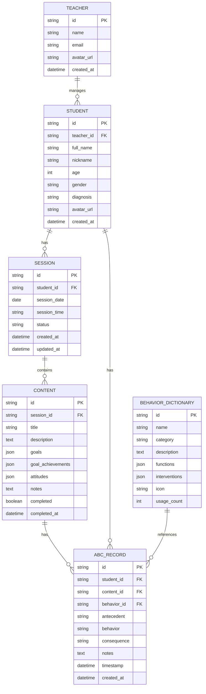

# Cấu trúc Dữ liệu - Educare Connect

## Mục lục

1. [Tổng quan Database](#tổng-quan-database)
2. [Schema Tables](#schema-tables)
3. [Relationships](#relationships)
4. [Sample Data](#sample-data)
5. [API Endpoints](#api-endpoints)

---

## Tổng quan Database

### Database Choice

- **Local**: SQLite (offline-first)
- **Cloud**: Firebase Firestore (sync khi online)
- **Hybrid**: Local SQLite + Cloud sync

### Database Diagram



---

## Schema Tables

### 1. TEACHER (Giáo viên)

```sql
CREATE TABLE teacher (
    id TEXT PRIMARY KEY,
    name TEXT NOT NULL,
    email TEXT UNIQUE NOT NULL,
    phone TEXT,
    avatar_url TEXT,
    specialization TEXT, -- VD: "Can thiệp sớm", "Giáo dục đặc biệt"
    created_at DATETIME DEFAULT CURRENT_TIMESTAMP,
    updated_at DATETIME DEFAULT CURRENT_TIMESTAMP
);
```

**TypeScript Interface**:

```typescript
interface Teacher {
  id: string;
  name: string;
  email: string;
  phone?: string;
  avatar_url?: string;
  specialization?: string;
  created_at: Date;
  updated_at: Date;
}
```

**Sample Data**:

```json
{
  "id": "teacher_001",
  "name": "Cô Hoa",
  "email": "hoa.nguyen@educare.vn",
  "phone": "+84901234567",
  "avatar_url": "https://example.com/avatars/hoa.jpg",
  "specialization": "Can thiệp sớm cho trẻ tự kỷ",
  "created_at": "2025-01-01T08:00:00Z",
  "updated_at": "2025-10-22T10:30:00Z"
}
```

---

### 2. STUDENT (Học sinh)

```sql
CREATE TABLE student (
    id TEXT PRIMARY KEY,
    teacher_id TEXT NOT NULL,
    full_name TEXT NOT NULL,
    nickname TEXT NOT NULL,
    age INTEGER NOT NULL,
    gender TEXT CHECK(gender IN ('male', 'female', 'other')),
    date_of_birth DATE,
    diagnosis TEXT, -- VD: "Tự kỷ", "Chậm phát triển"
    avatar_url TEXT,
    parent_name TEXT,
    parent_phone TEXT,
    parent_email TEXT,
    notes TEXT,
    is_active BOOLEAN DEFAULT 1,
    created_at DATETIME DEFAULT CURRENT_TIMESTAMP,
    updated_at DATETIME DEFAULT CURRENT_TIMESTAMP,
    FOREIGN KEY (teacher_id) REFERENCES teacher(id)
);
```

**TypeScript Interface**:

```typescript
interface Student {
  id: string;
  teacher_id: string;
  full_name: string;
  nickname: string;
  age: number;
  gender: "male" | "female" | "other";
  date_of_birth?: Date;
  diagnosis?: string;
  avatar_url?: string;
  parent_name?: string;
  parent_phone?: string;
  parent_email?: string;
  notes?: string;
  is_active: boolean;
  created_at: Date;
  updated_at: Date;
}
```

**Sample Data**:

```json
{
  "id": "student_001",
  "teacher_id": "teacher_001",
  "full_name": "Nguyễn Văn An",
  "nickname": "Bé An",
  "age": 5,
  "gender": "male",
  "date_of_birth": "2020-03-15",
  "diagnosis": "Tự kỷ mức độ nhẹ",
  "avatar_url": "https://example.com/avatars/student_001.jpg",
  "parent_name": "Nguyễn Văn Cha",
  "parent_phone": "+84912345678",
  "parent_email": "cha.nguyen@email.com",
  "notes": "Con thích màu xanh, không thích ồn ào",
  "is_active": true,
  "created_at": "2025-09-01T08:00:00Z",
  "updated_at": "2025-10-22T10:30:00Z"
}
```

---

### 3. SESSION (Buổi học)

```sql
CREATE TABLE session (
    id TEXT PRIMARY KEY,
    student_id TEXT NOT NULL,
    session_date DATE NOT NULL,
    session_time TEXT NOT NULL, -- VD: "morning", "afternoon", "evening"
    start_time TIME,
    end_time TIME,
    status TEXT CHECK(status IN ('planned', 'in_progress', 'completed', 'cancelled')) DEFAULT 'planned',
    notes TEXT,
    created_at DATETIME DEFAULT CURRENT_TIMESTAMP,
    updated_at DATETIME DEFAULT CURRENT_TIMESTAMP,
    completed_at DATETIME,
    FOREIGN KEY (student_id) REFERENCES student(id)
);

CREATE INDEX idx_session_student ON session(student_id);
CREATE INDEX idx_session_date ON session(session_date);
```

**TypeScript Interface**:

```typescript
interface Session {
  id: string;
  student_id: string;
  session_date: Date;
  session_time: "morning" | "afternoon" | "evening";
  start_time?: string;
  end_time?: string;
  status: "planned" | "in_progress" | "completed" | "cancelled";
  notes?: string;
  created_at: Date;
  updated_at: Date;
  completed_at?: Date;
}
```

**Sample Data**:

```json
{
  "id": "session_001",
  "student_id": "student_001",
  "session_date": "2025-10-22",
  "session_time": "morning",
  "start_time": "08:00:00",
  "end_time": "11:00:00",
  "status": "completed",
  "notes": "Buổi học tốt, con tập trung cao",
  "created_at": "2025-10-22T08:00:00Z",
  "updated_at": "2025-10-22T11:15:00Z",
  "completed_at": "2025-10-22T11:15:00Z"
}
```

---

### 4. CONTENT (Nội dung Dạy học)

```sql
CREATE TABLE content (
    id TEXT PRIMARY KEY,
    session_id TEXT NOT NULL,
    order_number INTEGER NOT NULL, -- Thứ tự trong buổi học
    title TEXT NOT NULL,
    description TEXT,
    domain TEXT, -- VD: "Nhận thức", "Giao tiếp", "Vận động"
    goals TEXT, -- JSON array of goals
    goal_achievements TEXT, -- JSON object: {goal_id: status}
    attitudes TEXT, -- JSON object: {cooperation: value, focus: value}
    notes TEXT,
    completed BOOLEAN DEFAULT 0,
    completed_at DATETIME,
    created_at DATETIME DEFAULT CURRENT_TIMESTAMP,
    updated_at DATETIME DEFAULT CURRENT_TIMESTAMP,
    FOREIGN KEY (session_id) REFERENCES session(id)
);

CREATE INDEX idx_content_session ON content(session_id);
```

**TypeScript Interface**:

```typescript
interface Goal {
  id: string;
  text: string;
}

interface GoalAchievement {
  [goal_id: string]: "achieved" | "not_achieved" | "in_progress";
}

interface Attitudes {
  overall: number; // 1-5
  cooperation: "excellent" | "good" | "fair" | "needs_improvement";
  focus: "excellent" | "good" | "fair" | "poor";
}

interface Content {
  id: string;
  session_id: string;
  order_number: number;
  title: string;
  description?: string;
  domain?: string;
  goals: Goal[];
  goal_achievements: GoalAchievement;
  attitudes: Attitudes;
  notes?: string;
  completed: boolean;
  completed_at?: Date;
  created_at: Date;
  updated_at: Date;
}
```

**Sample Data**:

```json
{
  "id": "content_001",
  "session_id": "session_001",
  "order_number": 1,
  "title": "Phân biệt màu sắc",
  "description": "Học nhận biết và gọi tên màu đỏ",
  "domain": "Nhận thức",
  "goals": [
    { "id": "goal_001", "text": "Gọi tên được màu đỏ" },
    { "id": "goal_002", "text": "Nhận thức được màu đỏ" },
    { "id": "goal_003", "text": "Phân biệt đỏ với xanh" }
  ],
  "goal_achievements": {
    "goal_001": "achieved",
    "goal_002": "achieved",
    "goal_003": "in_progress"
  },
  "attitudes": {
    "overall": 4,
    "cooperation": "good",
    "focus": "fair"
  },
  "notes": "Con đã nhận thức được màu đỏ, tuy nhiên có lúc tự ý rời khỏi chỗ ngồi",
  "completed": true,
  "completed_at": "2025-10-22T09:30:00Z",
  "created_at": "2025-10-22T08:00:00Z",
  "updated_at": "2025-10-22T09:30:00Z"
}
```

---

### 5. ABC_RECORD (Bản ghi A-B-C)

```sql
CREATE TABLE abc_record (
    id TEXT PRIMARY KEY,
    student_id TEXT NOT NULL,
    content_id TEXT, -- Có thể null nếu ghi nhận độc lập
    behavior_id TEXT, -- Reference to behavior_dictionary
    antecedent TEXT NOT NULL, -- Tiền đề
    antecedent_category TEXT, -- VD: "task_demand", "attention_seeking"
    behavior TEXT NOT NULL, -- Hành vi
    behavior_description TEXT,
    consequence TEXT NOT NULL, -- Hệ quả
    consequence_category TEXT, -- VD: "gained_attention", "escaped_task"
    notes TEXT,
    timestamp DATETIME NOT NULL, -- Thời gian xảy ra hành vi
    location TEXT, -- VD: "Lớp học", "Sân chơi"
    intensity TEXT CHECK(intensity IN ('low', 'medium', 'high')), -- Mức độ nghiêm trọng
    duration INTEGER, -- Thời gian kéo dài (giây)
    created_at DATETIME DEFAULT CURRENT_TIMESTAMP,
    updated_at DATETIME DEFAULT CURRENT_TIMESTAMP,
    FOREIGN KEY (student_id) REFERENCES student(id),
    FOREIGN KEY (content_id) REFERENCES content(id),
    FOREIGN KEY (behavior_id) REFERENCES behavior_dictionary(id)
);

CREATE INDEX idx_abc_student ON abc_record(student_id);
CREATE INDEX idx_abc_behavior ON abc_record(behavior_id);
CREATE INDEX idx_abc_timestamp ON abc_record(timestamp);
```

**TypeScript Interface**:

```typescript
interface ABCRecord {
  id: string;
  student_id: string;
  content_id?: string;
  behavior_id?: string;
  antecedent: string;
  antecedent_category?: string;
  behavior: string;
  behavior_description?: string;
  consequence: string;
  consequence_category?: string;
  notes?: string;
  timestamp: Date;
  location?: string;
  intensity?: "low" | "medium" | "high";
  duration?: number;
  created_at: Date;
  updated_at: Date;
}
```

**Sample Data**:

```json
{
  "id": "abc_001",
  "student_id": "student_001",
  "content_id": "content_001",
  "behavior_id": "behavior_003",
  "antecedent": "Yêu cầu làm việc khó",
  "antecedent_category": "task_demand",
  "behavior": "Tự ý rời khỏi chỗ",
  "behavior_description": "Con đứng lên và đi ra sân chơi",
  "consequence": "Tránh nhiệm vụ",
  "consequence_category": "escaped_task",
  "notes": "Xảy ra khi yêu cầu con phân biệt 3 màu cùng lúc",
  "timestamp": "2025-10-22T09:15:00Z",
  "location": "Lớp học",
  "intensity": "medium",
  "duration": 120,
  "created_at": "2025-10-22T09:20:00Z",
  "updated_at": "2025-10-22T09:20:00Z"
}
```

---

### 6. BEHAVIOR_DICTIONARY (Từ điển Hành vi)

```sql
CREATE TABLE behavior_dictionary (
    id TEXT PRIMARY KEY,
    name TEXT NOT NULL UNIQUE,
    category TEXT NOT NULL, -- VD: "Aggression", "Self-stimulation", "Avoidance"
    description TEXT NOT NULL,
    common_antecedents TEXT, -- JSON array
    functions TEXT, -- JSON array: ["attention", "escape", "sensory", "tangible"]
    interventions TEXT, -- JSON array of intervention strategies
    icon TEXT, -- Emoji or icon name
    usage_count INTEGER DEFAULT 0,
    created_at DATETIME DEFAULT CURRENT_TIMESTAMP,
    updated_at DATETIME DEFAULT CURRENT_TIMESTAMP
);

CREATE INDEX idx_behavior_category ON behavior_dictionary(category);
CREATE INDEX idx_behavior_usage ON behavior_dictionary(usage_count DESC);
```

**TypeScript Interface**:

```typescript
interface BehaviorDictionary {
  id: string;
  name: string;
  category: string;
  description: string;
  common_antecedents: string[];
  functions: ("attention" | "escape" | "sensory" | "tangible")[];
  interventions: Intervention[];
  icon: string;
  usage_count: number;
  created_at: Date;
  updated_at: Date;
}

interface Intervention {
  title: string;
  description: string;
  example?: string;
}
```

**Sample Data**:

```json
{
  "id": "behavior_001",
  "name": "Ném đồ vật",
  "category": "Aggression",
  "description": "Hành vi ném các vật dụng, đồ chơi trong lớp học hoặc tại nhà. Có thể ném về phía người khác hoặc ném bừa bãi.",
  "common_antecedents": [
    "Yêu cầu làm việc khó",
    "Không được chú ý",
    "Cảm thấy khó chịu",
    "Môi trường quá kích thích"
  ],
  "functions": ["attention", "escape", "sensory", "tangible"],
  "interventions": [
    {
      "title": "Dạy kỹ năng giao tiếp thay thế",
      "description": "Dạy con cách xin nghỉ bằng lời nói hoặc thẻ hình thay vì ném đồ",
      "example": "Khi con muốn nghỉ, dạy con nói 'Cho con nghỉ' hoặc đưa thẻ hình có biểu tượng nghỉ ngơi"
    },
    {
      "title": "Cung cấp kích thích cảm giác",
      "description": "Cho phép con ném vào rổ hoặc túi mềm như một hoạt động hợp lệ",
      "example": "Đặt một rổ ném bóng trong lớp, cho phép con ném bóng vào rổ khi cần kích thích cảm giác"
    },
    {
      "title": "Điều chỉnh môi trường",
      "description": "Giảm độ khó của nhiệm vụ hoặc chia nhỏ thành các bước đơn giản hơn"
    },
    {
      "title": "Tăng cường khen thưởng",
      "description": "Khen ngay khi con hoàn thành nhiệm vụ mà không ném đồ",
      "example": "Mỗi 5 phút con không ném đồ, cho con một sticker yêu thích"
    },
    {
      "title": "Bỏ qua hành vi nhỏ",
      "description": "Chỉ dọn dẹp, không mắng hoặc giảng giải nhiều để tránh củng cố hành vi bằng sự chú ý"
    }
  ],
  "icon": "⚠️",
  "usage_count": 127,
  "created_at": "2025-01-01T08:00:00Z",
  "updated_at": "2025-10-22T10:30:00Z"
}
```

---

## Relationships

### Entity Relationships Explained

```
TEACHER (1) ----< (N) STUDENT
└─ Một giáo viên quản lý nhiều học sinh

STUDENT (1) ----< (N) SESSION
└─ Một học sinh có nhiều buổi học

SESSION (1) ----< (N) CONTENT
└─ Một buổi học có nhiều nội dung dạy học

CONTENT (1) ----< (N) ABC_RECORD
└─ Một nội dung có thể có nhiều bản ghi A-B-C

STUDENT (1) ----< (N) ABC_RECORD
└─ Một học sinh có nhiều bản ghi A-B-C (qua các buổi học)

BEHAVIOR_DICTIONARY (1) ----< (N) ABC_RECORD
└─ Một hành vi trong từ điển được tham chiếu bởi nhiều bản ghi A-B-C
```

### Query Examples

**Lấy tất cả học sinh của giáo viên**:

```sql
SELECT * FROM student
WHERE teacher_id = 'teacher_001' AND is_active = 1
ORDER BY nickname;
```

**Lấy buổi học gần nhất của học sinh**:

```sql
SELECT * FROM session
WHERE student_id = 'student_001'
ORDER BY session_date DESC, start_time DESC
LIMIT 1;
```

**Lấy tất cả nội dung của một buổi học**:

```sql
SELECT * FROM content
WHERE session_id = 'session_001'
ORDER BY order_number;
```

**Lấy tất cả bản ghi A-B-C của học sinh trong khoảng thời gian**:

```sql
SELECT abc.*, bd.name as behavior_name, bd.category
FROM abc_record abc
LEFT JOIN behavior_dictionary bd ON abc.behavior_id = bd.id
WHERE abc.student_id = 'student_001'
  AND abc.timestamp BETWEEN '2025-10-01' AND '2025-10-31'
ORDER BY abc.timestamp DESC;
```

**Thống kê hành vi theo Tiền đề (A)**:

```sql
SELECT
    antecedent_category,
    COUNT(*) as count,
    ROUND(COUNT(*) * 100.0 / (SELECT COUNT(*) FROM abc_record WHERE student_id = 'student_001'), 2) as percentage
FROM abc_record
WHERE student_id = 'student_001'
  AND timestamp >= DATE('now', '-30 days')
GROUP BY antecedent_category
ORDER BY count DESC;
```

**Thống kê hành vi theo Hệ quả (C)**:

```sql
SELECT
    consequence_category,
    COUNT(*) as count,
    ROUND(COUNT(*) * 100.0 / (SELECT COUNT(*) FROM abc_record WHERE student_id = 'student_001'), 2) as percentage
FROM abc_record
WHERE student_id = 'student_001'
  AND timestamp >= DATE('now', '-30 days')
GROUP BY consequence_category
ORDER BY count DESC;
```

**Thống kê tần suất hành vi theo ngày**:

```sql
SELECT
    DATE(timestamp) as date,
    COUNT(*) as frequency
FROM abc_record
WHERE student_id = 'student_001'
  AND behavior_id = 'behavior_001'
  AND timestamp >= DATE('now', '-30 days')
GROUP BY DATE(timestamp)
ORDER BY date;
```

---

## Sample Data

### Complete Example Dataset

#### 1. Teachers

```json
[
  {
    "id": "teacher_001",
    "name": "Cô Hoa",
    "email": "hoa.nguyen@educare.vn",
    "phone": "+84901234567",
    "specialization": "Can thiệp sớm cho trẻ tự kỷ"
  }
]
```

#### 2. Students

```json
[
  {
    "id": "student_001",
    "teacher_id": "teacher_001",
    "full_name": "Nguyễn Văn An",
    "nickname": "Bé An",
    "age": 5,
    "gender": "male",
    "diagnosis": "Tự kỷ mức độ nhẹ"
  },
  {
    "id": "student_002",
    "teacher_id": "teacher_001",
    "full_name": "Trần Thị Bình",
    "nickname": "Bé Bình",
    "age": 4,
    "gender": "female",
    "diagnosis": "Chậm phát triển ngôn ngữ"
  }
]
```

#### 3. Behavior Dictionary

```json
[
  {
    "id": "behavior_001",
    "name": "Ném đồ vật",
    "category": "Aggression",
    "icon": "⚠️",
    "usage_count": 127
  },
  {
    "id": "behavior_002",
    "name": "La hét / Kêu to",
    "category": "Self-stimulation",
    "icon": "😤",
    "usage_count": 89
  },
  {
    "id": "behavior_003",
    "name": "Tự ý rời khỏi chỗ",
    "category": "Avoidance",
    "icon": "🏃",
    "usage_count": 156
  },
  {
    "id": "behavior_004",
    "name": "Đánh người khác",
    "category": "Aggression",
    "icon": "👊",
    "usage_count": 64
  },
  {
    "id": "behavior_005",
    "name": "Từ chối làm việc",
    "category": "Avoidance",
    "icon": "🙅",
    "usage_count": 201
  }
]
```

#### 4. Antecedent Categories

```json
[
  "task_demand", // Yêu cầu làm việc khó
  "lack_attention", // Thiếu chú ý từ người lớn
  "overstimulation", // Môi trường quá kích thích
  "schedule_change", // Thay đổi lịch trình
  "physical_discomfort", // Cảm thấy mệt mỏi/đói/khó chịu
  "denied_preferred", // Không được đồ vật/hoạt động yêu thích
  "other"
]
```

#### 5. Consequence Categories

```json
[
  "gained_attention", // Được chú ý
  "escaped_task", // Tránh nhiệm vụ
  "sensory_input", // Nhận kích thích cảm giác
  "gained_tangible", // Nhận đồ vật/hoạt động yêu thích
  "escaped_situation", // Rời khỏi tình huống khó chịu
  "other"
]
```

---

## API Endpoints

### REST API Design

#### Students

```
GET    /api/students              # Lấy danh sách học sinh
GET    /api/students/:id          # Lấy chi tiết học sinh
POST   /api/students              # Tạo học sinh mới
PUT    /api/students/:id          # Cập nhật học sinh
DELETE /api/students/:id          # Xóa học sinh (soft delete)
```

#### Sessions

```
GET    /api/students/:studentId/sessions              # Lấy danh sách buổi học
GET    /api/sessions/:id                              # Lấy chi tiết buổi học
POST   /api/students/:studentId/sessions              # Tạo buổi học mới
PUT    /api/sessions/:id                              # Cập nhật buổi học
DELETE /api/sessions/:id                              # Xóa buổi học
```

#### Contents

```
GET    /api/sessions/:sessionId/contents              # Lấy danh sách nội dung
GET    /api/contents/:id                              # Lấy chi tiết nội dung
POST   /api/sessions/:sessionId/contents              # Tạo nội dung mới
PUT    /api/contents/:id                              # Cập nhật nội dung
DELETE /api/contents/:id                              # Xóa nội dung
```

#### ABC Records

```
GET    /api/students/:studentId/abc-records           # Lấy danh sách A-B-C
GET    /api/abc-records/:id                           # Lấy chi tiết A-B-C
POST   /api/contents/:contentId/abc-records           # Tạo bản ghi A-B-C
PUT    /api/abc-records/:id                           # Cập nhật A-B-C
DELETE /api/abc-records/:id                           # Xóa A-B-C
```

#### Analytics

```
GET    /api/students/:studentId/analytics/frequency   # Biểu đồ tần suất
GET    /api/students/:studentId/analytics/antecedent  # Biểu đồ Tiền đề
GET    /api/students/:studentId/analytics/consequence # Biểu đồ Hệ quả
GET    /api/students/:studentId/analytics/insights    # Kết luận & Gợi ý
```

#### Behavior Dictionary

```
GET    /api/behaviors                                 # Lấy danh sách hành vi
GET    /api/behaviors/:id                             # Lấy chi tiết hành vi
GET    /api/behaviors/search?q=ném                    # Tìm kiếm hành vi
```

### Request/Response Examples

#### POST /api/sessions/:sessionId/contents

**Request**:

```json
{
  "title": "Phân biệt màu sắc",
  "description": "Học nhận biết và gọi tên màu đỏ",
  "domain": "Nhận thức",
  "order_number": 1,
  "goals": [
    { "id": "goal_001", "text": "Gọi tên được màu đỏ" },
    { "id": "goal_002", "text": "Nhận thức được màu đỏ" }
  ]
}
```

**Response**:

```json
{
  "success": true,
  "data": {
    "id": "content_001",
    "session_id": "session_001",
    "title": "Phân biệt màu sắc",
    "order_number": 1,
    "completed": false,
    "created_at": "2025-10-22T08:00:00Z"
  }
}
```

#### POST /api/contents/:contentId/abc-records

**Request**:

```json
{
  "antecedent": "Yêu cầu làm việc khó",
  "antecedent_category": "task_demand",
  "behavior": "Tự ý rời khỏi chỗ",
  "behavior_id": "behavior_003",
  "consequence": "Tránh nhiệm vụ",
  "consequence_category": "escaped_task",
  "timestamp": "2025-10-22T09:15:00Z",
  "intensity": "medium",
  "notes": "Xảy ra khi yêu cầu con phân biệt 3 màu cùng lúc"
}
```

**Response**:

```json
{
  "success": true,
  "data": {
    "id": "abc_001",
    "student_id": "student_001",
    "content_id": "content_001",
    "behavior_id": "behavior_003",
    "timestamp": "2025-10-22T09:15:00Z",
    "created_at": "2025-10-22T09:20:00Z"
  }
}
```

#### GET /api/students/:studentId/analytics/frequency?days=30

**Response**:

```json
{
  "success": true,
  "data": {
    "student_id": "student_001",
    "behavior_id": "behavior_001",
    "behavior_name": "Ném đồ vật",
    "period": {
      "start": "2025-09-22",
      "end": "2025-10-22",
      "days": 30
    },
    "frequency_data": [
      { "date": "2025-09-22", "count": 3 },
      { "date": "2025-09-23", "count": 2 },
      { "date": "2025-09-24", "count": 0 }
      // ... more data
    ],
    "statistics": {
      "total_count": 96,
      "average_per_day": 3.2,
      "max_count": 5,
      "max_date": "2025-10-05",
      "min_count": 0,
      "trend": "increasing"
    }
  }
}
```

---

## Data Validation

### Validation Rules

#### Student

```typescript
const studentValidation = {
  full_name: {
    required: true,
    minLength: 2,
    maxLength: 100,
  },
  nickname: {
    required: true,
    minLength: 2,
    maxLength: 50,
  },
  age: {
    required: true,
    min: 0,
    max: 18,
  },
  gender: {
    required: true,
    enum: ["male", "female", "other"],
  },
};
```

#### Content

```typescript
const contentValidation = {
  title: {
    required: true,
    minLength: 3,
    maxLength: 200,
  },
  goals: {
    required: true,
    minItems: 1,
    maxItems: 10,
  },
  notes: {
    maxLength: 500,
  },
};
```

#### ABC Record

```typescript
const abcRecordValidation = {
  antecedent: {
    required: true,
    minLength: 3,
  },
  behavior: {
    required: true,
    minLength: 3,
  },
  consequence: {
    required: true,
    minLength: 3,
  },
  timestamp: {
    required: true,
    type: "datetime",
  },
  intensity: {
    enum: ["low", "medium", "high"],
  },
};
```

---

## Data Migration & Seeding

### Initial Seed Data

```typescript
// seed-behavior-dictionary.ts
const seedBehaviors = [
    {
        name: "Ném đồ vật",
        category: "Aggression",
        description: "Hành vi ném các vật dụng...",
        icon: "⚠️",
        functions: ["attention", "escape", "sensory"],
        interventions: [...]
    },
    // ... more behaviors
];

// seed-students.ts
const seedStudents = [
    {
        full_name: "Nguyễn Văn An",
        nickname: "Bé An",
        age: 5,
        gender: "male",
        diagnosis: "Tự kỷ mức độ nhẹ"
    },
    // ... more students
];
```

---

**Tài liệu tiếp theo**: Xem [MODULE_INTEGRATION.md](./MODULE_INTEGRATION.md) để biết cách tích hợp các module.
