# Quy Trình Phát Triển Phần Mềm - Educare Connect

## 📋 Tổng Quan

Tài liệu này mô tả quy trình phát triển phần mềm hoàn chỉnh cho dự án Educare Connect, từ ý tưởng đến triển khai và bảo trì.

---

## 🔄 Quy Trình Phát Triển (SDLC)

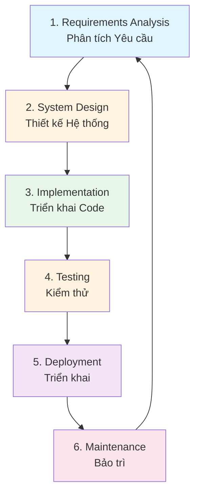

---

## Phase 1: Requirements Analysis (Phân tích Yêu cầu)

### 📝 Tài liệu cần tạo:

#### 1.1. Business Requirements Document (BRD)

**Mục đích**: Mô tả nhu cầu kinh doanh và mục tiêu dự án

**Nội dung**:

- Executive Summary
- Business Objectives
- Target Users
- Success Metrics (KPIs)
- Budget & Timeline
- Stakeholders

**Template**: `BRD.md`

#### 1.2. Product Requirements Document (PRD)

**Mục đích**: Chi tiết hóa các yêu cầu sản phẩm

**Nội dung**:

- Product Overview
- User Personas
- User Stories
- Feature List (Must-have, Should-have, Nice-to-have)
- Acceptance Criteria
- Assumptions & Constraints

**Template**: `FEATURES_OVERVIEW.md`

#### 1.3. Functional Requirements Specification (FRS)

**Mục đích**: Mô tả chi tiết chức năng hệ thống

**Nội dung**:

- Functional Requirements (FR-001, FR-002...)
- Non-Functional Requirements (NFR-001, NFR-002...)
- Performance Requirements
- Security Requirements
- Compliance Requirements

**Template**: `REQUIREMENTS.md`

### 📊 Sơ đồ cần vẽ:

#### 1. Use Case Diagram

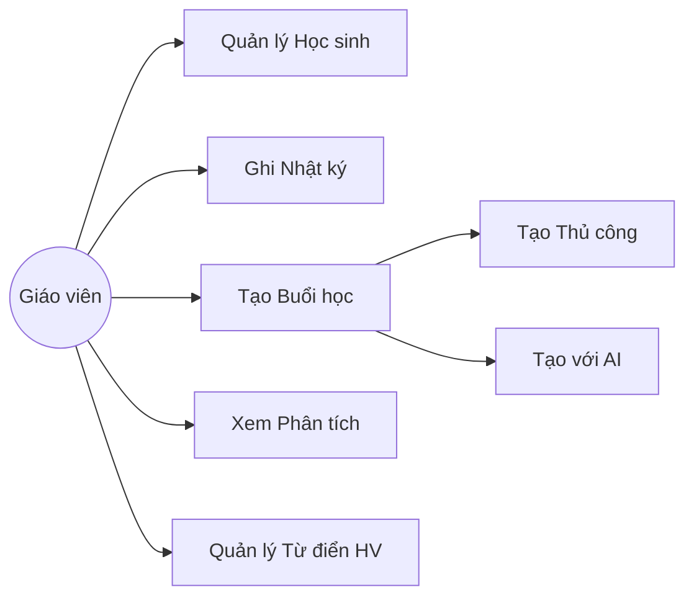

#### 2. User Journey Map

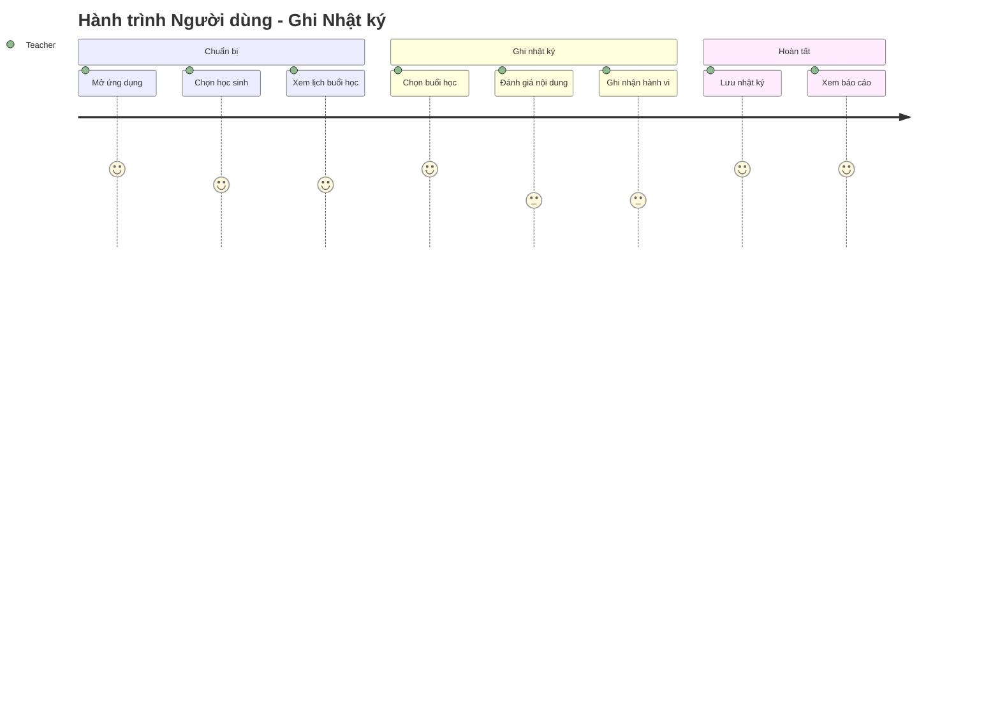

### 🔗 Resources:

- [Writing Better Requirements](https://www.visual-paradigm.com/guide/requirements/what-is-requirement-analysis/)
- [User Story Best Practices](https://www.atlassian.com/agile/project-management/user-stories)
- [Use Case Diagram Tutorial](https://www.lucidchart.com/pages/uml-use-case-diagram)

---

## Phase 2: System Design (Thiết kế Hệ thống)

### 📝 Tài liệu cần tạo:

#### 2.1. System Architecture Document (SAD)

**Mục đích**: Mô tả kiến trúc tổng thể hệ thống

**Nội dung**:

- Architecture Overview
- Technology Stack
- System Components
- Integration Points
- Deployment Architecture
- Security Architecture

**File tham khảo**: `MODULE_INTEGRATION.md`

#### 2.2. Database Design Document

**Mục đích**: Thiết kế cơ sở dữ liệu

**Nội dung**:

- Entity Relationship Diagram (ERD)
- Database Schema
- Table Definitions
- Indexes & Constraints
- Data Migration Strategy

**File tham khảo**: `DATA_STRUCTURE.md`

#### 2.3. API Design Document

**Mục đích**: Thiết kế RESTful API

**Nội dung**:

- API Endpoints
- Request/Response Formats
- Authentication & Authorization
- Error Handling
- Rate Limiting
- API Versioning

**Template**: `API_DOCUMENTATION.md`

#### 2.4. UI/UX Design Document

**Mục đích**: Thiết kế giao diện người dùng

**Nội dung**:

- Design System (Colors, Typography, Components)
- Wireframes
- High-Fidelity Mockups
- User Flows
- Interaction Design
- Responsive Design Guidelines

**File tham khảo**: `WIREFRAMES.md`, `SCREEN_DESIGN.md`

### 📊 Sơ đồ cần vẽ:

#### 1. System Architecture Diagram

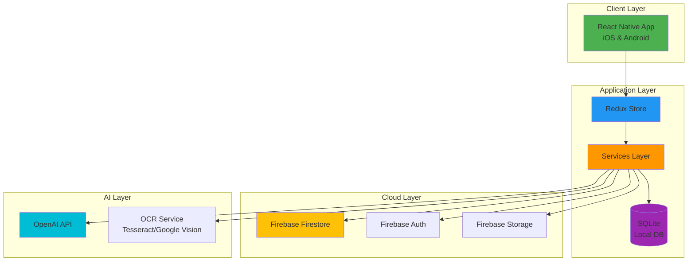

#### 2. Database ERD

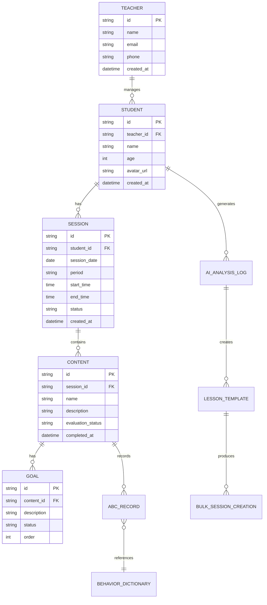

#### 3. Component Architecture (React Native)

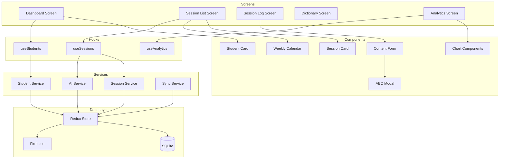

#### 4. Sequence Diagram - AI Lesson Creation

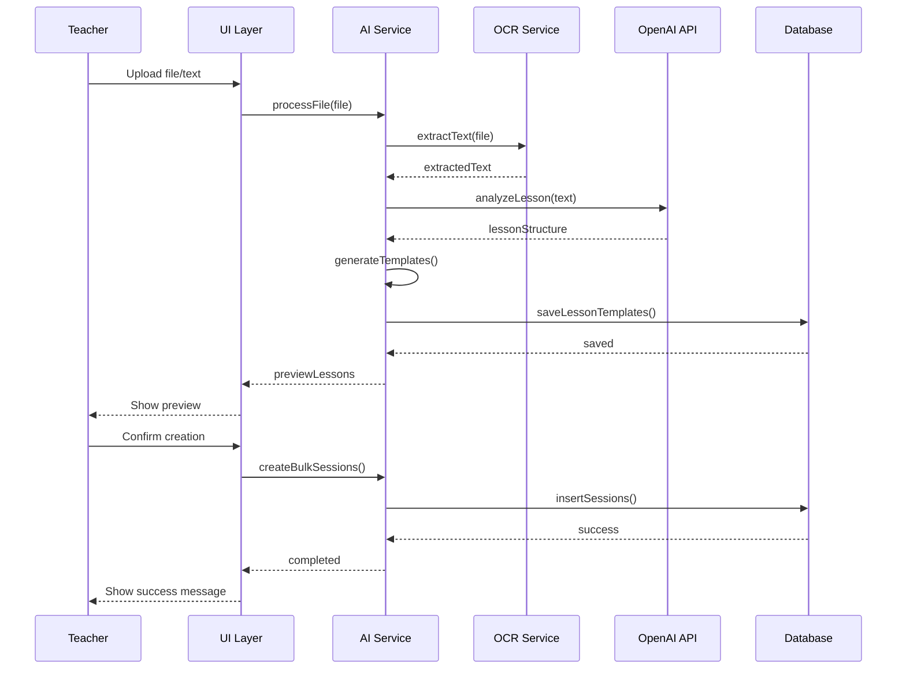

#### 5. State Machine Diagram - Session Status

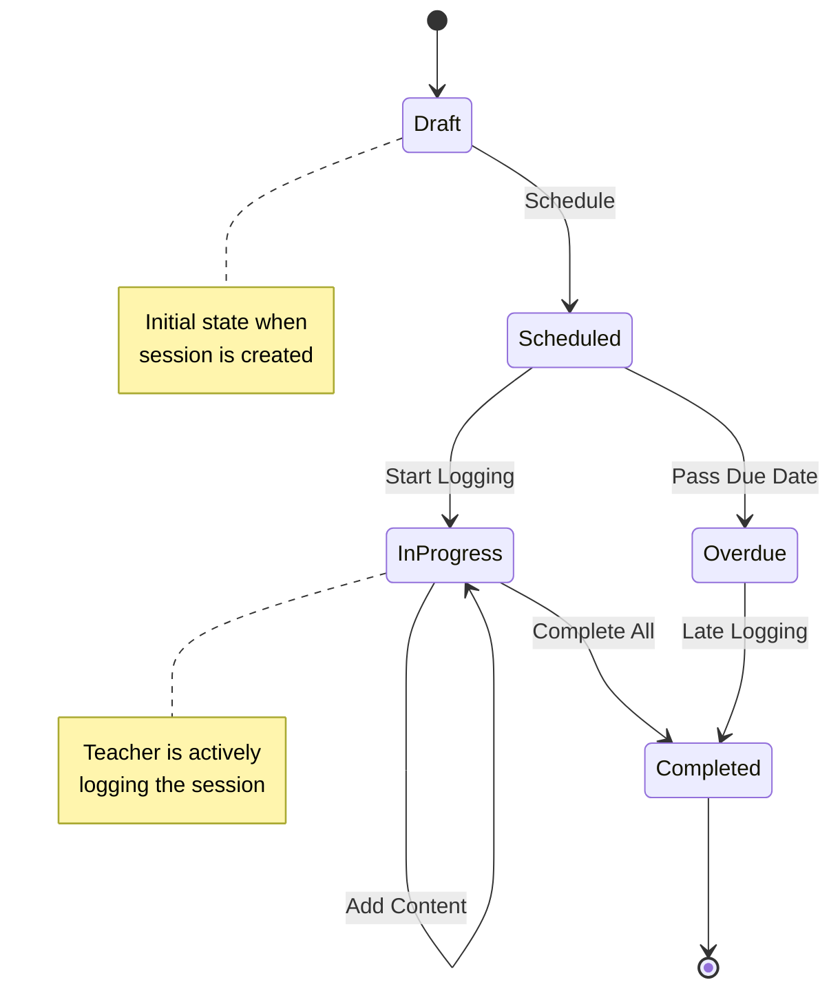

#### 6. Data Flow Diagram (Level 0)

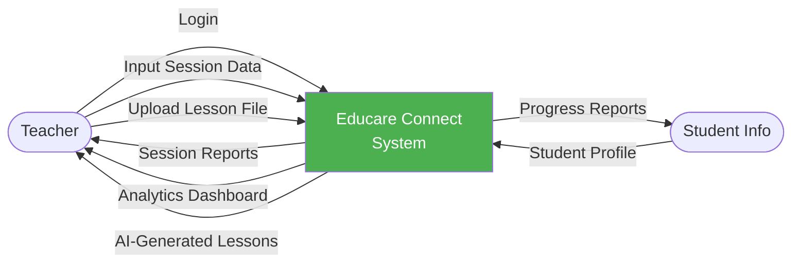

### 🔗 Resources:

- [System Design Primer](https://github.com/donnemartin/system-design-primer)
- [REST API Design Best Practices](https://restfulapi.net/)
- [Database Design Tutorial](https://www.lucidchart.com/pages/database-diagram/database-design)
- [React Native Architecture](https://reactnative.dev/docs/architecture-overview)
- [UML Diagrams Guide](https://www.visual-paradigm.com/guide/uml-unified-modeling-language/what-is-uml/)
- [Figma Design Resources](https://www.figma.com/community)

---

## Phase 3: Implementation (Triển khai Code)

### 📝 Tài liệu cần tạo:

#### 3.1. Technical Specification Document

**Mục đích**: Hướng dẫn chi tiết kỹ thuật triển khai

**Nội dung**:

- Code Structure
- Naming Conventions
- Coding Standards
- Component Guidelines
- State Management Patterns
- Error Handling Patterns

**Template**: `TECHNICAL_SPEC.md`

#### 3.2. Development Setup Guide

**Mục đích**: Hướng dẫn setup môi trường phát triển

**Nội dung**:

- Prerequisites
- Installation Steps
- Environment Variables
- Running Development Server
- Building for Production
- Troubleshooting

**Template**: `SETUP.md` hoặc `README.md`

#### 3.3. Git Workflow & Branching Strategy

**Mục đích**: Quy ước sử dụng Git

**Nội dung**:

- Branching Strategy (Git Flow, GitHub Flow)
- Commit Message Conventions
- Pull Request Process
- Code Review Guidelines

**Template**: `GIT_WORKFLOW.md`

### 📊 Sơ đồ cần vẽ:

#### 1. Git Branching Strategy

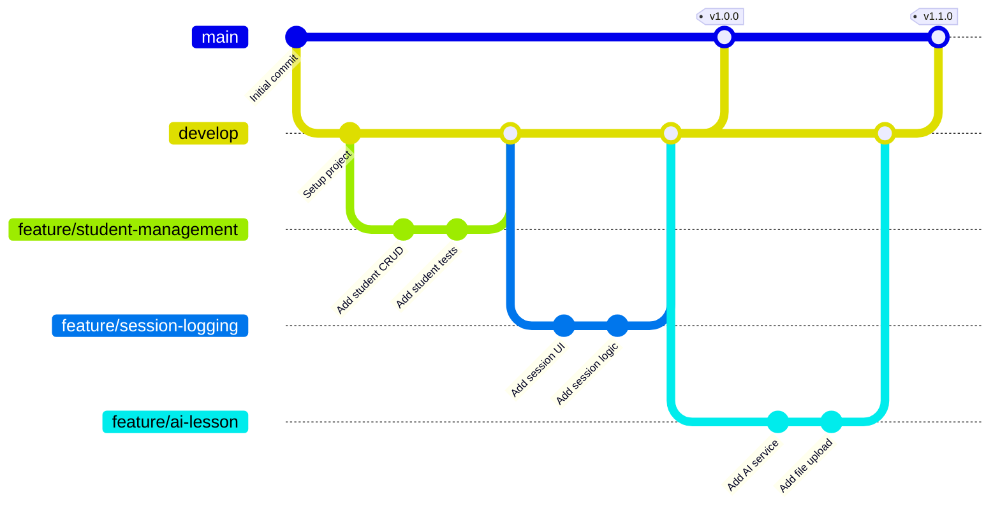

#### 2. CI/CD Pipeline

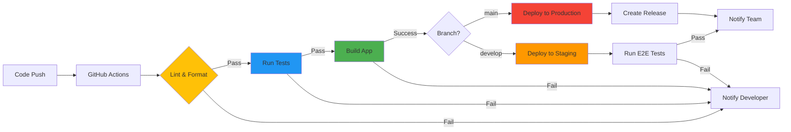

#### 3. Project Structure

```
educare-connect/
├── src/
│   ├── screens/              # Screen components
│   │   ├── Dashboard/
│   │   ├── SessionList/
│   │   ├── SessionLog/
│   │   ├── Dictionary/
│   │   └── Analytics/
│   ├── components/           # Reusable components
│   │   ├── common/           # Common UI components
│   │   ├── StudentCard/
│   │   ├── SessionCard/
│   │   └── ABCModal/
│   ├── navigation/           # Navigation setup
│   │   ├── AppNavigator.tsx
│   │   └── types.ts
│   ├── store/                # Redux store
│   │   ├── slices/
│   │   │   ├── studentSlice.ts
│   │   │   ├── sessionSlice.ts
│   │   │   └── aiSlice.ts
│   │   └── index.ts
│   ├── services/             # Business logic
│   │   ├── StudentService.ts
│   │   ├── SessionService.ts
│   │   ├── AILessonService.ts
│   │   ├── FileUploadService.ts
│   │   └── SyncService.ts
│   ├── hooks/                # Custom hooks
│   │   ├── useStudents.ts
│   │   ├── useSessions.ts
│   │   └── useAnalytics.ts
│   ├── utils/                # Utility functions
│   │   ├── dateUtils.ts
│   │   ├── validators.ts
│   │   └── formatters.ts
│   ├── database/             # SQLite setup
│   │   ├── schema.ts
│   │   ├── migrations/
│   │   └── queries.ts
│   ├── types/                # TypeScript types
│   │   ├── models.ts
│   │   ├── api.ts
│   │   └── navigation.ts
│   ├── constants/            # App constants
│   │   ├── colors.ts
│   │   ├── sizes.ts
│   │   └── config.ts
│   └── assets/               # Static assets
│       ├── images/
│       └── fonts/
├── __tests__/                # Test files
│   ├── unit/
│   ├── integration/
│   └── e2e/
├── docs/                     # Documentation
├── android/                  # Android native code
├── ios/                      # iOS native code
├── .github/                  # GitHub Actions
│   └── workflows/
│       ├── ci.yml
│       └── deploy.yml
├── package.json
├── tsconfig.json
├── .eslintrc.js
├── .prettierrc
└── README.md
```

### 🔗 Resources:

- [Clean Code Principles](https://github.com/ryanmcdermott/clean-code-javascript)
- [React Native Best Practices](https://github.com/react-native-community/discussions-and-proposals)
- [TypeScript Best Practices](https://www.typescriptlang.org/docs/handbook/declaration-files/do-s-and-don-ts.html)
- [Git Branching Strategies](https://www.atlassian.com/git/tutorials/comparing-workflows)
- [Conventional Commits](https://www.conventionalcommits.org/)

---

## Phase 4: Testing (Kiểm thử)

### 📝 Tài liệu cần tạo:

#### 4.1. Test Plan Document

**Mục đích**: Kế hoạch kiểm thử tổng thể

**Nội dung**:

- Test Objectives
- Test Scope
- Test Strategy
- Test Schedule
- Resource Requirements
- Risk Assessment

**Template**: `TEST_PLAN.md`

#### 4.2. Test Cases Document

**Mục đích**: Chi tiết các test case

**Nội dung**:

- Test Case ID
- Test Description
- Pre-conditions
- Test Steps
- Expected Results
- Actual Results
- Status (Pass/Fail)

**Template**: `TEST_CASES.md`

#### 4.3. Bug Report Template

**Mục đích**: Quy cách báo cáo lỗi

**Nội dung**:

- Bug ID
- Severity (Critical, High, Medium, Low)
- Steps to Reproduce
- Expected Behavior
- Actual Behavior
- Environment (OS, Device, Version)
- Screenshots/Videos

**Template**: GitHub Issues Template

### 📊 Sơ đồ cần vẽ:

#### 1. Testing Pyramid

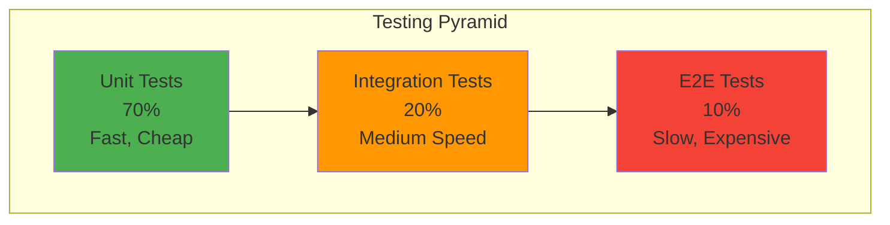

#### 2. Test Coverage Flow

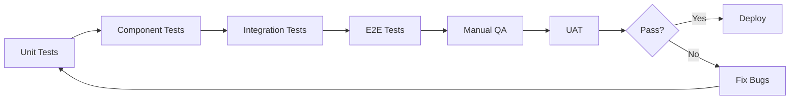

#### 3. Test Types

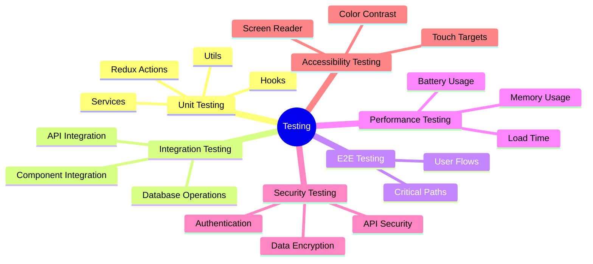

### 🔗 Resources:

- [React Native Testing Library](https://callstack.github.io/react-native-testing-library/)
- [Jest Documentation](https://jestjs.io/docs/getting-started)
- [Detox E2E Testing](https://wix.github.io/Detox/)
- [Testing Best Practices](https://github.com/goldbergyoni/javascript-testing-best-practices)
- [Test Automation University](https://testautomationu.applitools.com/)

---

## Phase 5: Deployment (Triển khai)

### 📝 Tài liệu cần tạo:

#### 5.1. Deployment Guide

**Mục đích**: Hướng dẫn triển khai ứng dụng

**Nội dung**:

- Pre-deployment Checklist
- Build Configuration
- iOS Deployment (App Store)
- Android Deployment (Google Play)
- Firebase Configuration
- Environment Setup
- Post-deployment Verification

**Template**: `DEPLOYMENT.md`

#### 5.2. Release Notes

**Mục đích**: Ghi chú phiên bản phát hành

**Nội dung**:

- Version Number
- Release Date
- New Features
- Bug Fixes
- Breaking Changes
- Migration Guide

**Template**: `CHANGELOG.md`

#### 5.3. Rollback Plan

**Mục đích**: Kế hoạch khôi phục khi có sự cố

**Nội dung**:

- Rollback Triggers
- Rollback Steps
- Data Recovery Plan
- Communication Plan

**Template**: `ROLLBACK_PLAN.md`

### 📊 Sơ đồ cần vẽ:

#### 1. Deployment Architecture

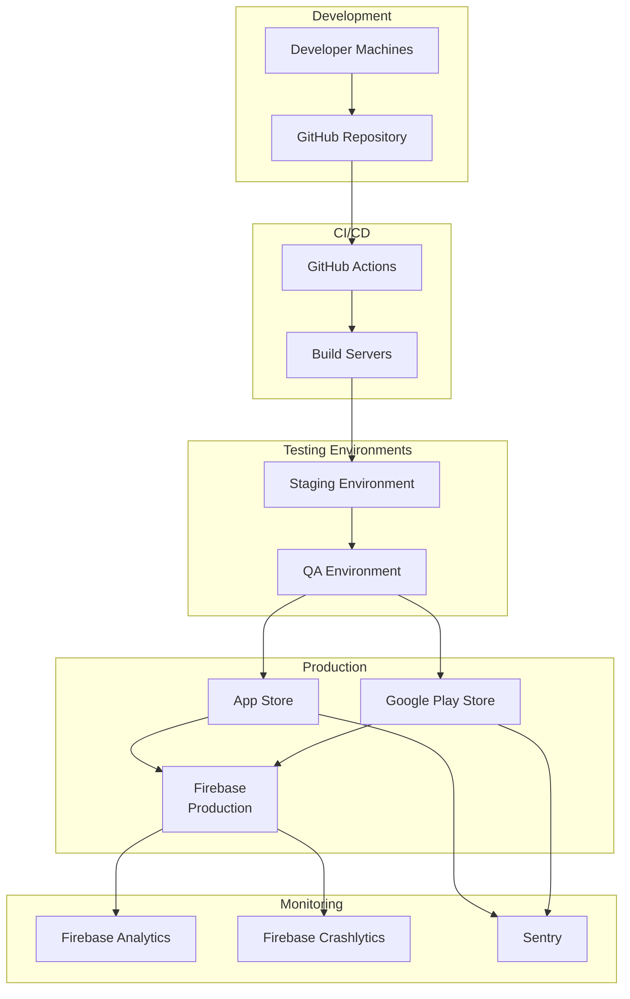

#### 2. Release Process

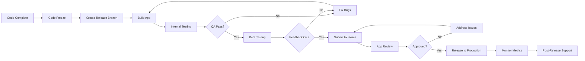

### 🔗 Resources:

- [React Native App Store Deployment](https://reactnative.dev/docs/publishing-to-app-store)
- [React Native Google Play Deployment](https://reactnative.dev/docs/signed-apk-android)
- [Firebase Deployment Guide](https://firebase.google.com/docs/hosting/deploying)
- [App Store Review Guidelines](https://developer.apple.com/app-store/review/guidelines/)
- [Google Play Policy](https://play.google.com/about/developer-content-policy/)

---

## Phase 6: Maintenance (Bảo trì)

### 📝 Tài liệu cần tạo:

#### 6.1. Operations Manual

**Mục đích**: Hướng dẫn vận hành hệ thống

**Nội dung**:

- System Monitoring
- Performance Metrics
- Alert Configurations
- Incident Response
- Backup & Recovery
- User Support

**Template**: `OPERATIONS.md`

#### 6.2. Knowledge Base

**Mục đích**: Cơ sở tri thức về hệ thống

**Nội dung**:

- Common Issues & Solutions
- FAQ
- Troubleshooting Guide
- Best Practices
- Tips & Tricks

**Template**: `KNOWLEDGE_BASE.md`

#### 6.3. Product Roadmap

**Mục đích**: Lộ trình phát triển sản phẩm

**Nội dung**:

- Planned Features
- Timeline
- Resource Allocation
- Dependencies
- Success Metrics

**File tham khảo**: `FEATURES_OVERVIEW.md` (Roadmap section)

### 📊 Sơ đồ cần vẽ:

#### 1. Monitoring Dashboard

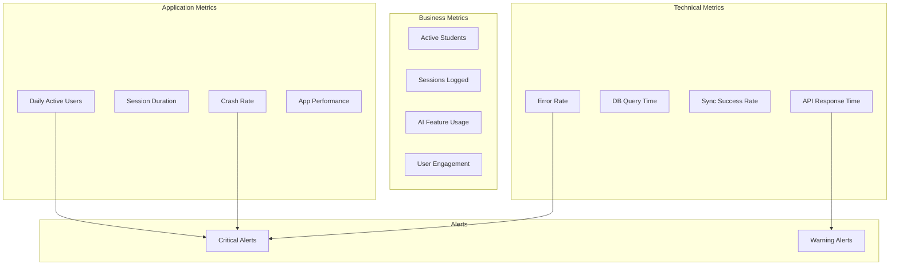

#### 2. Incident Response Flow

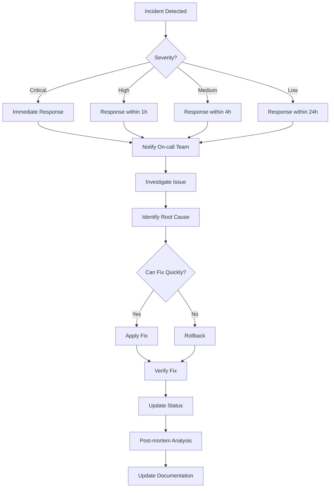

#### 3. Support Tiers

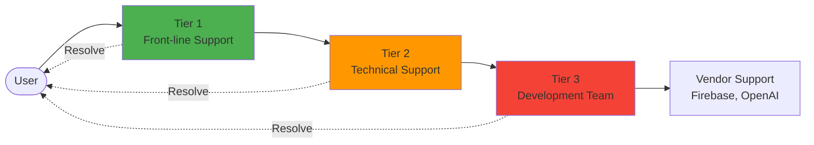

### 🔗 Resources:

- [SRE Handbook](https://sre.google/sre-book/table-of-contents/)
- [Incident Management Guide](https://www.atlassian.com/incident-management)
- [Firebase Performance Monitoring](https://firebase.google.com/docs/perf-mon)
- [Sentry Error Tracking](https://docs.sentry.io/)
- [App Store Analytics](https://developer.apple.com/app-store/measuring-app-performance/)

---

## 📚 Danh Sách Tài Liệu Hoàn Chỉnh

### A. Business Documents

1. ✅ BRD - Business Requirements Document
2. ✅ PRD - Product Requirements Document
3. ✅ Product Roadmap

### B. Technical Documents

4. ✅ FRS - Functional Requirements Specification
5. ✅ System Architecture Document
6. ✅ Database Design Document
7. ✅ API Documentation
8. ✅ Technical Specification
9. ✅ Data Structure Documentation (`DATA_STRUCTURE.md`)
10. ✅ Module Integration Guide (`MODULE_INTEGRATION.md`)

### C. Design Documents

11. ✅ UI/UX Design Document
12. ✅ Wireframes (`WIREFRAMES.md`)
13. ✅ Screen Design Specifications (`SCREEN_DESIGN.md`)
14. ✅ Design System Guide
15. ✅ User Flow Documentation (`USER_FLOW.md`)

### D. Development Documents

16. ✅ Development Setup Guide
17. ✅ Technical Specification
18. ✅ Code Standards & Conventions
19. ✅ Git Workflow Guide
20. ✅ Component Documentation

### E. Testing Documents

21. ✅ Test Plan
22. ✅ Test Cases
23. ✅ Bug Report Templates
24. ✅ Testing Strategy

### F. Deployment & Operations Documents

25. ✅ Deployment Guide
26. ✅ Release Notes / Changelog
27. ✅ Rollback Plan
28. ✅ Operations Manual
29. ✅ Monitoring & Alerting Guide

### G. User Documents

30. ✅ User Manual
31. ✅ Admin Guide
32. ✅ FAQ
33. ✅ Knowledge Base

### H. Maintenance Documents

34. ✅ Incident Response Plan
35. ✅ Disaster Recovery Plan
36. ✅ Performance Optimization Guide
37. ✅ Security Audit Report

---

## 🎨 Danh Sách Sơ Đồ Cần Vẽ

### 1. Requirements Phase

- ✅ Use Case Diagram
- ✅ User Journey Map
- ✅ Stakeholder Map
- ✅ Feature Prioritization Matrix

### 2. Design Phase

- ✅ System Architecture Diagram
- ✅ Component Architecture Diagram
- ✅ Database ERD (Entity Relationship Diagram)
- ✅ Sequence Diagrams
- ✅ State Machine Diagrams
- ✅ Data Flow Diagrams (DFD)
- ✅ Class Diagrams
- ✅ Deployment Diagram
- ✅ Network Architecture

### 3. Implementation Phase

- ✅ Git Branching Strategy
- ✅ CI/CD Pipeline Diagram
- ✅ Project Structure Tree
- ✅ Code Flow Diagrams

### 4. Testing Phase

- ✅ Testing Pyramid
- ✅ Test Coverage Flow
- ✅ Test Types Mind Map

### 5. Deployment Phase

- ✅ Deployment Architecture
- ✅ Release Process Flow
- ✅ Environment Setup Diagram

### 6. Maintenance Phase

- ✅ Monitoring Dashboard Structure
- ✅ Incident Response Flow
- ✅ Support Tiers Diagram
- ✅ Backup & Recovery Flow

---

## 🛠️ Tools & Technologies

### Documentation Tools

- **Markdown**: Tài liệu text-based
- **Mermaid**: Vẽ sơ đồ trong Markdown
- **Draw.io / Lucidchart**: Sơ đồ phức tạp
- **Figma**: UI/UX Design
- **Notion / Confluence**: Wiki & Knowledge Base

### API Documentation

- **Swagger/OpenAPI**: REST API Documentation
- **Postman**: API Testing & Documentation
- **API Blueprint**: API Design
- **ReadMe.io**: Developer Portal

### Diagram Tools

- **PlantUML**: Text-based UML diagrams
- **Mermaid.js**: Diagrams in Markdown
- **Lucidchart**: Professional diagrams
- **Whimsical**: Flowcharts & wireframes
- **Draw.io**: Free diagram tool

### Version Control for Docs

- **Git**: Version control
- **GitHub/GitLab**: Repository hosting
- **GitHub Pages**: Doc hosting
- **Docusaurus**: Documentation website

---

## 📊 Sample Documentation Timeline

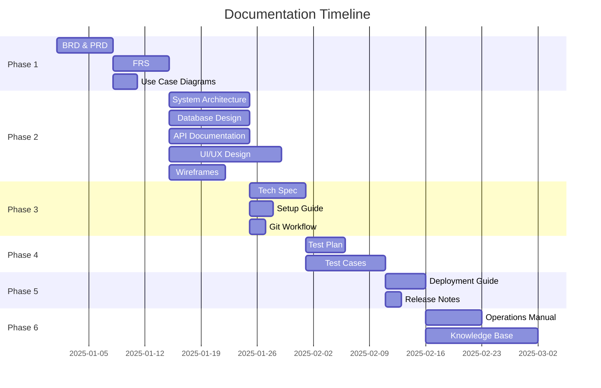

---

## ✅ Documentation Checklist

### Pre-Development

- [ ] Business Requirements documented
- [ ] Product Requirements defined
- [ ] Functional Requirements specified
- [ ] Use cases identified
- [ ] User personas created
- [ ] Success metrics defined

### Design Phase

- [ ] System architecture designed
- [ ] Database schema finalized
- [ ] API endpoints specified
- [ ] Wireframes approved
- [ ] High-fidelity mockups ready
- [ ] User flows documented
- [ ] All diagrams created (ERD, Sequence, State, etc.)

### Development Phase

- [ ] Technical specification written
- [ ] Setup guide created
- [ ] Code standards defined
- [ ] Git workflow established
- [ ] Component documentation in place

### Testing Phase

- [ ] Test plan approved
- [ ] Test cases written
- [ ] Bug report templates created
- [ ] Testing strategy defined

### Deployment Phase

- [ ] Deployment guide ready
- [ ] Release notes prepared
- [ ] Rollback plan documented
- [ ] Environment configs verified

### Maintenance Phase

- [ ] Operations manual completed
- [ ] Monitoring setup documented
- [ ] Incident response plan ready
- [ ] Knowledge base established
- [ ] User manual published

---

## 🎯 Best Practices

### 1. Documentation Best Practices

- ✅ Keep documentation close to code (same repo)
- ✅ Use version control for all docs
- ✅ Write documentation as you code
- ✅ Use clear, simple language
- ✅ Include examples and screenshots
- ✅ Keep documentation up-to-date
- ✅ Use consistent formatting
- ✅ Make documentation searchable
- ✅ Include diagrams for complex concepts
- ✅ Review documentation regularly

### 2. Diagram Best Practices

- ✅ Use standard notation (UML, BPMN)
- ✅ Keep diagrams simple and focused
- ✅ Use consistent colors and styles
- ✅ Add legends when necessary
- ✅ Include diagram versioning
- ✅ Use text-based diagrams (Mermaid) when possible
- ✅ Export diagrams in multiple formats (PNG, SVG, PDF)

### 3. API Documentation Best Practices

- ✅ Document all endpoints
- ✅ Include request/response examples
- ✅ Specify authentication requirements
- ✅ Document error codes and messages
- ✅ Provide interactive API playground
- ✅ Version API documentation
- ✅ Include rate limiting information

---

## 📖 Additional Resources

### Books

- "Clean Architecture" by Robert C. Martin
- "Software Architecture Patterns" by Mark Richards
- "The Phoenix Project" by Gene Kim
- "Database Design for Mere Mortals" by Michael J. Hernandez

### Online Courses

- [Software Development Process (Udacity)](https://www.udacity.com/course/software-development-process--ud805)
- [System Design (educative.io)](https://www.educative.io/courses/grokking-the-system-design-interview)
- [Technical Writing (Google)](https://developers.google.com/tech-writing)

### Documentation Examples

- [Stripe API Documentation](https://stripe.com/docs/api)
- [GitLab Documentation](https://docs.gitlab.com/)
- [React Native Documentation](https://reactnative.dev/docs/getting-started)
- [Firebase Documentation](https://firebase.google.com/docs)

### Diagram Resources

- [Mermaid Live Editor](https://mermaid.live/)
- [PlantUML Documentation](https://plantuml.com/)
- [UML Tutorial](https://www.tutorialspoint.com/uml/index.htm)
- [System Design Interview Resources](https://github.com/checkcheckzz/system-design-interview)

---

## 🚀 Getting Started

1. **Week 1-2: Requirements & Planning**

   - Create BRD, PRD, FRS
   - Define user personas and user stories
   - Draw use case diagrams
   - Prioritize features

2. **Week 3-4: System Design**

   - Design system architecture
   - Create database schema
   - Design API endpoints
   - Create wireframes and mockups
   - Draw all technical diagrams

3. **Week 5-8: Development**

   - Write technical specifications
   - Setup development environment
   - Implement features
   - Write unit tests
   - Document code

4. **Week 9-10: Testing**

   - Execute test plan
   - Fix bugs
   - Perform integration testing
   - Conduct E2E testing

5. **Week 11: Deployment Preparation**

   - Finalize deployment guide
   - Prepare release notes
   - Setup production environment
   - Configure monitoring

6. **Week 12+: Launch & Maintenance**
   - Deploy to production
   - Monitor system health
   - Provide user support
   - Plan next iteration

---

**Document Version**: 1.0  
**Last Updated**: October 23, 2025  
**Owner**: Development Team  
**Status**: Living Document (Updated Continuously)
