# Sơ đồ Hệ thống - Educare Connect

## Mục lục

1. [Use Case Diagram](#1-use-case-diagram)
2. [Activity Diagram](#2-activity-diagram)
3. [Sequence Diagram](#3-sequence-diagram)
4. [Class Diagram](#4-class-diagram)
5. [State Diagram](#5-state-diagram)
6. [User Flow Diagram](#6-user-flow-diagram)
7. [Component Diagram](#7-component-diagram)

---

## 1. Use Case Diagram

### 1.1. Tổng quan Hệ thống

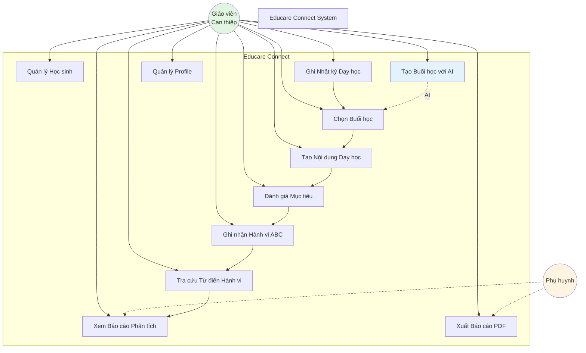
```mermaid
graph TB
    Teacher((Giáo viên<br/>Can thiệp))
    Parent((Phụ huynh))
    System[Educare Connect System]

    subgraph "Educare Connect"
        UC1[Quản lý Học sinh]
        UC2[Ghi Nhật ký Dạy học]
        UC3[Chọn Buổi học]
        UC4[Tạo Nội dung Dạy học]
        UC5[Đánh giá Mục tiêu]
        UC6[Ghi nhận Hành vi ABC]
        UC7[Tạo Buổi học với AI]
        UC8[Tra cứu Từ điển Hành vi]
        UC9[Xem Báo cáo Phân tích]
        UC10[Xuất Báo cáo PDF]
        UC11[Quản lý Profile]
    end

    Teacher --> UC1
    Teacher --> UC2
    Teacher --> UC3
    Teacher --> UC4
    Teacher --> UC5
    Teacher --> UC6
    Teacher --> UC7
    Teacher --> UC8
    Teacher --> UC9
    Teacher --> UC10
    Teacher --> UC11

    Parent -.-> UC9
    Parent -.-> UC10

    UC2 --> UC3
    UC3 --> UC4
    UC4 --> UC5
    UC5 --> UC6
    UC7 -.AI.-> UC3
    UC6 --> UC8
    UC8 --> UC9

    style Teacher fill:#e1f5e1
    style Parent fill:#fff4e1
    style UC7 fill:#e3f2fd
```

### 1.2. Use Case Chi tiết: Module 1 - Nhật ký Dạy học

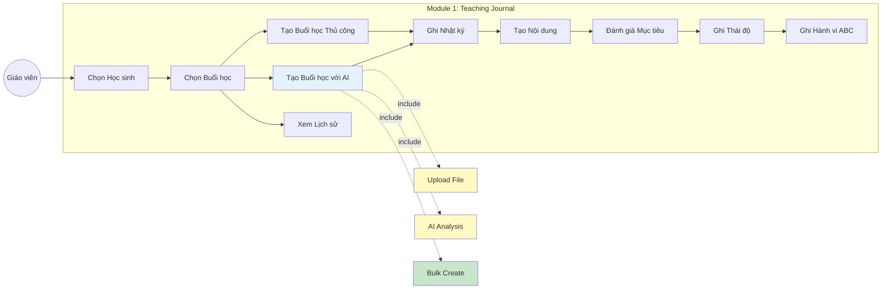
```mermaid
graph LR
    Teacher((Giáo viên))

    subgraph "Module 1: Teaching Journal"
        UC1[Chọn Học sinh]
        UC2[Chọn Buổi học]
        UC3[Tạo Buổi học Thủ công]
        UC4[Tạo Buổi học với AI]
        UC5[Ghi Nhật ký]
        UC6[Tạo Nội dung]
        UC7[Đánh giá Mục tiêu]
        UC8[Ghi Thái độ]
        UC9[Ghi Hành vi ABC]
        UC10[Xem Lịch sử]
    end

    Teacher --> UC1
    UC1 --> UC2
    UC2 --> UC3
    UC2 --> UC4
    UC3 --> UC5
    UC4 --> UC5
    UC5 --> UC6
    UC6 --> UC7
    UC7 --> UC8
    UC8 --> UC9
    UC2 --> UC10

    UC4 -.include.-> Upload[Upload File]
    UC4 -.include.-> AIAnalysis[AI Analysis]
    UC4 -.include.-> BulkCreate[Bulk Create]

    style UC4 fill:#e3f2fd
    style Upload fill:#fff9c4
    style AIAnalysis fill:#fff9c4
    style BulkCreate fill:#c8e6c9
```

### 1.3. Use Case Chi tiết: Module 2 - Từ điển & Phân tích

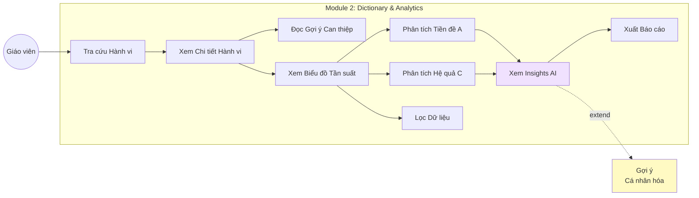
```mermaid
graph LR
    Teacher((Giáo viên))

    subgraph "Module 2: Dictionary & Analytics"
        UC1[Tra cứu Hành vi]
        UC2[Xem Chi tiết Hành vi]
        UC3[Đọc Gợi ý Can thiệp]
        UC4[Xem Biểu đồ Tần suất]
        UC5[Phân tích Tiền đề A]
        UC6[Phân tích Hệ quả C]
        UC7[Xem Insights AI]
        UC8[Xuất Báo cáo]
        UC9[Lọc Dữ liệu]
    end

    Teacher --> UC1
    UC1 --> UC2
    UC2 --> UC3
    UC2 --> UC4
    UC4 --> UC5
    UC4 --> UC6
    UC5 --> UC7
    UC6 --> UC7
    UC7 --> UC8
    UC4 --> UC9

    UC7 -.extend.-> Recommendation[Gợi ý<br/>Cá nhân hóa]

    style UC7 fill:#f0e1ff
    style Recommendation fill:#fff9c4
```

---

## 2. Activity Diagram

### 2.1. Luồng Ghi Nhật ký Hoàn chỉnh

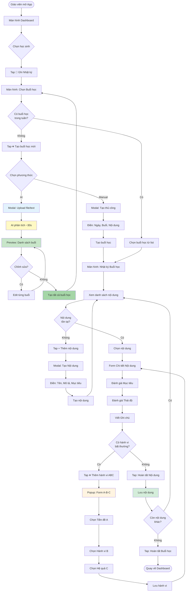
```mermaid
flowchart TD
    Start([Giáo viên mở App]) --> Dashboard[Màn hình Dashboard]
    Dashboard --> SelectStudent{Chọn học sinh}

    SelectStudent --> ClickJournal[Tap 📝 Ghi Nhật ký]
    ClickJournal --> SessionList[Màn hình: Chọn Buổi học]

    SessionList --> CheckSession{Có buổi học<br/>trong tuần?}

    CheckSession -->|Không| CreateSession[Tap ➕ Tạo buổi học mới]
    CheckSession -->|Có| SelectSession[Chọn buổi học từ list]

    CreateSession --> ChooseMethod{Chọn phương thức}

    ChooseMethod -->|Manual| ManualCreate[Modal: Tạo thủ công]
    ManualCreate --> FillSession[Điền: Ngày, Buổi, Nội dung]
    FillSession --> SaveSession[Tạo buổi học]
    SaveSession --> SessionLog

    ChooseMethod -->|AI| AIUpload[Modal: Upload file/text]
    AIUpload --> AIProcess[AI phân tích ~30s]
    AIProcess --> AIPreview[Preview: Danh sách buổi]
    AIPreview --> EditAI{Chỉnh sửa?}
    EditAI -->|Có| EditModal[Edit từng buổi]
    EditModal --> AIPreview
    EditAI -->|Không| BulkCreate[Tạo tất cả buổi học]
    BulkCreate --> SessionList

    SelectSession --> SessionLog[Màn hình: Nhật ký Buổi học]

    SessionLog --> ViewContents[Xem danh sách nội dung]
    ViewContents --> CheckContent{Nội dung<br/>tồn tại?}

    CheckContent -->|Không| AddContent[Tap + Thêm nội dung]
    AddContent --> ContentModal[Modal: Tạo Nội dung]
    ContentModal --> FillContent[Điền: Tên, Mô tả, Mục tiêu]
    FillContent --> CreateContent[Tạo nội dung]
    CreateContent --> ViewContents

    CheckContent -->|Có| SelectContent[Chọn nội dung]
    SelectContent --> ContentDetail[Form Chi tiết Nội dung]

    ContentDetail --> EvaluateGoals[Đánh giá Mục tiêu]
    EvaluateGoals --> RateAttitude[Đánh giá Thái độ]
    RateAttitude --> WriteNotes[Viết Ghi chú]
    WriteNotes --> CheckBehavior{Có hành vi<br/>bất thường?}

    CheckBehavior -->|Có| OpenABC[Tap ➕ Thêm hành vi ABC]
    OpenABC --> ABCModal[Popup: Form A-B-C]
    ABCModal --> FillA[Chọn Tiền đề A]
    FillA --> FillB[Chọn Hành vi B]
    FillB --> FillC[Chọn Hệ quả C]
    FillC --> SaveABC[Lưu hành vi]
    SaveABC --> ContentDetail

    CheckBehavior -->|Không| CompleteContent[Tap: Hoàn tất Nội dung]
    CompleteContent --> SaveContent[Lưu nội dung]
    SaveContent --> MoreContent{Còn nội dung<br/>khác?}

    MoreContent -->|Có| ViewContents
    MoreContent -->|Không| CompleteSession[Tap: Hoàn tất Buổi học]
    CompleteSession --> End([Quay về Dashboard])

    style AIUpload fill:#e3f2fd
    style AIProcess fill:#fff9c4
    style AIPreview fill:#c8e6c9
    style BulkCreate fill:#a5d6a7
    style ABCModal fill:#fff4e1
    style SaveContent fill:#d4edda
```

### 2.2. Luồng Tra cứu & Phân tích

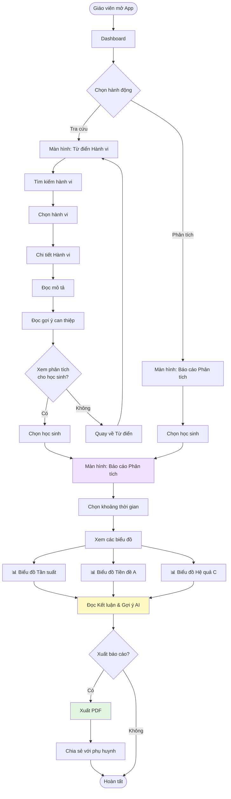
```mermaid
flowchart TD
    Start([Giáo viên mở App]) --> Dashboard[Dashboard]
    Dashboard --> ChooseAction{Chọn hành động}

    ChooseAction -->|Tra cứu| Dictionary[Màn hình: Từ điển Hành vi]
    ChooseAction -->|Phân tích| DirectAnalysis[Màn hình: Báo cáo Phân tích]

    Dictionary --> SearchBehavior[Tìm kiếm hành vi]
    SearchBehavior --> SelectBehavior[Chọn hành vi]
    SelectBehavior --> BehaviorDetail[Chi tiết Hành vi]

    BehaviorDetail --> ReadInfo[Đọc mô tả]
    ReadInfo --> ReadInterventions[Đọc gợi ý can thiệp]
    ReadInterventions --> ViewAnalysis{Xem phân tích<br/>cho học sinh?}

    ViewAnalysis -->|Có| SelectStudent[Chọn học sinh]
    SelectStudent --> Analytics[Màn hình: Báo cáo Phân tích]

    ViewAnalysis -->|Không| BackToDictionary[Quay về Từ điển]
    BackToDictionary --> Dictionary

    DirectAnalysis --> SelectStudentDirect[Chọn học sinh]
    SelectStudentDirect --> Analytics

    Analytics --> SelectPeriod[Chọn khoảng thời gian]
    SelectPeriod --> ViewCharts[Xem các biểu đồ]

    ViewCharts --> Chart1[📊 Biểu đồ Tần suất]
    ViewCharts --> Chart2[📊 Biểu đồ Tiền đề A]
    ViewCharts --> Chart3[📊 Biểu đồ Hệ quả C]

    Chart1 --> Insights[Đọc Kết luận & Gợi ý AI]
    Chart2 --> Insights
    Chart3 --> Insights

    Insights --> ExportOption{Xuất báo cáo?}

    ExportOption -->|Có| ExportPDF[Xuất PDF]
    ExportPDF --> ShareReport[Chia sẻ với phụ huynh]
    ShareReport --> End([Hoàn tất])

    ExportOption -->|Không| End

    style Analytics fill:#f0e1ff
    style Insights fill:#fff9c4
    style ExportPDF fill:#e1f5e1
```

### 2.3. Luồng AI Lesson Creation

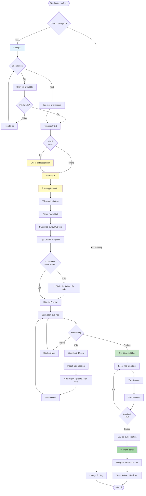
```mermaid
flowchart TD
    Start([Bắt đầu tạo buổi học]) --> ChooseMethod{Chọn phương thức}

    ChooseMethod -->|✍️ Thủ công| ManualFlow[Luồng thủ công]
    ChooseMethod -->|🤖 AI| AIFlow[Luồng AI]

    AIFlow --> UploadChoice{Chọn nguồn}

    UploadChoice -->|File| PickFile[Chọn file từ thiết bị]
    UploadChoice -->|Text| PasteText[Dán text từ clipboard]

    PickFile --> ValidateFile{File hợp lệ?}
    ValidateFile -->|Không| ErrorMsg[Hiển thị lỗi]
    ErrorMsg --> UploadChoice

    ValidateFile -->|Có| ExtractText[Trích xuất text]
    PasteText --> ExtractText

    ExtractText --> CheckOCR{File là<br/>ảnh?}
    CheckOCR -->|Có| OCRProcess[OCR: Text recognition]
    CheckOCR -->|Không| AIAnalyze
    OCRProcess --> AIAnalyze[AI Analysis]

    AIAnalyze --> Processing[⏳ Đang phân tích...]
    Processing --> ExtractStructure[Trích xuất cấu trúc]
    ExtractStructure --> ParseDates[Parse: Ngày, Buổi]
    ParseDates --> ParseContents[Parse: Nội dung, Mục tiêu]
    ParseContents --> GenerateTemplates[Tạo Lesson Templates]

    GenerateTemplates --> CheckConfidence{Confidence<br/>score > 80%?}

    CheckConfidence -->|Thấp| ShowWarning[⚠️ Cảnh báo: Độ tin cậy thấp]
    ShowWarning --> ShowPreview
    CheckConfidence -->|Cao| ShowPreview[Hiển thị Preview]

    ShowPreview --> ListTemplates[Danh sách buổi học]
    ListTemplates --> UserAction{Hành động}

    UserAction -->|Edit| SelectTemplate[Chọn buổi để sửa]
    SelectTemplate --> EditModal[Modal: Edit Session]
    EditModal --> EditFields[Sửa: Ngày, Nội dung, Mục tiêu]
    EditFields --> SaveEdit[Lưu thay đổi]
    SaveEdit --> ListTemplates

    UserAction -->|Delete| DeleteTemplate[Xóa buổi học]
    DeleteTemplate --> ListTemplates

    UserAction -->|Confirm| BulkCreate[Tạo tất cả buổi học]

    BulkCreate --> CreateLoop[Loop: Tạo từng buổi]
    CreateLoop --> CreateSession[Tạo Session]
    CreateSession --> CreateContents[Tạo Contents]
    CreateContents --> CheckMore{Còn buổi<br/>nào?}

    CheckMore -->|Có| CreateLoop
    CheckMore -->|Không| LogBulk[Lưu log bulk_creation]

    LogBulk --> Success[✅ Thành công!]
    Success --> Navigate[Navigate về Session List]
    Navigate --> ShowToast[Toast: Đã tạo X buổi học]
    ShowToast --> End([Hoàn tất])

    ManualFlow --> End

    style AIFlow fill:#e3f2fd
    style Processing fill:#fff9c4
    style OCRProcess fill:#fff9c4
    style AIAnalyze fill:#fff9c4
    style BulkCreate fill:#c8e6c9
    style Success fill:#a5d6a7
```

---

## 3. Sequence Diagram

### 3.1. Ghi Nhật ký Buổi học

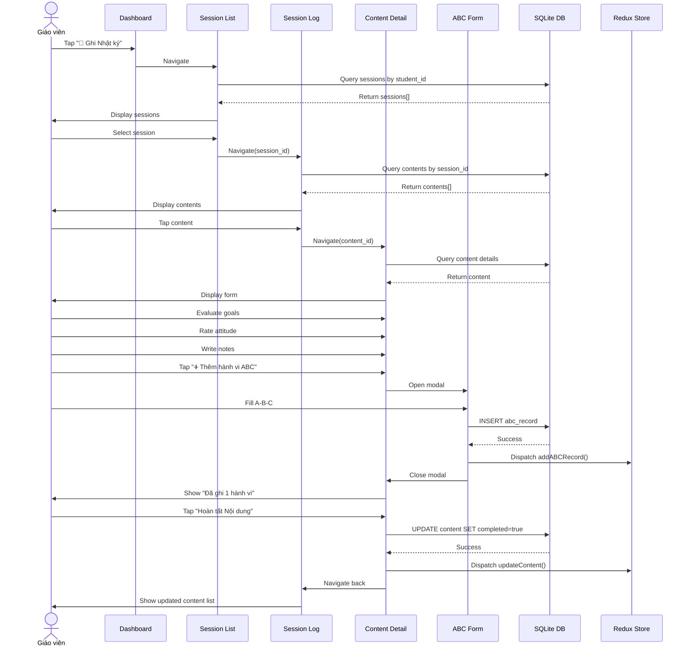
```mermaid
sequenceDiagram
    actor Teacher as Giáo viên
    participant Dashboard
    participant SessionList as Session List
    participant SessionLog as Session Log
    participant ContentForm as Content Detail
    participant ABCModal as ABC Form
    participant DB as SQLite DB
    participant Redux as Redux Store

    Teacher->>Dashboard: Tap "📝 Ghi Nhật ký"
    Dashboard->>SessionList: Navigate

    SessionList->>DB: Query sessions by student_id
    DB-->>SessionList: Return sessions[]
    SessionList->>Teacher: Display sessions

    Teacher->>SessionList: Select session
    SessionList->>SessionLog: Navigate(session_id)

    SessionLog->>DB: Query contents by session_id
    DB-->>SessionLog: Return contents[]
    SessionLog->>Teacher: Display contents

    Teacher->>SessionLog: Tap content
    SessionLog->>ContentForm: Navigate(content_id)

    ContentForm->>DB: Query content details
    DB-->>ContentForm: Return content
    ContentForm->>Teacher: Display form

    Teacher->>ContentForm: Evaluate goals
    Teacher->>ContentForm: Rate attitude
    Teacher->>ContentForm: Write notes

    Teacher->>ContentForm: Tap "➕ Thêm hành vi ABC"
    ContentForm->>ABCModal: Open modal

    Teacher->>ABCModal: Fill A-B-C
    ABCModal->>DB: INSERT abc_record
    DB-->>ABCModal: Success
    ABCModal->>Redux: Dispatch addABCRecord()
    ABCModal->>ContentForm: Close modal

    ContentForm->>Teacher: Show "Đã ghi 1 hành vi"

    Teacher->>ContentForm: Tap "Hoàn tất Nội dung"
    ContentForm->>DB: UPDATE content SET completed=true
    DB-->>ContentForm: Success
    ContentForm->>Redux: Dispatch updateContent()
    ContentForm->>SessionLog: Navigate back

    SessionLog->>Teacher: Show updated content list
```

### 3.2. AI Lesson Creation

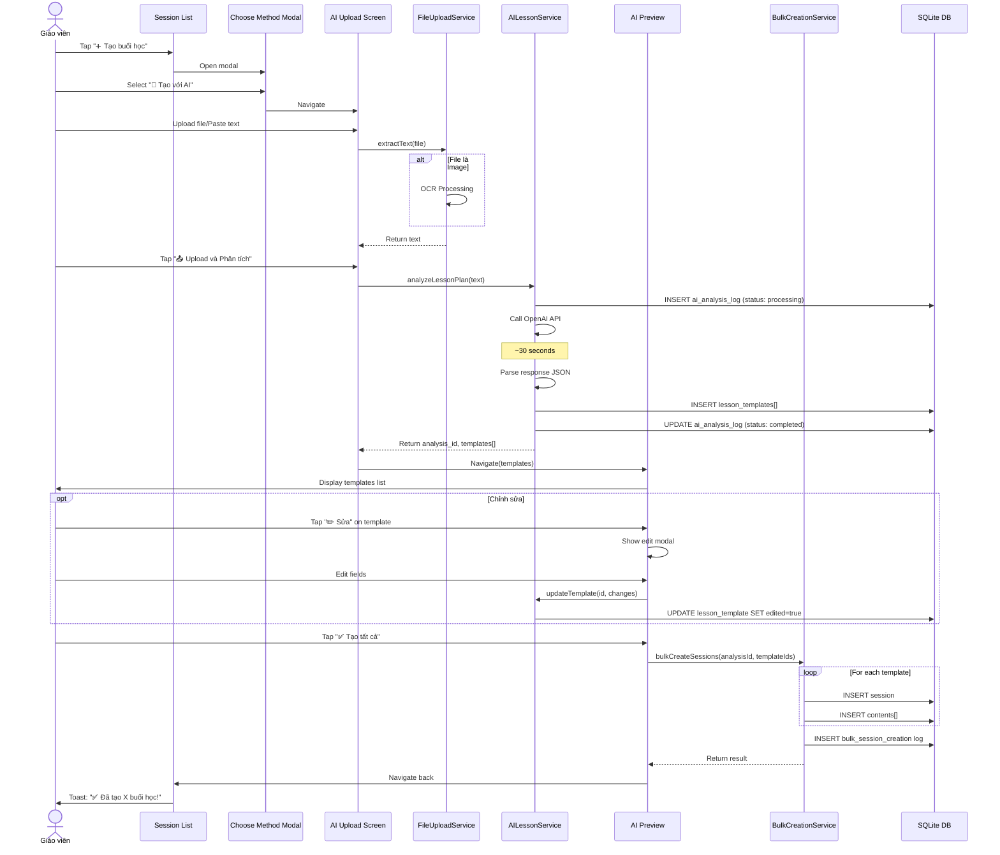
```mermaid
sequenceDiagram
    actor Teacher as Giáo viên
    participant SessionList as Session List
    participant ChooseModal as Choose Method Modal
    participant AIUpload as AI Upload Screen
    participant FileService as FileUploadService
    participant AIService as AILessonService
    participant AIPreview as AI Preview
    participant BulkService as BulkCreationService
    participant DB as SQLite DB

    Teacher->>SessionList: Tap "➕ Tạo buổi học"
    SessionList->>ChooseModal: Open modal

    Teacher->>ChooseModal: Select "🤖 Tạo với AI"
    ChooseModal->>AIUpload: Navigate

    Teacher->>AIUpload: Upload file/Paste text
    AIUpload->>FileService: extractText(file)

    alt File là Image
        FileService->>FileService: OCR Processing
    end

    FileService-->>AIUpload: Return text

    Teacher->>AIUpload: Tap "📤 Upload và Phân tích"
    AIUpload->>AIService: analyzeLessonPlan(text)

    AIService->>DB: INSERT ai_analysis_log (status: processing)
    AIService->>AIService: Call OpenAI API
    Note over AIService: ~30 seconds

    AIService->>AIService: Parse response JSON
    AIService->>DB: INSERT lesson_templates[]
    AIService->>DB: UPDATE ai_analysis_log (status: completed)

    AIService-->>AIUpload: Return analysis_id, templates[]
    AIUpload->>AIPreview: Navigate(templates)

    AIPreview->>Teacher: Display templates list

    opt Chỉnh sửa
        Teacher->>AIPreview: Tap "✏️ Sửa" on template
        AIPreview->>AIPreview: Show edit modal
        Teacher->>AIPreview: Edit fields
        AIPreview->>AIService: updateTemplate(id, changes)
        AIService->>DB: UPDATE lesson_template SET edited=true
    end

    Teacher->>AIPreview: Tap "✅ Tạo tất cả"
    AIPreview->>BulkService: bulkCreateSessions(analysisId, templateIds)

    loop For each template
        BulkService->>DB: INSERT session
        BulkService->>DB: INSERT contents[]
    end

    BulkService->>DB: INSERT bulk_session_creation log
    BulkService-->>AIPreview: Return result

    AIPreview->>SessionList: Navigate back
    SessionList->>Teacher: Toast: "✅ Đã tạo X buổi học!"
```

### 3.3. Tra cứu & Phân tích

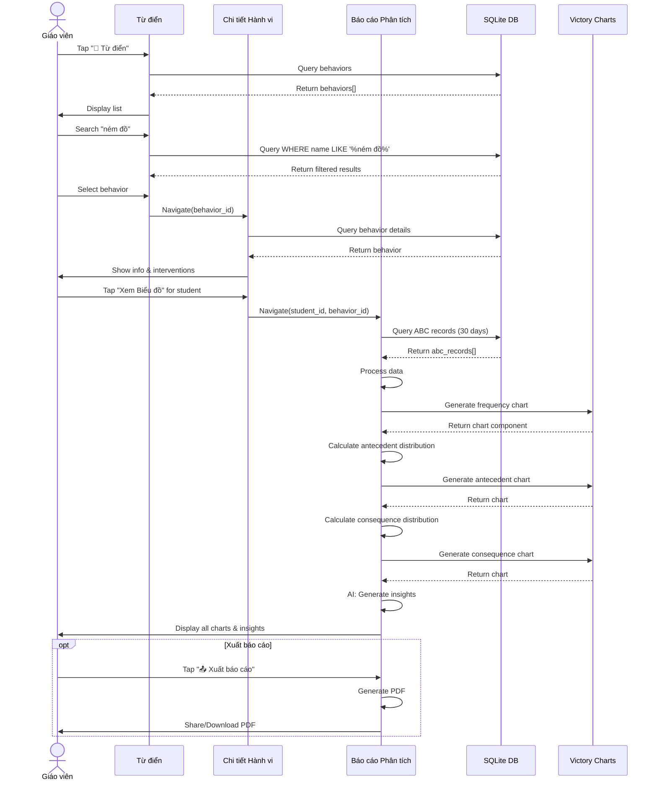
```mermaid
sequenceDiagram
    actor Teacher as Giáo viên
    participant Dictionary as Từ điển
    participant BehaviorDetail as Chi tiết Hành vi
    participant Analytics as Báo cáo Phân tích
    participant DB as SQLite DB
    participant ChartEngine as Victory Charts

    Teacher->>Dictionary: Tap "📖 Từ điển"
    Dictionary->>DB: Query behaviors
    DB-->>Dictionary: Return behaviors[]
    Dictionary->>Teacher: Display list

    Teacher->>Dictionary: Search "ném đồ"
    Dictionary->>DB: Query WHERE name LIKE '%ném đồ%'
    DB-->>Dictionary: Return filtered results

    Teacher->>Dictionary: Select behavior
    Dictionary->>BehaviorDetail: Navigate(behavior_id)

    BehaviorDetail->>DB: Query behavior details
    DB-->>BehaviorDetail: Return behavior
    BehaviorDetail->>Teacher: Show info & interventions

    Teacher->>BehaviorDetail: Tap "Xem Biểu đồ" for student
    BehaviorDetail->>Analytics: Navigate(student_id, behavior_id)

    Analytics->>DB: Query ABC records (30 days)
    DB-->>Analytics: Return abc_records[]

    Analytics->>Analytics: Process data
    Analytics->>ChartEngine: Generate frequency chart
    ChartEngine-->>Analytics: Return chart component

    Analytics->>Analytics: Calculate antecedent distribution
    Analytics->>ChartEngine: Generate antecedent chart
    ChartEngine-->>Analytics: Return chart

    Analytics->>Analytics: Calculate consequence distribution
    Analytics->>ChartEngine: Generate consequence chart
    ChartEngine-->>Analytics: Return chart

    Analytics->>Analytics: AI: Generate insights
    Analytics->>Teacher: Display all charts & insights

    opt Xuất báo cáo
        Teacher->>Analytics: Tap "📤 Xuất báo cáo"
        Analytics->>Analytics: Generate PDF
        Analytics->>Teacher: Share/Download PDF
    end
```

---

## 4. Class Diagram

### 4.1. Domain Model

```mermaid
classDiagram
    class Teacher {
        +string id
        +string name
        +string email
        +string avatar_url
        +Date created_at
        +manageStudents()
        +createSession()
        +viewAnalytics()
    }

    class Student {
        +string id
        +string teacher_id
        +string full_name
        +string nickname
        +int age
        +string gender
        +string avatar_url
        +Date date_of_birth
        +string diagnosis
        +boolean is_active
        +getSessions()
        +getABCRecords()
    }

    class Session {
        +string id
        +string student_id
        +Date session_date
        +string session_time
        +string time_range
        +string status
        +Date created_at
        +Date updated_at
        +addContent()
        +complete()
        +isCompleted()
    }

    class Content {
        +string id
        +string session_id
        +string title
        +string description
        +Goal[] goals
        +int order_number
        +boolean completed
        +Date completed_at
        +evaluate()
        +addABCRecord()
    }

    class Goal {
        +string id
        +string text
        +string achievement
        +boolean achieved
    }

    class ABCRecord {
        +string id
        +string student_id
        +string content_id
        +string behavior_id
        +string antecedent
        +string behavior
        +string consequence
        +string intensity
        +Date timestamp
        +linkBehavior()
    }

    class BehaviorDictionary {
        +string id
        +string name
        +string category
        +string description
        +string[] functions
        +Intervention[] interventions
        +int usage_count
        +search()
        +getDetails()
    }

    class Intervention {
        +string title
        +string description
        +string example
    }

    class AIAnalysisLog {
        +string id
        +string teacher_id
        +string file_name
        +string file_type
        +string original_text
        +ExtractedData extracted_data
        +string status
        +int processing_time_ms
        +analyze()
    }

    class LessonTemplate {
        +string id
        +string analysis_id
        +Date lesson_date
        +string session_time
        +ContentTemplate[] contents
        +int confidence_score
        +boolean edited
        +edit()
        +delete()
    }

    class BulkSessionCreation {
        +string id
        +string teacher_id
        +string student_id
        +string analysis_id
        +string[] session_ids
        +int total_sessions
        +int success_count
        +int failed_count
        +createAll()
    }

    Teacher "1" --> "0..*" Student : manages
    Student "1" --> "0..*" Session : has
    Session "1" --> "0..*" Content : contains
    Content "1" --> "1..*" Goal : has
    Content "1" --> "0..*" ABCRecord : has
    Student "1" --> "0..*" ABCRecord : generates
    ABCRecord "0..*" --> "1" BehaviorDictionary : references
    BehaviorDictionary "1" --> "0..*" Intervention : provides
    Teacher "1" --> "0..*" AIAnalysisLog : creates
    AIAnalysisLog "1" --> "0..*" LessonTemplate : produces
    AIAnalysisLog "1" --> "0..*" BulkSessionCreation : generates
    BulkSessionCreation "1" --> "0..*" Session : creates
```

### 4.2. Service Layer Architecture

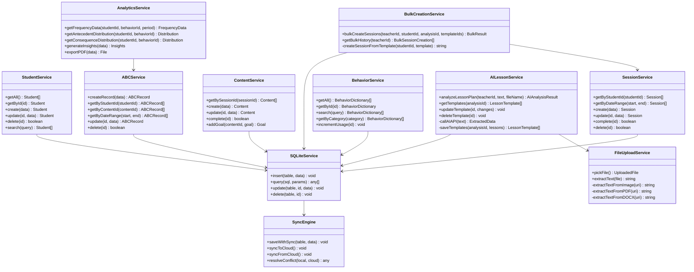
```mermaid
classDiagram
    class StudentService {
        +getAll() Student[]
        +getById(id) Student
        +create(data) Student
        +update(id, data) Student
        +delete(id) boolean
        +search(query) Student[]
    }

    class SessionService {
        +getByStudentId(studentId) Session[]
        +getByDateRange(start, end) Session[]
        +create(data) Session
        +update(id, data) Session
        +complete(id) boolean
        +delete(id) boolean
    }

    class ContentService {
        +getBySessionId(sessionId) Content[]
        +create(data) Content
        +update(id, data) Content
        +complete(id) boolean
        +addGoal(contentId, goal) Goal
    }

    class ABCService {
        +createRecord(data) ABCRecord
        +getByStudentId(studentId) ABCRecord[]
        +getByContentId(contentId) ABCRecord[]
        +getByDateRange(start, end) ABCRecord[]
        +update(id, data) ABCRecord
        +delete(id) boolean
    }

    class BehaviorService {
        +getAll() BehaviorDictionary[]
        +getById(id) BehaviorDictionary
        +search(query) BehaviorDictionary[]
        +getByCategory(category) BehaviorDictionary[]
        +incrementUsage(id) void
    }

    class AnalyticsService {
        +getFrequencyData(studentId, behaviorId, period) FrequencyData
        +getAntecedentDistribution(studentId, behaviorId) Distribution
        +getConsequenceDistribution(studentId, behaviorId) Distribution
        +generateInsights(data) Insights
        +exportPDF(data) File
    }

    class AILessonService {
        +analyzeLessonPlan(teacherId, text, fileName) AIAnalysisResult
        +getTemplates(analysisId) LessonTemplate[]
        +updateTemplate(id, changes) void
        +deleteTemplate(id) void
        -callAIAPI(text) ExtractedData
        -saveTemplates(analysisId, lessons) LessonTemplate[]
    }

    class FileUploadService {
        +pickFile() UploadedFile
        +extractText(file) string
        -extractTextFromImage(uri) string
        -extractTextFromPDF(uri) string
        -extractTextFromDOCX(uri) string
    }

    class BulkCreationService {
        +bulkCreateSessions(teacherId, studentId, analysisId, templateIds) BulkResult
        +getBulkHistory(teacherId) BulkSessionCreation[]
        -createSessionFromTemplate(studentId, template) string
    }

    class SQLiteService {
        +insert(table, data) void
        +query(sql, params) any[]
        +update(table, id, data) void
        +delete(table, id) void
    }

    class SyncEngine {
        +saveWithSync(table, data) void
        +syncToCloud() void
        +syncFromCloud() void
        +resolveConflict(local, cloud) any
    }

    StudentService --> SQLiteService
    SessionService --> SQLiteService
    ContentService --> SQLiteService
    ABCService --> SQLiteService
    BehaviorService --> SQLiteService
    AnalyticsService --> ABCService
    AILessonService --> SQLiteService
    AILessonService --> FileUploadService
    BulkCreationService --> SQLiteService
    BulkCreationService --> SessionService

    SQLiteService --> SyncEngine
```

---

## 5. State Diagram

### 5.1. Session State Machine

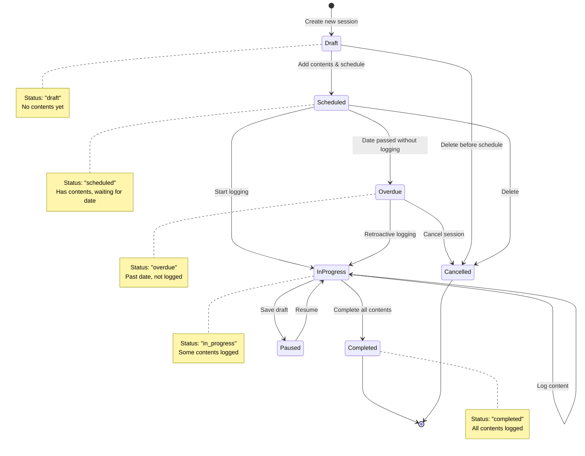
```mermaid
stateDiagram-v2
    [*] --> Draft : Create new session

    Draft --> Scheduled : Add contents & schedule
    Scheduled --> InProgress : Start logging
    InProgress --> InProgress : Log content
    InProgress --> Completed : Complete all contents
    InProgress --> Paused : Save draft
    Paused --> InProgress : Resume

    Completed --> [*]

    Scheduled --> Overdue : Date passed without logging
    Overdue --> InProgress : Retroactive logging
    Overdue --> Cancelled : Cancel session

    Draft --> Cancelled : Delete before schedule
    Scheduled --> Cancelled : Delete

    Cancelled --> [*]

    note right of Draft
        Status: "draft"
        No contents yet
    end note

    note right of Scheduled
        Status: "scheduled"
        Has contents, waiting for date
    end note

    note right of InProgress
        Status: "in_progress"
        Some contents logged
    end note

    note right of Completed
        Status: "completed"
        All contents logged
    end note

    note right of Overdue
        Status: "overdue"
        Past date, not logged
    end note
```

### 5.2. AI Analysis State Machine

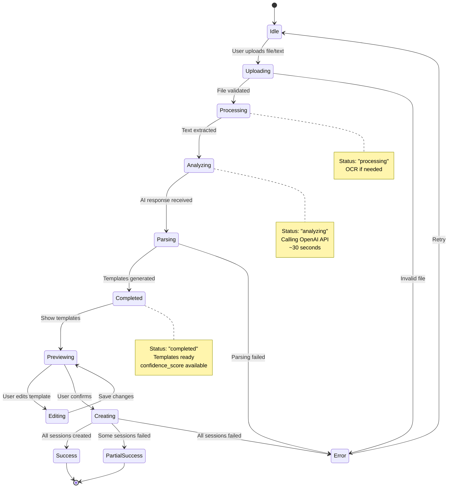
```mermaid
stateDiagram-v2
    [*] --> Idle

    Idle --> Uploading : User uploads file/text
    Uploading --> Processing : File validated
    Uploading --> Error : Invalid file

    Processing --> Analyzing : Text extracted
    Analyzing --> Parsing : AI response received
    Parsing --> Completed : Templates generated
    Parsing --> Error : Parsing failed

    Completed --> Previewing : Show templates
    Previewing --> Editing : User edits template
    Editing --> Previewing : Save changes
    Previewing --> Creating : User confirms

    Creating --> Success : All sessions created
    Creating --> PartialSuccess : Some sessions failed
    Creating --> Error : All sessions failed

    Success --> [*]
    PartialSuccess --> [*]
    Error --> Idle : Retry

    note right of Processing
        Status: "processing"
        OCR if needed
    end note

    note right of Analyzing
        Status: "analyzing"
        Calling OpenAI API
        ~30 seconds
    end note

    note right of Completed
        Status: "completed"
        Templates ready
        confidence_score available
    end note
```

### 5.3. Content Evaluation State

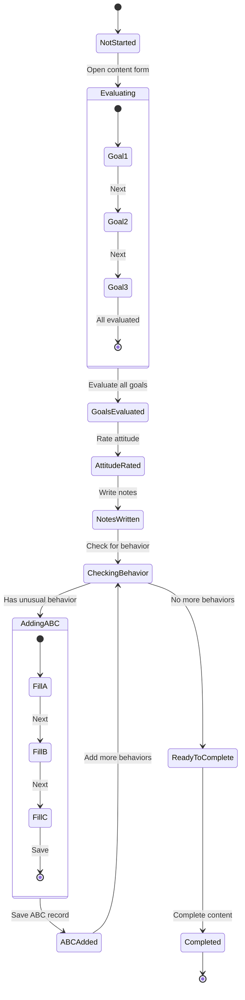
```mermaid
stateDiagram-v2
    [*] --> NotStarted

    NotStarted --> Evaluating : Open content form

    Evaluating --> GoalsEvaluated : Evaluate all goals
    GoalsEvaluated --> AttitudeRated : Rate attitude
    AttitudeRated --> NotesWritten : Write notes

    NotesWritten --> CheckingBehavior : Check for behavior

    CheckingBehavior --> AddingABC : Has unusual behavior
    AddingABC --> ABCAdded : Save ABC record
    ABCAdded --> CheckingBehavior : Add more behaviors

    CheckingBehavior --> ReadyToComplete : No more behaviors
    ReadyToComplete --> Completed : Complete content

    Completed --> [*]

    state Evaluating {
        [*] --> Goal1
        Goal1 --> Goal2 : Next
        Goal2 --> Goal3 : Next
        Goal3 --> [*] : All evaluated
    }

    state AddingABC {
        [*] --> FillA
        FillA --> FillB : Next
        FillB --> FillC : Next
        FillC --> [*] : Save
    }
```

---

## 6. User Flow Diagram

### 6.1. Complete User Journey Map

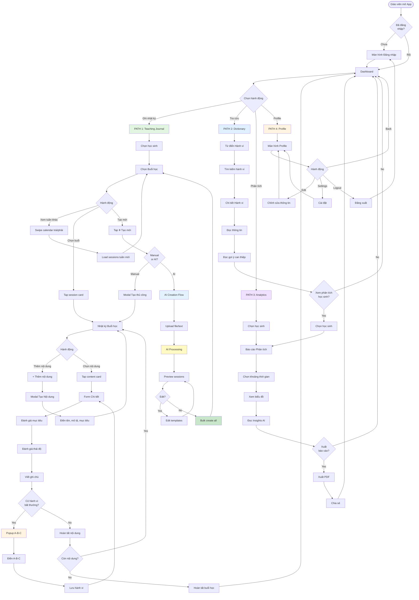
```mermaid
graph TB
    Start([Giáo viên mở App]) --> Login{Đã đăng<br/>nhập?}

    Login -->|Chưa| LoginScreen[Màn hình Đăng nhập]
    LoginScreen --> Dashboard
    Login -->|Rồi| Dashboard[Dashboard]

    Dashboard --> Action{Chọn hành động}

    Action -->|Ghi nhật ký| Path1[PATH 1: Teaching Journal]
    Action -->|Tra cứu| Path2[PATH 2: Dictionary]
    Action -->|Phân tích| Path3[PATH 3: Analytics]
    Action -->|Profile| Path4[PATH 4: Profile]

    %% PATH 1: Teaching Journal
    Path1 --> SelectStudent1[Chọn học sinh]
    SelectStudent1 --> SessionList[Chọn Buổi học]

    SessionList --> SessionAction{Hành động}
    SessionAction -->|Xem tuần khác| SwipeCalendar[Swipe calendar trái/phải]
    SwipeCalendar --> LoadWeek[Load sessions tuần mới]
    LoadWeek --> SessionList

    SessionAction -->|Chọn buổi| SelectSession[Tap session card]
    SelectSession --> SessionLog[Nhật ký Buổi học]

    SessionAction -->|Tạo mới| CreateNew[Tap ➕ Tạo mới]
    CreateNew --> ChooseMethod{Manual<br/>or AI?}

    ChooseMethod -->|Manual| ManualCreate[Modal Tạo thủ công]
    ManualCreate --> SessionLog

    ChooseMethod -->|AI| AIFlow[AI Creation Flow]
    AIFlow --> AIUpload[Upload file/text]
    AIUpload --> AIProcess[AI Processing]
    AIProcess --> AIPreview[Preview sessions]
    AIPreview --> EditCheck{Edit?}
    EditCheck -->|Yes| EditTemplate[Edit templates]
    EditTemplate --> AIPreview
    EditCheck -->|No| BulkCreate[Bulk create all]
    BulkCreate --> SessionList

    SessionLog --> ContentAction{Hành động}
    ContentAction -->|Thêm nội dung| AddContent[+ Thêm nội dung]
    AddContent --> ContentModal[Modal Tạo Nội dung]
    ContentModal --> FillContent[Điền tên, mô tả, mục tiêu]
    FillContent --> SessionLog

    ContentAction -->|Chọn nội dung| SelectContent[Tap content card]
    SelectContent --> ContentDetail[Form Chi tiết]

    ContentDetail --> Evaluate[Đánh giá mục tiêu]
    Evaluate --> RateAttitude[Đánh giá thái độ]
    RateAttitude --> WriteNotes[Viết ghi chú]
    WriteNotes --> BehaviorCheck{Có hành vi<br/>bất thường?}

    BehaviorCheck -->|Yes| ABCModal[Popup A-B-C]
    ABCModal --> FillABC[Điền A-B-C]
    FillABC --> SaveABC[Lưu hành vi]
    SaveABC --> ContentDetail

    BehaviorCheck -->|No| CompleteContent[Hoàn tất nội dung]
    CompleteContent --> MoreContent{Còn nội dung?}
    MoreContent -->|Yes| SessionLog
    MoreContent -->|No| CompleteSession[Hoàn tất buổi học]
    CompleteSession --> Dashboard

    %% PATH 2: Dictionary
    Path2 --> Dictionary[Từ điển Hành vi]
    Dictionary --> SearchBehavior[Tìm kiếm hành vi]
    SearchBehavior --> BehaviorDetail[Chi tiết Hành vi]
    BehaviorDetail --> ReadInfo[Đọc thông tin]
    ReadInfo --> ReadIntervention[Đọc gợi ý can thiệp]
    ReadIntervention --> ToAnalytics{Xem phân tích<br/>học sinh?}
    ToAnalytics -->|Yes| SelectStudent2[Chọn học sinh]
    SelectStudent2 --> Analytics
    ToAnalytics -->|No| Dashboard

    %% PATH 3: Analytics
    Path3 --> SelectStudent3[Chọn học sinh]
    SelectStudent3 --> Analytics[Báo cáo Phân tích]
    Analytics --> SelectPeriod[Chọn khoảng thời gian]
    SelectPeriod --> ViewCharts[Xem biểu đồ]
    ViewCharts --> ReadInsights[Đọc Insights AI]
    ReadInsights --> ExportCheck{Xuất<br/>báo cáo?}
    ExportCheck -->|Yes| ExportPDF[Xuất PDF]
    ExportPDF --> Share[Chia sẻ]
    Share --> Dashboard
    ExportCheck -->|No| Dashboard

    %% PATH 4: Profile
    Path4 --> Profile[Màn hình Profile]
    Profile --> ProfileAction{Hành động}
    ProfileAction -->|Edit| EditProfile[Chỉnh sửa thông tin]
    EditProfile --> Profile
    ProfileAction -->|Settings| Settings[Cài đặt]
    Settings --> Profile
    ProfileAction -->|Logout| Logout[Đăng xuất]
    Logout --> LoginScreen
    ProfileAction -->|Back| Dashboard

    style Path1 fill:#e1f5e1
    style Path2 fill:#e1f0ff
    style Path3 fill:#f0e1ff
    style Path4 fill:#fff4e1
    style AIFlow fill:#e3f2fd
    style AIProcess fill:#fff9c4
    style BulkCreate fill:#c8e6c9
    style ABCModal fill:#fff4e1
```

### 6.2. Happy Path: Ghi nhật ký hoàn chỉnh

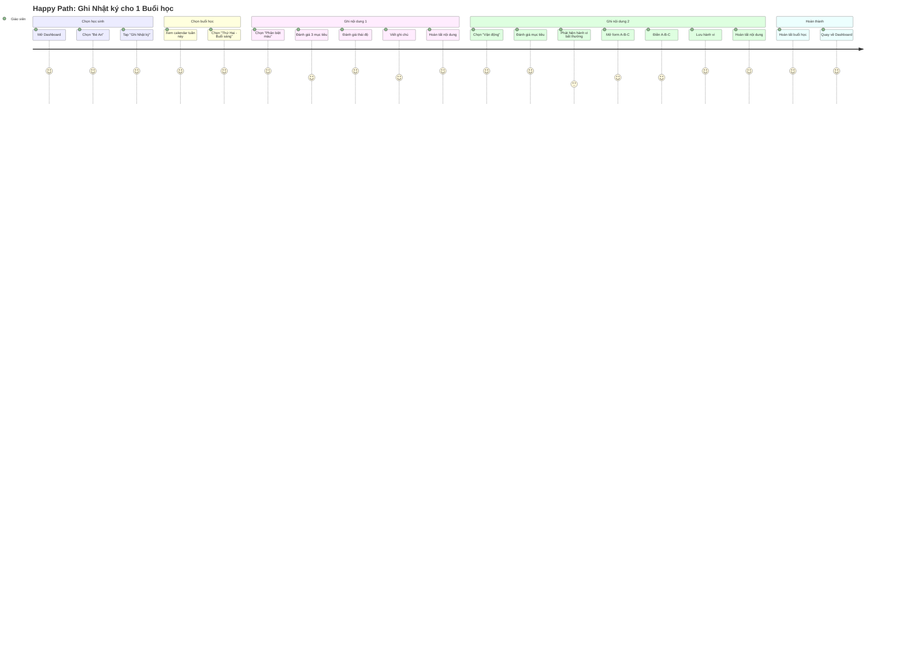
```mermaid
journey
    title Happy Path: Ghi Nhật ký cho 1 Buổi học
    section Chọn học sinh
      Mở Dashboard: 5: Giáo viên
      Chọn "Bé An": 5: Giáo viên
      Tap "Ghi Nhật ký": 5: Giáo viên
    section Chọn buổi học
      Xem calendar tuần này: 5: Giáo viên
      Chọn "Thứ Hai - Buổi sáng": 5: Giáo viên
    section Ghi nội dung 1
      Chọn "Phân biệt màu": 5: Giáo viên
      Đánh giá 3 mục tiêu: 4: Giáo viên
      Đánh giá thái độ: 5: Giáo viên
      Viết ghi chú: 4: Giáo viên
      Hoàn tất nội dung: 5: Giáo viên
    section Ghi nội dung 2
      Chọn "Vận động": 5: Giáo viên
      Đánh giá mục tiêu: 5: Giáo viên
      Phát hiện hành vi bất thường: 3: Giáo viên
      Mở form A-B-C: 4: Giáo viên
      Điền A-B-C: 4: Giáo viên
      Lưu hành vi: 5: Giáo viên
      Hoàn tất nội dung: 5: Giáo viên
    section Hoàn thành
      Hoàn tất buổi học: 5: Giáo viên
      Quay về Dashboard: 5: Giáo viên
```

### 6.3. AI Path: Tạo buổi học với AI

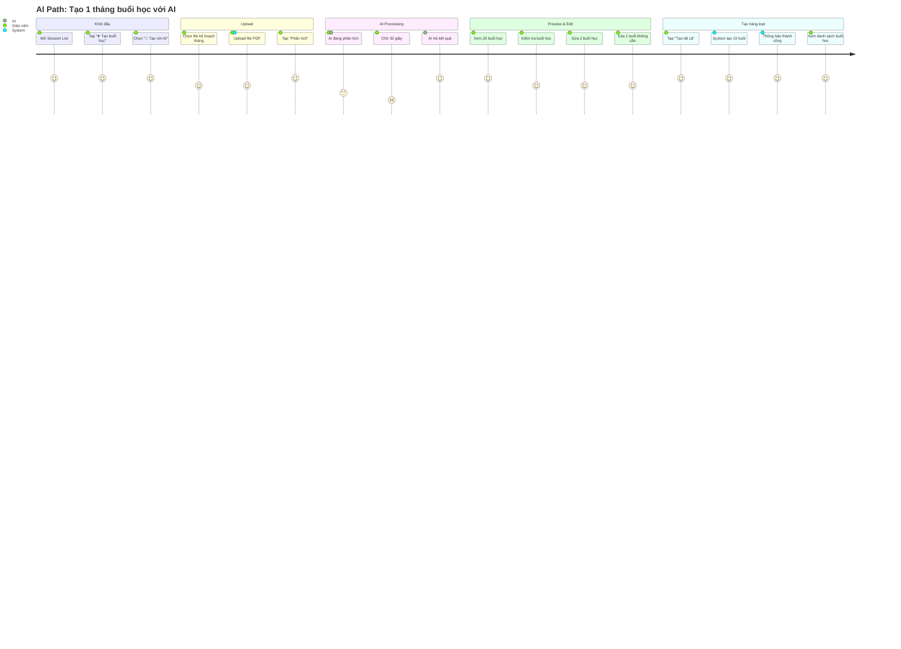
```mermaid
journey
    title AI Path: Tạo 1 tháng buổi học với AI
    section Khởi đầu
      Mở Session List: 5: Giáo viên
      Tap "➕ Tạo buổi học": 5: Giáo viên
      Chọn "🤖 Tạo với AI": 5: Giáo viên
    section Upload
      Chọn file kế hoạch tháng: 4: Giáo viên
      Upload file PDF: 4: Giáo viên, System
      Tap "Phân tích": 5: Giáo viên
    section AI Processing
      AI đang phân tích: 3: Giáo viên, AI
      Chờ 30 giây: 2: Giáo viên
      AI trả kết quả: 5: AI
    section Preview & Edit
      Xem 20 buổi học: 5: Giáo viên
      Kiểm tra buổi học: 4: Giáo viên
      Sửa 2 buổi học: 4: Giáo viên
      Xóa 1 buổi không cần: 4: Giáo viên
    section Tạo hàng loạt
      Tap "Tạo tất cả": 5: Giáo viên
      System tạo 19 buổi: 5: System
      Thông báo thành công: 5: System
      Xem danh sách buổi học: 5: Giáo viên
```

---

## 7. Component Diagram

### 7.1. React Native Component Architecture

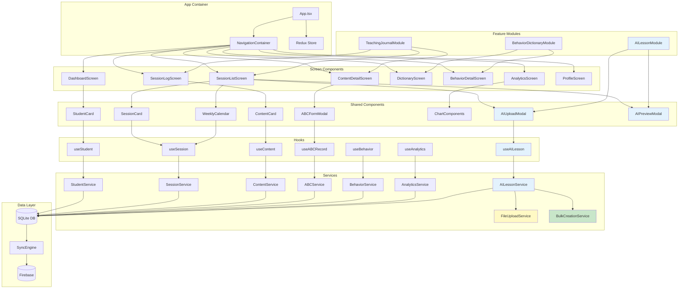
```mermaid
graph TB
    subgraph "App Container"
        App[App.tsx]
        Navigation[NavigationContainer]
        Redux[Redux Store]
    end

    subgraph "Screen Components"
        Dashboard[DashboardScreen]
        SessionList[SessionListScreen]
        SessionLog[SessionLogScreen]
        ContentDetail[ContentDetailScreen]
        Dictionary[DictionaryScreen]
        BehaviorDetail[BehaviorDetailScreen]
        Analytics[AnalyticsScreen]
        Profile[ProfileScreen]
    end

    subgraph "Feature Modules"
        TeachingJournal[TeachingJournalModule]
        BehaviorDict[BehaviorDictionaryModule]
        AILesson[AILessonModule]
    end

    subgraph "Shared Components"
        StudentCard[StudentCard]
        SessionCard[SessionCard]
        ContentCard[ContentCard]
        ABCModal[ABCFormModal]
        WeeklyCalendar[WeeklyCalendar]
        ChartComponent[ChartComponents]
        AIUploadModal[AIUploadModal]
        AIPreviewModal[AIPreviewModal]
    end

    subgraph "Hooks"
        useStudent[useStudent]
        useSession[useSession]
        useContent[useContent]
        useABC[useABCRecord]
        useBehavior[useBehavior]
        useAnalytics[useAnalytics]
        useAILesson[useAILesson]
    end

    subgraph "Services"
        StudentService[StudentService]
        SessionService[SessionService]
        ContentService[ContentService]
        ABCService[ABCService]
        BehaviorService[BehaviorService]
        AnalyticsService[AnalyticsService]
        AILessonService[AILessonService]
        FileService[FileUploadService]
        BulkService[BulkCreationService]
    end

    subgraph "Data Layer"
        SQLite[(SQLite DB)]
        Firebase[(Firebase)]
        SyncEngine[SyncEngine]
    end

    App --> Navigation
    App --> Redux
    Navigation --> Dashboard
    Navigation --> SessionList
    Navigation --> SessionLog
    Navigation --> ContentDetail
    Navigation --> Dictionary
    Navigation --> BehaviorDetail
    Navigation --> Analytics
    Navigation --> Profile

    Dashboard --> StudentCard
    SessionList --> SessionCard
    SessionList --> WeeklyCalendar
    SessionList --> AIUploadModal
    SessionList --> AIPreviewModal
    SessionLog --> ContentCard
    ContentDetail --> ABCModal
    Analytics --> ChartComponent

    TeachingJournal --> SessionList
    TeachingJournal --> SessionLog
    TeachingJournal --> ContentDetail
    BehaviorDict --> Dictionary
    BehaviorDict --> BehaviorDetail
    AILesson --> AIUploadModal
    AILesson --> AIPreviewModal

    StudentCard --> useStudent
    SessionCard --> useSession
    ContentCard --> useContent
    ABCModal --> useABC
    WeeklyCalendar --> useSession
    AIUploadModal --> useAILesson

    useStudent --> StudentService
    useSession --> SessionService
    useContent --> ContentService
    useABC --> ABCService
    useBehavior --> BehaviorService
    useAnalytics --> AnalyticsService
    useAILesson --> AILessonService

    AILessonService --> FileService
    AILessonService --> BulkService

    StudentService --> SQLite
    SessionService --> SQLite
    ContentService --> SQLite
    ABCService --> SQLite
    BehaviorService --> SQLite
    AnalyticsService --> SQLite
    AILessonService --> SQLite

    SQLite --> SyncEngine
    SyncEngine --> Firebase

    style AILesson fill:#e3f2fd
    style AIUploadModal fill:#e3f2fd
    style AIPreviewModal fill:#e3f2fd
    style useAILesson fill:#e3f2fd
    style AILessonService fill:#e3f2fd
    style FileService fill:#fff9c4
    style BulkService fill:#c8e6c9
```

### 7.2. Navigation Flow

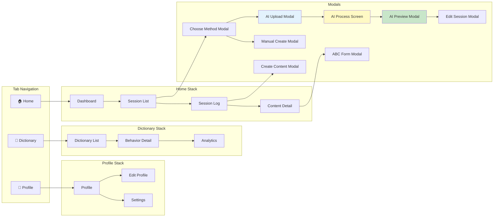
```mermaid
graph LR
    subgraph "Tab Navigation"
        Home[🏠 Home]
        Dict[📖 Dictionary]
        Prof[👤 Profile]
    end

    subgraph "Home Stack"
        Dashboard[Dashboard]
        SessionList[Session List]
        SessionLog[Session Log]
        ContentDetail[Content Detail]
    end

    subgraph "Dictionary Stack"
        DictList[Dictionary List]
        BehaviorDetail[Behavior Detail]
        Analytics1[Analytics]
    end

    subgraph "Profile Stack"
        ProfileScreen[Profile]
        Settings[Settings]
        EditProfile[Edit Profile]
    end

    subgraph "Modals"
        ChooseMethod[Choose Method Modal]
        ManualCreate[Manual Create Modal]
        AIUpload[AI Upload Modal]
        AIProcess[AI Process Screen]
        AIPreview[AI Preview Modal]
        EditSession[Edit Session Modal]
        CreateContent[Create Content Modal]
        ABCForm[ABC Form Modal]
    end

    Home --> Dashboard
    Dashboard --> SessionList
    SessionList --> SessionLog
    SessionList --> ChooseMethod
    SessionLog --> ContentDetail
    SessionLog --> CreateContent
    ContentDetail --> ABCForm

    ChooseMethod --> ManualCreate
    ChooseMethod --> AIUpload
    AIUpload --> AIProcess
    AIProcess --> AIPreview
    AIPreview --> EditSession

    Dict --> DictList
    DictList --> BehaviorDetail
    BehaviorDetail --> Analytics1

    Prof --> ProfileScreen
    ProfileScreen --> Settings
    ProfileScreen --> EditProfile

    style AIUpload fill:#e3f2fd
    style AIProcess fill:#fff9c4
    style AIPreview fill:#c8e6c9
```

---

## 8. Deployment Diagram

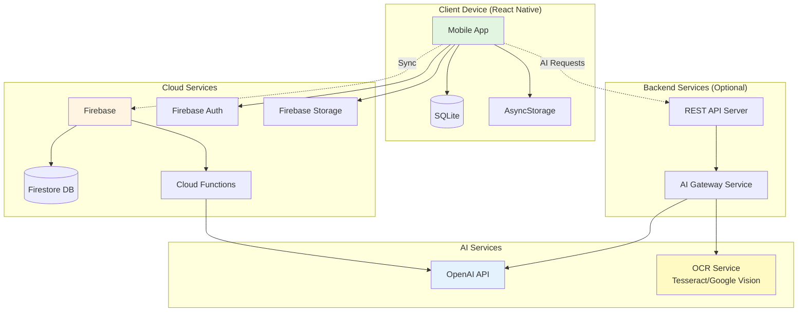
```mermaid
graph TB
    subgraph "Client Device (React Native)"
        MobileApp[Mobile App]
        LocalDB[(SQLite)]
        LocalStorage[AsyncStorage]
    end

    subgraph "Cloud Services"
        Firebase[Firebase]
        Firestore[(Firestore DB)]
        Auth[Firebase Auth]
        Storage[Firebase Storage]
        Functions[Cloud Functions]
    end

    subgraph "AI Services"
        OpenAI[OpenAI API]
        OCR[OCR Service<br/>Tesseract/Google Vision]
    end

    subgraph "Backend Services (Optional)"
        APIServer[REST API Server]
        AIGateway[AI Gateway Service]
    end

    MobileApp --> LocalDB
    MobileApp --> LocalStorage
    MobileApp -.Sync.-> Firebase
    MobileApp --> Auth
    MobileApp --> Storage

    Firebase --> Firestore
    Firebase --> Functions

    MobileApp -.AI Requests.-> APIServer
    APIServer --> AIGateway
    AIGateway --> OpenAI
    AIGateway --> OCR

    Functions --> OpenAI

    style MobileApp fill:#e1f5e1
    style Firebase fill:#fff4e1
    style OpenAI fill:#e3f2fd
    style OCR fill:#fff9c4
```

---

## Tóm tắt Các Sơ đồ

### ✅ Đã tạo:

1. **Use Case Diagram**: 3 biểu đồ

   - Tổng quan hệ thống
   - Module 1: Teaching Journal
   - Module 2: Dictionary & Analytics

2. **Activity Diagram**: 3 luồng

   - Ghi nhật ký hoàn chỉnh
   - Tra cứu & phân tích
   - AI lesson creation

3. **Sequence Diagram**: 3 tương tác

   - Ghi nhật ký buổi học
   - AI lesson creation
   - Tra cứu & phân tích

4. **Class Diagram**: 2 sơ đồ

   - Domain model (9 classes chính)
   - Service layer architecture (11 services)

5. **State Diagram**: 3 máy trạng thái

   - Session state machine
   - AI analysis state machine
   - Content evaluation state

6. **User Flow Diagram**: 3 luồng

   - Complete user journey map
   - Happy path: Ghi nhật ký
   - AI path: Tạo buổi học với AI

7. **Component Diagram**: 2 sơ đồ

   - React Native component architecture
   - Navigation flow

8. **Deployment Diagram**: Kiến trúc triển khai

**Tất cả sơ đồ sử dụng Mermaid syntax và có thể render trực tiếp trong Markdown!** 🎉
