# Tổng quan Chức năng - Educare Connect

## Giới thiệu

**Educare Connect** là ứng dụng hỗ trợ giáo viên can thiệp sớm trong việc ghi nhận, phân tích và can thiệp hành vi học sinh một cách khoa học và hiệu quả.

## Người dùng Mục tiêu

- **Chính**: Giáo viên can thiệp sớm
- **Phụ**: Phụ huynh (xem báo cáo), Chuyên gia (nhận báo cáo)

## 2 Module Chính

### Module 1: Nhật ký Dạy học & Can thiệp 📝

**Mục đích**: Ghi nhận quá trình dạy học và hành vi học sinh hàng ngày

**Chức năng chính**:

1. ✅ Quản lý danh sách học sinh
2. ✅ Tạo và theo dõi buổi học
3. ✅ Ghi nhận nội dung dạy học
4. ✅ Đánh giá mục tiêu học tập
5. ✅ Đánh giá thái độ học tập
6. ✅ Ghi nhận hành vi bất thường (A-B-C)
7. ✅ Lưu ghi chú chi tiết
8. ✅ Ghi nhật ký retroactive (Ghi cho ngày trước) — Cho phép chọn ngày khi tạo/sửa entry
9. ✅ Mini-calendar & Unlogged Sessions — Hiển thị ngày chưa ghi và cho phép mở nhanh buổi chưa ghi
10. ✅ Reminders & Local Notifications — Cấu hình nhắc nhở để giảm trường hợp quên ghi

**Lợi ích**:

- ⏱️ Tiết kiệm thời gian ghi chép
- 📊 Dữ liệu có cấu trúc, dễ phân tích
- 🎯 Theo dõi tiến trình rõ ràng
- 📱 Ghi nhận ngay tại thời điểm xảy ra

- 🔁 Hỗ trợ ghi retroactive (khi quên ghi trong ngày). Ghi chú dữ liệu:
  - recorded_for_date: ngày thực tế của buổi (dùng cho thống kê)
  - recorded_at: timestamp khi ghi nhận/ chỉnh sửa (dùng để audit)

---

### Module 2: Từ điển Giải mã Hành vi & Phân tích 📖📈

**Mục đích**: Tra cứu thông tin hành vi và phân tích dữ liệu để đưa ra can thiệp hiệu quả

**Chức năng chính**:

1. 🔍 Tra cứu từ điển hành vi
2. 📚 Xem thông tin chi tiết hành vi
3. 💡 Đọc gợi ý can thiệp chung
4. 📊 Xem biểu đồ tần suất hành vi
5. 📊 Phân tích nguyên nhân (Tiền đề - A)
6. 📊 Phân tích hệ quả (Consequence - C)
7. 🤖 Nhận kết luận & gợi ý tự động
8. 📄 Xuất báo cáo (tính năng tương lai)

**Lợi ích**:

- 📚 Kiến thức khoa học về hành vi
- 📈 Trực quan hóa xu hướng
- 🎯 Can thiệp dựa trên dữ liệu
- 💬 Giao tiếp tốt hơn với phụ huynh

---

## Phương pháp A-B-C (ABA - Applied Behavior Analysis)

### Giải thích

Phương pháp A-B-C là công cụ phân tích hành vi dựa trên khoa học ABA (Applied Behavior Analysis):

```
A (Antecedent) → B (Behavior) → C (Consequence)
   Tiền đề      →    Hành vi   →    Hệ quả
```

### A - Tiền đề (Antecedent)

**Điều gì xảy ra TRƯỚC hành vi?**

Ví dụ:

- Yêu cầu làm việc khó
- Thiếu chú ý từ người lớn
- Môi trường ồn ào
- Thay đổi lịch trình
- Cảm giác khó chịu (đói, mệt)

### B - Hành vi (Behavior)

**Hành vi cụ thể là gì?**

Ví dụ:

- Ném đồ vật
- La hét
- Tự ý rời khỏi chỗ
- Đánh người khác
- Từ chối làm việc

### C - Hệ quả (Consequence)

**Điều gì xảy ra SAU hành vi?**

Ví dụ:

- Được chú ý (từ giáo viên, bạn bè)
- Tránh được nhiệm vụ khó
- Nhận kích thích cảm giác
- Nhận đồ vật/hoạt động yêu thích

### Tại sao quan trọng?

**Hiểu chức năng hành vi** → **Can thiệp đúng đắn**

Ví dụ:

- Nếu hành vi để **tránh việc khó** → Giảm độ khó, dạy kỹ năng xin nghỉ
- Nếu hành vi để **thu hút chú ý** → Tăng chú ý khi hành vi tích cực, giảm chú ý khi hành vi tiêu cực

---

## User Journey Tổng quan

```mermaid
flowchart TD
    Start([Giáo viên mở App]) --> Login[Đăng nhập]
    Login --> Dashboard[Dashboard]

    Dashboard --> Path1{Chọn hành động}

    Path1 -->|Ghi nhật ký| M1Start[Chọn học sinh]
    M1Start --> M1Session[Ghi nhật ký buổi học]
    M1Session --> M1Content[Ghi nhận nội dung]
    M1Content --> M1ABC{Có hành vi?}
    M1ABC -->|Có| M1Record[Ghi A-B-C]
    M1ABC -->|Không| M1Save[Lưu]
    M1Record --> M1Save
    M1Save --> Dashboard

    Path1 -->|Tra cứu| M2Dict[Từ điển Hành vi]
    M2Dict --> M2Detail[Chi tiết Hành vi]
    M2Detail --> M2Analysis[Xem Phân tích]
    M2Analysis --> M2Insight[Đọc Gợi ý]
    M2Insight --> Dashboard

    Path1 -->|Xem phân tích| M2Analysis

    style M1Start fill:#e1f5e1
    style M1Session fill:#e1f5e1
    style M1Content fill:#e1f5e1
    style M1Record fill:#fff4e1
    style M2Dict fill:#e1f0ff
    style M2Analysis fill:#f0e1ff
```



---

## Tính năng Chi tiết

### 1. Dashboard (Màn hình Chính)

**Hiển thị**:

- Danh sách học sinh (dạng thẻ)
- Thông tin cơ bản: Tên, tuổi, chẩn đoán
- Trạng thái: Đã ghi nhật ký hôm nay chưa

**Hành động**:

- 📝 Ghi Nhật ký → Module 1
- 📈 Phân tích Hành vi → Module 2
- 📖 Tra cứu Từ điển → Module 2

**Navigation**:

- Bottom tab: Trang chủ | Từ điển | Cài đặt

---

### 2. Ghi Nhật ký Buổi học

**Workflow**:

```
Chọn học sinh → Xem nội dung đã lên kế hoạch →
Chọn nội dung → Điền form đánh giá →
(Nếu có hành vi) Ghi A-B-C → Lưu
```

**Form Đánh giá gồm**:

1. **Mục tiêu buổi học**: Hiển thị mục tiêu đã đặt
2. **Đánh giá mục tiêu**: Checkbox Đạt/Chưa đạt/Đang học
3. **Thái độ học tập**: Slider đánh giá (1-5)
   - Mức độ hợp tác
   - Mức độ tập trung
4. **Ghi chú giáo viên**: Văn bản tự do
5. **Ghi nhận hành vi A-B-C**: Popup form (nếu cần)

**Popup Form A-B-C**:

- Dropdown A: Chọn nhanh Tiền đề
- Dropdown B: Chọn nhanh Hành vi
- Dropdown C: Chọn nhanh Hệ quả
- Ghi chú bổ sung (tùy chọn)
- Thời gian: Tự động

**Ưu điểm**:

- ⚡ Nhanh: Dropdown chọn sẵn
- 🎯 Chuẩn: Dữ liệu có cấu trúc
- 🔗 Liên kết: A-B-C gắn với nội dung dạy học

---

### 3. Từ điển Hành vi

**Chức năng**:

- Tìm kiếm hành vi
- Lọc theo danh mục (Công kích, Tự kích thích, Tránh né, v.v.)
- Xem danh sách hành vi phổ biến
- Sắp xếp theo mức độ sử dụng

**Thông tin Chi tiết Hành vi**:

- 📄 Mô tả hành vi
- 🎯 Chức năng có thể có (4 loại: Attention, Escape, Sensory, Tangible)
- 💡 Gợi ý can thiệp chung (dựa trên bằng chứng khoa học)
- 📊 Link đến phân tích cho học sinh cụ thể

**Ví dụ Hành vi**:

1. Ném đồ vật
2. La hét / Kêu to
3. Tự ý rời khỏi chỗ
4. Đánh người khác
5. Từ chối làm việc
6. Tự gây thương tích
7. Cắn
8. ...

---

### 4. Báo cáo Phân tích Trực quan

**Nguồn dữ liệu**: Tất cả bản ghi A-B-C của học sinh (từ Module 1)

**3 Biểu đồ Chính**:

#### 4.1. Biểu đồ Tần suất

- **Loại**: Line Chart
- **Trục X**: Ngày (7 ngày / 30 ngày / Tùy chỉnh)
- **Trục Y**: Số lần hành vi
- **Hiển thị**: Trung bình, Cao nhất, Thấp nhất
- **Mục đích**: Xem xu hướng tăng/giảm

#### 4.2. Biểu đồ Tiền đề (A)

- **Loại**: Horizontal Bar Chart / Pie Chart
- **Hiển thị**: % các nguyên nhân phổ biến
- **Mục đích**: Biết nguyên nhân chính → Can thiệp đúng

Ví dụ:

```
Yêu cầu làm việc khó:     ████████ 40%
Thiếu chú ý:              ███████ 35%
Môi trường kích thích:    ███ 15%
Khác:                     ██ 10%
```

#### 4.3. Biểu đồ Hệ quả (C)

- **Loại**: Horizontal Bar Chart / Pie Chart
- **Hiển thị**: % các kết quả củng cố hành vi
- **Mục đích**: Biết hành vi được củng cố như thế nào → Thay đổi hệ quả

Ví dụ:

```
Được chú ý:               ██████████ 50%
Tránh nhiệm vụ:           ██████ 30%
Kích thích cảm giác:      ███ 15%
Khác:                     █ 5%
```

---

### 5. Kết luận & Gợi ý Tự động

**AI/Rule-based System**:

**Input**:

- Dữ liệu tần suất
- Dữ liệu Tiền đề (A)
- Dữ liệu Hệ quả (C)
- Thông tin hành vi từ từ điển

**Output**:

- 📊 Phân tích dữ liệu (thống kê)
- 📈 Xu hướng (tăng/giảm/ổn định)
- 🎯 Nguyên nhân chính
- 🔄 Hệ quả củng cố chính
- 💊 5 gợi ý can thiệp ưu tiên
- 📅 Ngày đánh giá lại (2 tuần sau)

**Ví dụ Gợi ý**:

```
📌 Phân tích:
• Hành vi xảy ra trung bình 3.2 lần/ngày
• Nguyên nhân chính: Yêu cầu làm việc khó (40%)
• Hậu quả củng cố: Được chú ý (50%)

💊 Gợi ý Can thiệp:

1. Giảm độ khó nhiệm vụ
   Chia nhỏ thành các bước đơn giản hơn

2. Dạy kỹ năng thay thế
   Dạy con xin nghỉ bằng lời nói hoặc thẻ hình

3. Tăng khen thưởng
   Khen ngay khi hoàn thành nhiệm vụ

4. Giảm chú ý khi hành vi
   Chỉ dọn dẹp, không mắng nhiều

5. Cung cấp chú ý chủ động
   Chú ý con trước khi con có hành vi
```

---

## So sánh Trước & Sau

### Trước khi có App

❌ Ghi chép thủ công trên giấy  
❌ Dữ liệu không có cấu trúc  
❌ Khó phân tích xu hướng  
❌ Mất nhiều thời gian tổng hợp  
❌ Khó chia sẻ với phụ huynh  
❌ Quyết định can thiệp chủ quan

### Sau khi có App

✅ Ghi nhận nhanh trên điện thoại  
✅ Dữ liệu có cấu trúc, chuẩn hóa  
✅ Biểu đồ trực quan, dễ hiểu  
✅ Tự động phân tích và tổng hợp  
✅ Xuất báo cáo PDF dễ dàng  
✅ Can thiệp dựa trên dữ liệu khoa học

---

## Công nghệ Sử dụng

```
React Native
├── UI Components: React Native Paper
├── Charts: Victory Native / React Native Chart Kit
├── Forms: React Hook Form + Yup
├── Navigation: React Navigation
├── State: Redux Toolkit
├── Local DB: SQLite
├── Cloud DB: Firebase Firestore
└── Offline: Redux Persist + Sync Engine
```

---

## Roadmap Tính năng

### Phiên bản Demo (v0.1) ✅

- [x] Dashboard
- [x] Ghi nhật ký buổi học
- [x] Form A-B-C
- [x] Từ điển hành vi
- [x] Báo cáo phân tích
- [x] Offline-first

### Phiên bản 1.0 (Sắp tới)

- [ ] Xuất báo cáo PDF
- [ ] Gửi email cho phụ huynh
- [ ] Lên kế hoạch buổi học
- [ ] Template nội dung dạy học
- [ ] Nhiều giáo viên cùng lớp
- [ ] Backup & Restore

### Phiên bản 2.0 (Tương lai)

- [ ] AI phân tích nâng cao
- [ ] Gợi ý can thiệp cá nhân hóa
- [ ] Video recording hành vi
- [ ] Dashboard cho phụ huynh
- [ ] Cộng đồng giáo viên
- [ ] Thư viện tài liệu

---

## Kết luận

**Educare Connect** giúp giáo viên can thiệp sớm:

- 📊 Làm việc thông minh hơn, không chỉ chăm chỉ hơn
- 🎯 Can thiệp dựa trên dữ liệu, không chỉ cảm tính
- 💬 Giao tiếp hiệu quả với phụ huynh
- 📈 Theo dõi tiến trình rõ ràng
- 🧠 Ứng dụng khoa học ABA vào thực tiễn

**Sứ mệnh**: Hỗ trợ giáo viên can thiệp sớm mang lại tương lai tốt đẹp hơn cho trẻ em có nhu cầu đặc biệt.

---

**Xem chi tiết**:

- [User Flow](./USER_FLOW.md)
- [Screen Design](./SCREEN_DESIGN.md)
- [Data Structure](./DATA_STRUCTURE.md)
- [Module Integration](./MODULE_INTEGRATION.md)
