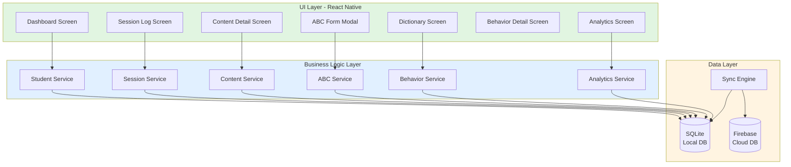

# Tích hợp Module - Educare Connect

## Mục lục

1. [Kiến trúc Tổng quan](#kiến-trúc-tổng-quan)
2. [Module 1: Nhật ký Dạy học](#module-1-nhật-ký-dạy-học--can-thiệp)
3. [Module 2: Từ điển & Phân tích](#module-2-từ-điển--phân-tích)
4. [Tích hợp giữa 2 Module](#tích-hợp-giữa-2-module)
5. [State Management](#state-management)
6. [Offline-First Strategy](#offline-first-strategy)

---

## Kiến trúc Tổng quan

### System Architecture



### Technology Stack

```
Frontend:
├── React Native (Core)
├── React Navigation (Routing)
├── Redux Toolkit (State Management)
├── React Hook Form (Form Handling)
├── React Native Paper (UI Components)
└── Victory Native (Charts)

Data:
├── SQLite (Local Database)
├── Firebase Firestore (Cloud Database)
├── Redux Persist (State Persistence)
└── AsyncStorage (Simple Key-Value)

Utils:
├── Date-fns (Date Manipulation)
├── Yup (Validation)
└── i18next (Internationalization)
```

---

## Module 1: Nhật ký Dạy học & Can thiệp

### Mục đích

- Ghi nhận quá trình dạy học hàng ngày
- Đánh giá mục tiêu học tập
- Ghi nhận hành vi A-B-C trong ngữ cảnh

### Component Structure

```
Module 1: SessionLogModule
│
├── Screens/
│   ├── SessionListScreen.tsx          # Danh sách buổi học
│   ├── SessionLogScreen.tsx           # Nhật ký buổi học
│   ├── ContentDetailScreen.tsx        # Chi tiết nội dung
│   └── ABCFormModal.tsx               # Form A-B-C
│
├── Components/
│   ├── SessionCard.tsx                # Thẻ buổi học
│   ├── ContentCard.tsx                # Thẻ nội dung
│   ├── GoalCheckbox.tsx               # Checkbox mục tiêu
│   ├── AttitudeSlider.tsx             # Thanh đánh giá thái độ
│   └── ABCQuickSelect.tsx             # Dropdown A-B-C
│
├── Hooks/
│   ├── useSession.ts                  # Hook quản lý buổi học
│   ├── useContent.ts                  # Hook quản lý nội dung
│   └── useABCRecord.ts                # Hook quản lý A-B-C
│
├── Services/
│   ├── SessionService.ts              # API calls
│   ├── ContentService.ts
│   └── ABCService.ts
│
└── Types/
    ├── session.types.ts
    ├── content.types.ts
    └── abc.types.ts
```

### Data Flow - Ghi Nhật ký


### Key Features

#### 1. Auto-save (Tự động lưu)

```typescript
// hooks/useContent.ts
import { useEffect } from "react";
import { useDebounce } from "./useDebounce";

export const useContent = (contentId: string) => {
  const [formData, setFormData] = useState<ContentFormData>();
  const debouncedFormData = useDebounce(formData, 3000); // 3s delay

  useEffect(() => {
    if (debouncedFormData) {
      ContentService.autosave(contentId, debouncedFormData);
    }
  }, [debouncedFormData]);

  return { formData, setFormData };
};
```

#### 2. Form Validation

```typescript
// validation/contentSchema.ts
import * as yup from "yup";

export const contentSchema = yup.object({
  goal_achievements: yup
    .object()
    .test(
      "all-goals-evaluated",
      "Tất cả mục tiêu phải được đánh giá",
      (value, context) => {
        const goals = context.parent.goals;
        return goals.every((goal) => value[goal.id] !== undefined);
      }
    ),
  attitudes: yup
    .object({
      overall: yup.number().min(1).max(5).required(),
      cooperation: yup
        .string()
        .oneOf(["excellent", "good", "fair", "needs_improvement"])
        .required(),
      focus: yup
        .string()
        .oneOf(["excellent", "good", "fair", "poor"])
        .required(),
    })
    .required(),
  notes: yup.string().max(500),
});
```

#### 3. ABC Quick Select

```typescript
// components/ABCQuickSelect.tsx
const antecedentOptions = [
  { value: "task_demand", label: "Yêu cầu làm việc khó" },
  { value: "lack_attention", label: "Thiếu chú ý từ người lớn" },
  { value: "overstimulation", label: "Môi trường quá kích thích" },
  // ...
];

const ABCQuickSelect = ({ field, value, onChange }) => {
  return (
    <Picker selectedValue={value} onValueChange={onChange}>
      {antecedentOptions.map((option) => (
        <Picker.Item
          key={option.value}
          label={option.label}
          value={option.value}
        />
      ))}
    </Picker>
  );
};
```

---

## Module 2: Từ điển & Phân tích

### Mục đích

- Tra cứu thông tin về hành vi
- Phân tích dữ liệu A-B-C trực quan
- Đưa ra gợi ý can thiệp

### Component Structure

```
Module 2: DictionaryAnalyticsModule
│
├── Screens/
│   ├── DictionaryScreen.tsx           # Từ điển hành vi
│   ├── BehaviorDetailScreen.tsx       # Chi tiết hành vi
│   └── AnalyticsScreen.tsx            # Báo cáo phân tích
│
├── Components/
│   ├── BehaviorCard.tsx               # Thẻ hành vi
│   ├── CategoryTabs.tsx               # Tab danh mục
│   ├── FrequencyChart.tsx             # Biểu đồ tần suất
│   ├── AntecedentChart.tsx            # Biểu đồ Tiền đề
│   ├── ConsequenceChart.tsx           # Biểu đồ Hệ quả
│   └── InsightBox.tsx                 # Kết luận & Gợi ý
│
├── Hooks/
│   ├── useBehavior.ts                 # Hook quản lý hành vi
│   ├── useAnalytics.ts                # Hook phân tích
│   └── useChartData.ts                # Hook xử lý dữ liệu biểu đồ
│
├── Services/
│   ├── BehaviorService.ts             # API calls
│   ├── AnalyticsService.ts
│   └── InsightGenerator.ts            # AI/Rule-based insights
│
└── Types/
    ├── behavior.types.ts
    └── analytics.types.ts
```

### Data Flow - Phân tích


### Key Features

#### 1. Chart Data Processing

```typescript
// hooks/useChartData.ts
import { useMemo } from "react";

export const useChartData = (
  rawData: ABCRecord[],
  type: "frequency" | "antecedent" | "consequence"
) => {
  const chartData = useMemo(() => {
    if (type === "frequency") {
      return processFrequencyData(rawData);
    } else if (type === "antecedent") {
      return processDistributionData(rawData, "antecedent_category");
    } else {
      return processDistributionData(rawData, "consequence_category");
    }
  }, [rawData, type]);

  return chartData;
};

const processFrequencyData = (records: ABCRecord[]) => {
  const grouped = groupBy(records, (r) => format(r.timestamp, "yyyy-MM-dd"));
  return Object.entries(grouped).map(([date, items]) => ({
    date: new Date(date),
    count: items.length,
  }));
};

const processDistributionData = (records: ABCRecord[], field: string) => {
  const grouped = groupBy(records, (r) => r[field]);
  const total = records.length;
  return Object.entries(grouped).map(([category, items]) => ({
    category,
    count: items.length,
    percentage: (items.length / total) * 100,
  }));
};
```

#### 2. Insight Generation (AI/Rule-based)

```typescript
// services/InsightGenerator.ts
export class InsightGenerator {
  static generateInsights(
    frequencyData: FrequencyData[],
    antecedentData: DistributionData[],
    consequenceData: DistributionData[],
    behaviorInfo: BehaviorDictionary
  ): Insight {
    // Calculate statistics
    const avgFrequency = this.calculateAverage(frequencyData);
    const trend = this.detectTrend(frequencyData);
    const topAntecedent = this.getTopCategory(antecedentData);
    const topConsequence = this.getTopCategory(consequenceData);

    // Generate analysis
    const analysis = {
      frequency: `Hành vi xảy ra trung bình ${avgFrequency.toFixed(
        1
      )} lần/ngày`,
      trend:
        trend === "increasing"
          ? "Xu hướng tăng"
          : trend === "decreasing"
          ? "Xu hướng giảm"
          : "Ổn định",
      topAntecedent: `Nguyên nhân chính: ${this.getCategoryLabel(
        topAntecedent.category
      )} (${topAntecedent.percentage.toFixed(0)}%)`,
      topConsequence: `Hậu quả củng cố: ${this.getCategoryLabel(
        topConsequence.category
      )} (${topConsequence.percentage.toFixed(0)}%)`,
    };

    // Generate interventions
    const interventions = this.generateInterventions(
      topAntecedent.category,
      topConsequence.category,
      behaviorInfo
    );

    // Generate follow-up date (2 weeks later)
    const followUpDate = addWeeks(new Date(), 2);

    return {
      analysis,
      interventions,
      followUpDate,
    };
  }

  private static generateInterventions(
    topAntecedent: string,
    topConsequence: string,
    behaviorInfo: BehaviorDictionary
  ): Intervention[] {
    const interventions: Intervention[] = [];

    // Rule-based intervention selection
    if (topAntecedent === "task_demand" && topConsequence === "escaped_task") {
      interventions.push({
        title: "Giảm độ khó nhiệm vụ",
        description: "Chia nhỏ thành các bước đơn giản hơn",
        priority: "high",
      });
      interventions.push({
        title: "Dạy kỹ năng thay thế",
        description: "Dạy con xin nghỉ bằng lời nói hoặc thẻ hình",
        priority: "high",
      });
    }

    if (topConsequence === "gained_attention") {
      interventions.push({
        title: "Giảm chú ý khi hành vi",
        description: "Chỉ dọn dẹp, không mắng hoặc giảng giải nhiều",
        priority: "medium",
      });
      interventions.push({
        title: "Tăng chú ý khi hành vi tích cực",
        description: "Khen ngay khi con có hành vi phù hợp",
        priority: "high",
      });
    }

    // Add general interventions from behavior dictionary
    behaviorInfo.interventions.slice(0, 2).forEach((int) => {
      if (!interventions.find((i) => i.title === int.title)) {
        interventions.push({
          ...int,
          priority: "low",
        });
      }
    });

    return interventions.slice(0, 5); // Top 5 interventions
  }
}
```

#### 3. Search & Filter

```typescript
// hooks/useBehaviorSearch.ts
export const useBehaviorSearch = () => {
  const [searchQuery, setSearchQuery] = useState("");
  const [selectedCategory, setSelectedCategory] = useState<string | null>(null);
  const [behaviors, setBehaviors] = useState<BehaviorDictionary[]>([]);

  const filteredBehaviors = useMemo(() => {
    let result = behaviors;

    // Filter by category
    if (selectedCategory) {
      result = result.filter((b) => b.category === selectedCategory);
    }

    // Filter by search query
    if (searchQuery) {
      const query = searchQuery.toLowerCase();
      result = result.filter(
        (b) =>
          b.name.toLowerCase().includes(query) ||
          b.description.toLowerCase().includes(query)
      );
    }

    // Sort by usage count
    return result.sort((a, b) => b.usage_count - a.usage_count);
  }, [behaviors, searchQuery, selectedCategory]);

  return {
    searchQuery,
    setSearchQuery,
    selectedCategory,
    setSelectedCategory,
    filteredBehaviors,
  };
};
```

---

## Tích hợp giữa 2 Module

### Data Sharing


### Cross-Module Navigation

```typescript
// navigation/RootNavigator.tsx
import { createNativeStackNavigator } from "@react-navigation/native-stack";

export type RootStackParamList = {
  // Module 1
  Dashboard: undefined;
  SessionLog: { studentId: string; sessionId: string };
  ContentDetail: { contentId: string };

  // Module 2
  Dictionary: undefined;
  BehaviorDetail: { behaviorId: string };
  Analytics: { studentId: string; behaviorId?: string };
};

const Stack = createNativeStackNavigator<RootStackParamList>();

// Cross-module navigation example
const navigateFromDictionaryToAnalytics = (
  navigation,
  behaviorId,
  studentId
) => {
  navigation.navigate("Analytics", { studentId, behaviorId });
};

const navigateFromContentToAnalytics = (navigation, studentId) => {
  navigation.navigate("Analytics", { studentId });
};
```

### Shared Components

```typescript
// components/shared/StudentSelector.tsx
// Used in both modules to select student

export const StudentSelector = ({ onSelect }) => {
  const students = useSelector(selectStudents);

  return (
    <View>
      {students.map((student) => (
        <StudentCard
          key={student.id}
          student={student}
          onPress={() => onSelect(student)}
        />
      ))}
    </View>
  );
};
```

### Event Bus (Optional)

```typescript
// utils/eventBus.ts
// For cross-module communication

import { EventEmitter } from "events";

class AppEventBus extends EventEmitter {}

export const eventBus = new AppEventBus();

// Events
export const Events = {
  ABC_RECORD_CREATED: "abc_record_created",
  SESSION_COMPLETED: "session_completed",
  BEHAVIOR_VIEWED: "behavior_viewed",
};

// Module 1: Emit event when ABC record created
eventBus.emit(Events.ABC_RECORD_CREATED, { studentId, behaviorId });

// Module 2: Listen for new ABC records
eventBus.on(Events.ABC_RECORD_CREATED, ({ studentId, behaviorId }) => {
  // Refresh analytics data
  refreshAnalytics(studentId, behaviorId);
});
```

---

## State Management

### Redux Store Structure

```typescript
// store/index.ts
import { configureStore } from "@reduxjs/toolkit";
import { persistStore, persistReducer } from "redux-persist";
import AsyncStorage from "@react-native-async-storage/async-storage";

import authReducer from "./slices/authSlice";
import studentsReducer from "./slices/studentsSlice";
import sessionsReducer from "./slices/sessionsSlice";
import contentsReducer from "./slices/contentsSlice";
import abcRecordsReducer from "./slices/abcRecordsSlice";
import behaviorsReducer from "./slices/behaviorsSlice";
import analyticsReducer from "./slices/analyticsSlice";

const persistConfig = {
  key: "root",
  storage: AsyncStorage,
  whitelist: ["auth", "students"], // Only persist these
};

export const store = configureStore({
  reducer: {
    auth: persistReducer(persistConfig, authReducer),
    students: persistReducer(persistConfig, studentsReducer),
    sessions: sessionsReducer,
    contents: contentsReducer,
    abcRecords: abcRecordsReducer,
    behaviors: behaviorsReducer,
    analytics: analyticsReducer,
  },
  middleware: (getDefaultMiddleware) =>
    getDefaultMiddleware({
      serializableCheck: {
        ignoredActions: ["persist/PERSIST"],
      },
    }),
});

export const persistor = persistStore(store);

export type RootState = ReturnType<typeof store.getState>;
export type AppDispatch = typeof store.dispatch;
```

### Slice Example

```typescript
// store/slices/abcRecordsSlice.ts
import { createSlice, createAsyncThunk } from "@reduxjs/toolkit";
import { ABCService } from "../../services/ABCService";

interface ABCRecordsState {
  records: ABCRecord[];
  loading: boolean;
  error: string | null;
}

const initialState: ABCRecordsState = {
  records: [],
  loading: false,
  error: null,
};

export const fetchABCRecords = createAsyncThunk(
  "abcRecords/fetch",
  async ({
    studentId,
    startDate,
    endDate,
  }: {
    studentId: string;
    startDate: Date;
    endDate: Date;
  }) => {
    const records = await ABCService.getRecords(studentId, startDate, endDate);
    return records;
  }
);

export const createABCRecord = createAsyncThunk(
  "abcRecords/create",
  async (data: CreateABCRecordDTO) => {
    const record = await ABCService.createRecord(data);
    return record;
  }
);

const abcRecordsSlice = createSlice({
  name: "abcRecords",
  initialState,
  reducers: {
    clearRecords: (state) => {
      state.records = [];
    },
  },
  extraReducers: (builder) => {
    builder
      .addCase(fetchABCRecords.pending, (state) => {
        state.loading = true;
        state.error = null;
      })
      .addCase(fetchABCRecords.fulfilled, (state, action) => {
        state.loading = false;
        state.records = action.payload;
      })
      .addCase(fetchABCRecords.rejected, (state, action) => {
        state.loading = false;
        state.error = action.error.message || "Failed to fetch records";
      })
      .addCase(createABCRecord.fulfilled, (state, action) => {
        state.records.push(action.payload);
      });
  },
});

export const { clearRecords } = abcRecordsSlice.actions;
export default abcRecordsSlice.reducer;

// Selectors
export const selectABCRecords = (state: RootState) => state.abcRecords.records;
export const selectABCRecordsLoading = (state: RootState) =>
  state.abcRecords.loading;
```

---

## Offline-First Strategy

### Architecture

```
┌─────────────────────────────────────┐
│         UI Components               │
└────────────┬────────────────────────┘
             │
┌────────────▼────────────────────────┐
│      Redux Store (State)            │
└────────────┬────────────────────────┘
             │
┌────────────▼────────────────────────┐
│      Service Layer                  │
└────────┬───────────────┬────────────┘
         │               │
┌────────▼──────┐ ┌─────▼────────────┐
│ SQLite (Local)│ │ Firebase (Cloud) │
└───────────────┘ └──────────────────┘
         ▲               ▲
         │               │
         └───────┬───────┘
         ┌───────▼───────┐
         │  Sync Engine  │
         └───────────────┘
```

### Sync Strategy

```typescript
// services/SyncEngine.ts
import NetInfo from "@react-native-community/netinfo";

export class SyncEngine {
  private static syncQueue: SyncItem[] = [];
  private static isSyncing = false;

  static async init() {
    // Monitor network status
    NetInfo.addEventListener((state) => {
      if (state.isConnected && !this.isSyncing) {
        this.syncPendingChanges();
      }
    });

    // Periodic sync (every 5 minutes)
    setInterval(() => {
      this.syncPendingChanges();
    }, 5 * 60 * 1000);
  }

  static async saveWithSync(table: string, data: any) {
    // Always save to local first
    const localRecord = await SQLiteService.insert(table, data);

    // Add to sync queue
    this.syncQueue.push({
      table,
      operation: "insert",
      data: localRecord,
      timestamp: new Date(),
    });

    // Try to sync immediately
    this.syncPendingChanges();

    return localRecord;
  }

  private static async syncPendingChanges() {
    const networkState = await NetInfo.fetch();
    if (!networkState.isConnected || this.isSyncing) {
      return;
    }

    this.isSyncing = true;

    try {
      while (this.syncQueue.length > 0) {
        const item = this.syncQueue[0];

        // Sync to Firebase
        await this.syncToFirebase(item);

        // Remove from queue
        this.syncQueue.shift();
      }
    } catch (error) {
      console.error("Sync error:", error);
      // Keep items in queue for retry
    } finally {
      this.isSyncing = false;
    }
  }

  private static async syncToFirebase(item: SyncItem) {
    const { table, operation, data } = item;

    if (operation === "insert") {
      await firebase.firestore().collection(table).doc(data.id).set(data);
    } else if (operation === "update") {
      await firebase.firestore().collection(table).doc(data.id).update(data);
    } else if (operation === "delete") {
      await firebase.firestore().collection(table).doc(data.id).delete();
    }
  }
}
```

### Service Layer with Offline Support

```typescript
// services/ABCService.ts
export class ABCService {
  static async createRecord(data: CreateABCRecordDTO): Promise<ABCRecord> {
    // Generate local ID
    const localId = `abc_${Date.now()}_${Math.random()}`;

    const record: ABCRecord = {
      id: localId,
      ...data,
      created_at: new Date(),
      updated_at: new Date(),
    };

    // Save to local DB (always succeeds even offline)
    await SQLiteService.insert("abc_record", record);

    // Queue for sync to cloud
    SyncEngine.saveWithSync("abc_record", record);

    // Update Redux store immediately
    store.dispatch(addABCRecord(record));

    return record;
  }

  static async getRecords(
    studentId: string,
    startDate: Date,
    endDate: Date
  ): Promise<ABCRecord[]> {
    // Always read from local DB (fast, works offline)
    const records = await SQLiteService.query(
      `
            SELECT * FROM abc_record
            WHERE student_id = ? 
              AND timestamp BETWEEN ? AND ?
            ORDER BY timestamp DESC
        `,
      [studentId, startDate.toISOString(), endDate.toISOString()]
    );

    return records;
  }
}
```

### Conflict Resolution

```typescript
// services/ConflictResolver.ts
export class ConflictResolver {
  static async resolveConflict(
    localRecord: any,
    cloudRecord: any
  ): Promise<any> {
    // Strategy: Last write wins
    if (localRecord.updated_at > cloudRecord.updated_at) {
      // Local is newer, upload to cloud
      await firebase
        .firestore()
        .collection(localRecord._table)
        .doc(localRecord.id)
        .set(localRecord);
      return localRecord;
    } else {
      // Cloud is newer, update local
      await SQLiteService.update(
        cloudRecord._table,
        cloudRecord.id,
        cloudRecord
      );
      return cloudRecord;
    }
  }
}
```

---

## Error Handling

### Global Error Boundary

```typescript
// components/ErrorBoundary.tsx
import React, { Component, ErrorInfo, ReactNode } from "react";

interface Props {
  children: ReactNode;
}

interface State {
  hasError: boolean;
  error?: Error;
}

export class ErrorBoundary extends Component<Props, State> {
  constructor(props: Props) {
    super(props);
    this.state = { hasError: false };
  }

  static getDerivedStateFromError(error: Error): State {
    return { hasError: true, error };
  }

  componentDidCatch(error: Error, errorInfo: ErrorInfo) {
    console.error("ErrorBoundary caught:", error, errorInfo);
    // Log to error reporting service
    // Sentry.captureException(error, { extra: errorInfo });
  }

  render() {
    if (this.state.hasError) {
      return (
        <View style={styles.container}>
          <Text style={styles.title}>Đã xảy ra lỗi</Text>
          <Text style={styles.message}>{this.state.error?.message}</Text>
          <Button
            title="Tải lại"
            onPress={() => this.setState({ hasError: false })}
          />
        </View>
      );
    }

    return this.props.children;
  }
}
```

### Service Error Handling

```typescript
// services/BaseService.ts
export class BaseService {
  protected static async handleError(error: any): Promise<never> {
    if (error.code === "SQLITE_ERROR") {
      throw new DatabaseError(error.message);
    } else if (error.code === "NETWORK_ERROR") {
      throw new NetworkError("Không thể kết nối. Vui lòng kiểm tra mạng.");
    } else if (error.code === "VALIDATION_ERROR") {
      throw new ValidationError(error.message);
    } else {
      throw new AppError("Đã xảy ra lỗi. Vui lòng thử lại.");
    }
  }
}
```

---

## Performance Optimization

### Lazy Loading

```typescript
// navigation/RootNavigator.tsx
import React, { lazy, Suspense } from "react";

const DictionaryScreen = lazy(() => import("../screens/DictionaryScreen"));
const AnalyticsScreen = lazy(() => import("../screens/AnalyticsScreen"));

const LazyScreen = ({ component: Component, ...props }) => (
  <Suspense fallback={<LoadingScreen />}>
    <Component {...props} />
  </Suspense>
);
```

### Memoization

```typescript
// components/charts/FrequencyChart.tsx
import React, { useMemo } from "react";

export const FrequencyChart = ({ data }: { data: FrequencyData[] }) => {
  const chartData = useMemo(() => {
    return data.map((d) => ({
      x: d.date,
      y: d.count,
    }));
  }, [data]);

  return <VictoryLine data={chartData} />;
};
```

### Virtual List

```typescript
// screens/DictionaryScreen.tsx
import { FlatList } from "react-native";

export const DictionaryScreen = () => {
  const behaviors = useBehaviors();

  return (
    <FlatList
      data={behaviors}
      renderItem={({ item }) => <BehaviorCard behavior={item} />}
      keyExtractor={(item) => item.id}
      initialNumToRender={10}
      maxToRenderPerBatch={10}
      windowSize={5}
    />
  );
};
```

---

## Testing Strategy

### Unit Tests

```typescript
// services/__tests__/ABCService.test.ts
import { ABCService } from "../ABCService";
import { SQLiteService } from "../SQLiteService";

jest.mock("../SQLiteService");

describe("ABCService", () => {
  it("should create ABC record", async () => {
    const mockRecord = {
      student_id: "student_001",
      antecedent: "task_demand",
      behavior: "throwing",
      consequence: "escaped_task",
      timestamp: new Date(),
    };

    SQLiteService.insert = jest.fn().mockResolvedValue({
      id: "abc_001",
      ...mockRecord,
    });

    const result = await ABCService.createRecord(mockRecord);

    expect(result.id).toBe("abc_001");
    expect(SQLiteService.insert).toHaveBeenCalledWith(
      "abc_record",
      expect.any(Object)
    );
  });
});
```

### Integration Tests

```typescript
// __tests__/integration/SessionFlow.test.tsx
import { render, fireEvent, waitFor } from "@testing-library/react-native";
import { SessionLogScreen } from "../screens/SessionLogScreen";

describe("Session Flow", () => {
  it("should complete content with ABC record", async () => {
    const { getByText, getByTestId } = render(<SessionLogScreen />);

    // Select content
    fireEvent.press(getByText("Phân biệt màu sắc"));

    // Fill form
    fireEvent.press(getByTestId("goal-checkbox-1"));
    fireEvent.changeText(getByTestId("notes-input"), "Test note");

    // Add ABC record
    fireEvent.press(getByText("➕ Thêm ghi nhận hành vi"));
    fireEvent.press(getByText("Yêu cầu làm việc khó"));
    fireEvent.press(getByText("Ném đồ vật"));
    fireEvent.press(getByText("Tránh nhiệm vụ"));
    fireEvent.press(getByText("Lưu hành vi"));

    // Complete content
    fireEvent.press(getByText("Hoàn tất Nội dung"));

    await waitFor(() => {
      expect(getByText("Đã hoàn thành")).toBeTruthy();
    });
  });
});
```

---

## Deployment Checklist

### Pre-launch

- [ ] Test on real devices (iOS & Android)
- [ ] Test offline functionality
- [ ] Test sync after reconnection
- [ ] Performance testing (load 100+ records)
- [ ] Accessibility testing (VoiceOver/TalkBack)
- [ ] Security audit (data encryption)
- [ ] Privacy compliance (GDPR/local laws)
- [ ] Beta testing with real teachers
- [ ] Documentation complete
- [ ] Tutorial/Onboarding flow

### Post-launch

- [ ] Error monitoring setup (Sentry)
- [ ] Analytics setup (Firebase Analytics)
- [ ] Crash reporting (Crashlytics)
- [ ] Feedback mechanism
- [ ] Regular backups
- [ ] Version update strategy
- [ ] Support channel

---

**Kết thúc tài liệu**: Bộ tài liệu thiết kế hoàn chỉnh cho Educare Connect.
