# Tích hợp Module - Educare Connect

## Mục lục

1. [Kiến trúc Tổng quan](#kiến-trúc-tổng-quan)
2. [Module 1: Nhật ký Dạy học](#module-1-nhật-ký-dạy-học--can-thiệp)
3. [Module 2: Từ điển & Phân tích](#module-2-từ-điển--phân-tích)
4. [Tích hợp giữa 2 Module](#tích-hợp-giữa-2-module)
5. [State Management](#state-management)
6. [Offline-First Strategy](#offline-first-strategy)

---

## Kiến trúc Tổng quan

### System Architecture

```mermaid
flowchart TB
    subgraph UI["UI Layer - React Native"]
        Dashboard[Dashboard Screen]
        SessionLog[Session Log Screen]
        ContentDetail[Content Detail Screen]
        ABCModal[ABC Form Modal]
        Dictionary[Dictionary Screen]
        BehaviorDetail[Behavior Detail Screen]
        Analytics[Analytics Screen]
    end

    subgraph BL["Business Logic Layer"]
        StudentService[Student Service]
        SessionService[Session Service]
        ContentService[Content Service]
        ABCService[ABC Service]
        BehaviorService[Behavior Service]
        AnalyticsService[Analytics Service]
        AILessonService[🤖 AI Lesson Service]
        FileUploadService[📂 File Upload Service]
        BulkCreationService[⚡ Bulk Creation Service]
    end

    subgraph DL["Data Layer"]
        LocalDB[(SQLite<br/>Local DB)]
        CloudDB[(Firebase<br/>Cloud DB)]
        SyncEngine[Sync Engine]
    end

    Dashboard --> StudentService
    SessionLog --> SessionService
    ContentDetail --> ContentService
    ABCModal --> ABCService
    Dictionary --> BehaviorService
    Analytics --> AnalyticsService

    StudentService --> LocalDB
    SessionService --> LocalDB
    ContentService --> LocalDB
    ABCService --> LocalDB
    BehaviorService --> LocalDB
    AnalyticsService --> LocalDB

    SyncEngine --> LocalDB
    SyncEngine --> CloudDB

    style UI fill:#e1f5e1
    style BL fill:#e1f0ff
    style DL fill:#fff4e1
```



### Technology Stack

```
Frontend:
├── React Native (Core)
├── React Navigation (Routing)
├── Redux Toolkit (State Management)
├── React Hook Form (Form Handling)
├── React Native Paper (UI Components)
└── Victory Native (Charts)

Data:
├── SQLite (Local Database)
├── Firebase Firestore (Cloud Database)
├── Redux Persist (State Persistence)
└── AsyncStorage (Simple Key-Value)

Utils:
├── Date-fns (Date Manipulation)
├── Yup (Validation)
└── i18next (Internationalization)
```

---

## Module 1: Nhật ký Dạy học & Can thiệp

### Mục đích

- Ghi nhận quá trình dạy học hàng ngày
- Đánh giá mục tiêu học tập
- Ghi nhận hành vi A-B-C trong ngữ cảnh

### Component Structure

```
Module 1: SessionLogModule
│
├── Screens/
│   ├── SessionListScreen.tsx          # Danh sách buổi học
│   ├── SessionLogScreen.tsx           # Nhật ký buổi học
│   ├── ContentDetailScreen.tsx        # Chi tiết nội dung
│   └── ABCFormModal.tsx               # Form A-B-C
│
├── Components/
│   ├── SessionCard.tsx                # Thẻ buổi học
│   ├── ContentCard.tsx                # Thẻ nội dung
│   ├── GoalCheckbox.tsx               # Checkbox mục tiêu
│   ├── AttitudeSlider.tsx             # Thanh đánh giá thái độ
│   └── ABCQuickSelect.tsx             # Dropdown A-B-C
│
├── Hooks/
│   ├── useSession.ts                  # Hook quản lý buổi học
│   ├── useContent.ts                  # Hook quản lý nội dung
│   └── useABCRecord.ts                # Hook quản lý A-B-C
│
├── Services/
│   ├── SessionService.ts              # API calls
│   ├── ContentService.ts
│   ├── ABCService.ts
│   ├── AILessonService.ts             # 🤖 AI lesson analysis
│   ├── FileUploadService.ts           # 📂 File handling & OCR
│   └── BulkCreationService.ts         # ⚡ Bulk session creation
│
└── Types/
    ├── session.types.ts
    ├── content.types.ts
    └── abc.types.ts
```

### Data Flow - Ghi Nhật ký

```mermaid
sequenceDiagram
    participant UI as ContentDetailScreen
    participant Hook as useContent
    participant Service as ContentService
    participant DB as SQLite

    UI->>UI: User điền form đánh giá
    UI->>UI: User nhấn "➕ Thêm Hành vi A-B-C"

    UI->>Hook: openABCModal()
    Hook->>UI: Show ABCFormModal

    UI->>UI: User điền A-B-C form
    UI->>Hook: saveABCRecord(data)

    Hook->>Service: createABCRecord(data)
    Service->>DB: INSERT INTO abc_record
    DB-->>Service: Record created
    Service-->>Hook: ABCRecord

    Hook-->>UI: Update state (ABC added)
    UI->>UI: Hiển thị "Đã ghi nhận 1 hành vi"

    UI->>UI: User nhấn "Hoàn tất Nội dung"
    UI->>Hook: completeContent(data)

    Hook->>Service: updateContent(id, data)
    Service->>DB: UPDATE content SET ...
    DB-->>Service: Updated
    Service-->>Hook: Content

    Hook-->>UI: Navigate back to SessionLog
    UI->>UI: Refresh content list
```



### Key Features

#### 1. Auto-save (Tự động lưu)

```typescript
// hooks/useContent.ts
import { useEffect } from "react";
import { useDebounce } from "./useDebounce";

export const useContent = (contentId: string) => {
  const [formData, setFormData] = useState<ContentFormData>();
  const debouncedFormData = useDebounce(formData, 3000); // 3s delay

  useEffect(() => {
    if (debouncedFormData) {
      ContentService.autosave(contentId, debouncedFormData);
    }
  }, [debouncedFormData]);

  return { formData, setFormData };
};
```

#### 2. Form Validation

```typescript
// validation/contentSchema.ts
import * as yup from "yup";

export const contentSchema = yup.object({
  goal_achievements: yup
    .object()
    .test(
      "all-goals-evaluated",
      "Tất cả mục tiêu phải được đánh giá",
      (value, context) => {
        const goals = context.parent.goals;
        return goals.every((goal) => value[goal.id] !== undefined);
      }
    ),
  attitudes: yup
    .object({
      overall: yup.number().min(1).max(5).required(),
      cooperation: yup
        .string()
        .oneOf(["excellent", "good", "fair", "needs_improvement"])
        .required(),
      focus: yup
        .string()
        .oneOf(["excellent", "good", "fair", "poor"])
        .required(),
    })
    .required(),
  notes: yup.string().max(500),
});
```

#### 3. ABC Quick Select

```typescript
// components/ABCQuickSelect.tsx
const antecedentOptions = [
  { value: "task_demand", label: "Yêu cầu làm việc khó" },
  { value: "lack_attention", label: "Thiếu chú ý từ người lớn" },
  { value: "overstimulation", label: "Môi trường quá kích thích" },
  // ...
];

const ABCQuickSelect = ({ field, value, onChange }) => {
  return (
    <Picker selectedValue={value} onValueChange={onChange}>
      {antecedentOptions.map((option) => (
        <Picker.Item
          key={option.value}
          label={option.label}
          value={option.value}
        />
      ))}
    </Picker>
  );
};
```

---

## Module 2: Từ điển & Phân tích

### Mục đích

- Tra cứu thông tin về hành vi
- Phân tích dữ liệu A-B-C trực quan
- Đưa ra gợi ý can thiệp

### Component Structure

```
Module 2: DictionaryAnalyticsModule
│
├── Screens/
│   ├── DictionaryScreen.tsx           # Từ điển hành vi
│   ├── BehaviorDetailScreen.tsx       # Chi tiết hành vi
│   └── AnalyticsScreen.tsx            # Báo cáo phân tích
│
├── Components/
│   ├── BehaviorCard.tsx               # Thẻ hành vi
│   ├── CategoryTabs.tsx               # Tab danh mục
│   ├── FrequencyChart.tsx             # Biểu đồ tần suất
│   ├── AntecedentChart.tsx            # Biểu đồ Tiền đề
│   ├── ConsequenceChart.tsx           # Biểu đồ Hệ quả
│   └── InsightBox.tsx                 # Kết luận & Gợi ý
│
├── Hooks/
│   ├── useBehavior.ts                 # Hook quản lý hành vi
│   ├── useAnalytics.ts                # Hook phân tích
│   └── useChartData.ts                # Hook xử lý dữ liệu biểu đồ
│
├── Services/
│   ├── BehaviorService.ts             # API calls
│   ├── AnalyticsService.ts
│   └── InsightGenerator.ts            # AI/Rule-based insights
│
└── Types/
    ├── behavior.types.ts
    └── analytics.types.ts
```

### Data Flow - Phân tích


### Key Features

#### 1. Chart Data Processing

```typescript
// hooks/useChartData.ts
import { useMemo } from "react";

export const useChartData = (
  rawData: ABCRecord[],
  type: "frequency" | "antecedent" | "consequence"
) => {
  const chartData = useMemo(() => {
    if (type === "frequency") {
      return processFrequencyData(rawData);
    } else if (type === "antecedent") {
      return processDistributionData(rawData, "antecedent_category");
    } else {
      return processDistributionData(rawData, "consequence_category");
    }
  }, [rawData, type]);

  return chartData;
};

const processFrequencyData = (records: ABCRecord[]) => {
  const grouped = groupBy(records, (r) => format(r.timestamp, "yyyy-MM-dd"));
  return Object.entries(grouped).map(([date, items]) => ({
    date: new Date(date),
    count: items.length,
  }));
};

const processDistributionData = (records: ABCRecord[], field: string) => {
  const grouped = groupBy(records, (r) => r[field]);
  const total = records.length;
  return Object.entries(grouped).map(([category, items]) => ({
    category,
    count: items.length,
    percentage: (items.length / total) * 100,
  }));
};
```

#### 2. Insight Generation (AI/Rule-based)

```typescript
// services/InsightGenerator.ts
export class InsightGenerator {
  static generateInsights(
    frequencyData: FrequencyData[],
    antecedentData: DistributionData[],
    consequenceData: DistributionData[],
    behaviorInfo: BehaviorDictionary
  ): Insight {
    // Calculate statistics
    const avgFrequency = this.calculateAverage(frequencyData);
    const trend = this.detectTrend(frequencyData);
    const topAntecedent = this.getTopCategory(antecedentData);
    const topConsequence = this.getTopCategory(consequenceData);

    // Generate analysis
    const analysis = {
      frequency: `Hành vi xảy ra trung bình ${avgFrequency.toFixed(
        1
      )} lần/ngày`,
      trend:
        trend === "increasing"
          ? "Xu hướng tăng"
          : trend === "decreasing"
          ? "Xu hướng giảm"
          : "Ổn định",
      topAntecedent: `Nguyên nhân chính: ${this.getCategoryLabel(
        topAntecedent.category
      )} (${topAntecedent.percentage.toFixed(0)}%)`,
      topConsequence: `Hậu quả củng cố: ${this.getCategoryLabel(
        topConsequence.category
      )} (${topConsequence.percentage.toFixed(0)}%)`,
    };

    // Generate interventions
    const interventions = this.generateInterventions(
      topAntecedent.category,
      topConsequence.category,
      behaviorInfo
    );

    // Generate follow-up date (2 weeks later)
    const followUpDate = addWeeks(new Date(), 2);

    return {
      analysis,
      interventions,
      followUpDate,
    };
  }

  private static generateInterventions(
    topAntecedent: string,
    topConsequence: string,
    behaviorInfo: BehaviorDictionary
  ): Intervention[] {
    const interventions: Intervention[] = [];

    // Rule-based intervention selection
    if (topAntecedent === "task_demand" && topConsequence === "escaped_task") {
      interventions.push({
        title: "Giảm độ khó nhiệm vụ",
        description: "Chia nhỏ thành các bước đơn giản hơn",
        priority: "high",
      });
      interventions.push({
        title: "Dạy kỹ năng thay thế",
        description: "Dạy con xin nghỉ bằng lời nói hoặc thẻ hình",
        priority: "high",
      });
    }

    if (topConsequence === "gained_attention") {
      interventions.push({
        title: "Giảm chú ý khi hành vi",
        description: "Chỉ dọn dẹp, không mắng hoặc giảng giải nhiều",
        priority: "medium",
      });
      interventions.push({
        title: "Tăng chú ý khi hành vi tích cực",
        description: "Khen ngay khi con có hành vi phù hợp",
        priority: "high",
      });
    }

    // Add general interventions from behavior dictionary
    behaviorInfo.interventions.slice(0, 2).forEach((int) => {
      if (!interventions.find((i) => i.title === int.title)) {
        interventions.push({
          ...int,
          priority: "low",
        });
      }
    });

    return interventions.slice(0, 5); // Top 5 interventions
  }
}
```

#### 3. Search & Filter

```typescript
// hooks/useBehaviorSearch.ts
export const useBehaviorSearch = () => {
  const [searchQuery, setSearchQuery] = useState("");
  const [selectedCategory, setSelectedCategory] = useState<string | null>(null);
  const [behaviors, setBehaviors] = useState<BehaviorDictionary[]>([]);

  const filteredBehaviors = useMemo(() => {
    let result = behaviors;

    // Filter by category
    if (selectedCategory) {
      result = result.filter((b) => b.category === selectedCategory);
    }

    // Filter by search query
    if (searchQuery) {
      const query = searchQuery.toLowerCase();
      result = result.filter(
        (b) =>
          b.name.toLowerCase().includes(query) ||
          b.description.toLowerCase().includes(query)
      );
    }

    // Sort by usage count
    return result.sort((a, b) => b.usage_count - a.usage_count);
  }, [behaviors, searchQuery, selectedCategory]);

  return {
    searchQuery,
    setSearchQuery,
    selectedCategory,
    setSelectedCategory,
    filteredBehaviors,
  };
};
```

---

## Tích hợp giữa 2 Module

### Data Sharing

```mermaid
flowchart LR
    subgraph M1["Module 1: Nhật ký"]
        A[Ghi nhận A-B-C]
        B[Lưu vào DB]
    end

    subgraph DB["Shared Database"]
        C[(abc_record)]
    end

    subgraph M2["Module 2: Phân tích"]
        D[Truy vấn dữ liệu]
        E[Tạo biểu đồ]
        F[Đưa ra gợi ý]
    end

    A --> B
    B --> C
    C --> D
    D --> E
    E --> F

    style M1 fill:#e1f5e1
    style DB fill:#fff4e1
    style M2 fill:#e1f0ff
```



### Cross-Module Navigation

```typescript
// navigation/RootNavigator.tsx
import { createNativeStackNavigator } from "@react-navigation/native-stack";

export type RootStackParamList = {
  // Module 1
  Dashboard: undefined;
  SessionLog: { studentId: string; sessionId: string };
  ContentDetail: { contentId: string };

  // Module 2
  Dictionary: undefined;
  BehaviorDetail: { behaviorId: string };
  Analytics: { studentId: string; behaviorId?: string };
};

const Stack = createNativeStackNavigator<RootStackParamList>();

// Cross-module navigation example
const navigateFromDictionaryToAnalytics = (
  navigation,
  behaviorId,
  studentId
) => {
  navigation.navigate("Analytics", { studentId, behaviorId });
};

const navigateFromContentToAnalytics = (navigation, studentId) => {
  navigation.navigate("Analytics", { studentId });
};
```

### Shared Components

```typescript
// components/shared/StudentSelector.tsx
// Used in both modules to select student

export const StudentSelector = ({ onSelect }) => {
  const students = useSelector(selectStudents);

  return (
    <View>
      {students.map((student) => (
        <StudentCard
          key={student.id}
          student={student}
          onPress={() => onSelect(student)}
        />
      ))}
    </View>
  );
};
```

### Event Bus (Optional)

```typescript
// utils/eventBus.ts
// For cross-module communication

import { EventEmitter } from "events";

class AppEventBus extends EventEmitter {}

export const eventBus = new AppEventBus();

// Events
export const Events = {
  ABC_RECORD_CREATED: "abc_record_created",
  SESSION_COMPLETED: "session_completed",
  BEHAVIOR_VIEWED: "behavior_viewed",
};

// Module 1: Emit event when ABC record created
eventBus.emit(Events.ABC_RECORD_CREATED, { studentId, behaviorId });

// Module 2: Listen for new ABC records
eventBus.on(Events.ABC_RECORD_CREATED, ({ studentId, behaviorId }) => {
  // Refresh analytics data
  refreshAnalytics(studentId, behaviorId);
});
```

---

## State Management

### Redux Store Structure

```typescript
// store/index.ts
import { configureStore } from "@reduxjs/toolkit";
import { persistStore, persistReducer } from "redux-persist";
import AsyncStorage from "@react-native-async-storage/async-storage";

import authReducer from "./slices/authSlice";
import studentsReducer from "./slices/studentsSlice";
import sessionsReducer from "./slices/sessionsSlice";
import contentsReducer from "./slices/contentsSlice";
import abcRecordsReducer from "./slices/abcRecordsSlice";
import behaviorsReducer from "./slices/behaviorsSlice";
import analyticsReducer from "./slices/analyticsSlice";

const persistConfig = {
  key: "root",
  storage: AsyncStorage,
  whitelist: ["auth", "students"], // Only persist these
};

export const store = configureStore({
  reducer: {
    auth: persistReducer(persistConfig, authReducer),
    students: persistReducer(persistConfig, studentsReducer),
    sessions: sessionsReducer,
    contents: contentsReducer,
    abcRecords: abcRecordsReducer,
    behaviors: behaviorsReducer,
    analytics: analyticsReducer,
  },
  middleware: (getDefaultMiddleware) =>
    getDefaultMiddleware({
      serializableCheck: {
        ignoredActions: ["persist/PERSIST"],
      },
    }),
});

export const persistor = persistStore(store);

export type RootState = ReturnType<typeof store.getState>;
export type AppDispatch = typeof store.dispatch;
```

### Slice Example

```typescript
// store/slices/abcRecordsSlice.ts
import { createSlice, createAsyncThunk } from "@reduxjs/toolkit";
import { ABCService } from "../../services/ABCService";

interface ABCRecordsState {
  records: ABCRecord[];
  loading: boolean;
  error: string | null;
}

const initialState: ABCRecordsState = {
  records: [],
  loading: false,
  error: null,
};

export const fetchABCRecords = createAsyncThunk(
  "abcRecords/fetch",
  async ({
    studentId,
    startDate,
    endDate,
  }: {
    studentId: string;
    startDate: Date;
    endDate: Date;
  }) => {
    const records = await ABCService.getRecords(studentId, startDate, endDate);
    return records;
  }
);

export const createABCRecord = createAsyncThunk(
  "abcRecords/create",
  async (data: CreateABCRecordDTO) => {
    const record = await ABCService.createRecord(data);
    return record;
  }
);

const abcRecordsSlice = createSlice({
  name: "abcRecords",
  initialState,
  reducers: {
    clearRecords: (state) => {
      state.records = [];
    },
  },
  extraReducers: (builder) => {
    builder
      .addCase(fetchABCRecords.pending, (state) => {
        state.loading = true;
        state.error = null;
      })
      .addCase(fetchABCRecords.fulfilled, (state, action) => {
        state.loading = false;
        state.records = action.payload;
      })
      .addCase(fetchABCRecords.rejected, (state, action) => {
        state.loading = false;
        state.error = action.error.message || "Failed to fetch records";
      })
      .addCase(createABCRecord.fulfilled, (state, action) => {
        state.records.push(action.payload);
      });
  },
});

export const { clearRecords } = abcRecordsSlice.actions;
export default abcRecordsSlice.reducer;

// Selectors
export const selectABCRecords = (state: RootState) => state.abcRecords.records;
export const selectABCRecordsLoading = (state: RootState) =>
  state.abcRecords.loading;
```

---

## Offline-First Strategy

### Architecture

```
┌─────────────────────────────────────┐
│         UI Components               │
└────────────┬────────────────────────┘
             │
┌────────────▼────────────────────────┐
│      Redux Store (State)            │
└────────────┬────────────────────────┘
             │
┌────────────▼────────────────────────┐
│      Service Layer                  │
└────────┬───────────────┬────────────┘
         │               │
┌────────▼──────┐ ┌─────▼────────────┐
│ SQLite (Local)│ │ Firebase (Cloud) │
└───────────────┘ └──────────────────┘
         ▲               ▲
         │               │
         └───────┬───────┘
         ┌───────▼───────┐
         │  Sync Engine  │
         └───────────────┘
```

### Sync Strategy

```typescript
// services/SyncEngine.ts
import NetInfo from "@react-native-community/netinfo";

export class SyncEngine {
  private static syncQueue: SyncItem[] = [];
  private static isSyncing = false;

  static async init() {
    // Monitor network status
    NetInfo.addEventListener((state) => {
      if (state.isConnected && !this.isSyncing) {
        this.syncPendingChanges();
      }
    });

    // Periodic sync (every 5 minutes)
    setInterval(() => {
      this.syncPendingChanges();
    }, 5 * 60 * 1000);
  }

  static async saveWithSync(table: string, data: any) {
    // Always save to local first
    const localRecord = await SQLiteService.insert(table, data);

    // Add to sync queue
    this.syncQueue.push({
      table,
      operation: "insert",
      data: localRecord,
      timestamp: new Date(),
    });

    // Try to sync immediately
    this.syncPendingChanges();

    return localRecord;
  }

  private static async syncPendingChanges() {
    const networkState = await NetInfo.fetch();
    if (!networkState.isConnected || this.isSyncing) {
      return;
    }

    this.isSyncing = true;

    try {
      while (this.syncQueue.length > 0) {
        const item = this.syncQueue[0];

        // Sync to Firebase
        await this.syncToFirebase(item);

        // Remove from queue
        this.syncQueue.shift();
      }
    } catch (error) {
      console.error("Sync error:", error);
      // Keep items in queue for retry
    } finally {
      this.isSyncing = false;
    }
  }

  private static async syncToFirebase(item: SyncItem) {
    const { table, operation, data } = item;

    if (operation === "insert") {
      await firebase.firestore().collection(table).doc(data.id).set(data);
    } else if (operation === "update") {
      await firebase.firestore().collection(table).doc(data.id).update(data);
    } else if (operation === "delete") {
      await firebase.firestore().collection(table).doc(data.id).delete();
    }
  }
}
```

### Service Layer with Offline Support

```typescript
// services/ABCService.ts
export class ABCService {
  static async createRecord(data: CreateABCRecordDTO): Promise<ABCRecord> {
    // Generate local ID
    const localId = `abc_${Date.now()}_${Math.random()}`;

    const record: ABCRecord = {
      id: localId,
      ...data,
      created_at: new Date(),
      updated_at: new Date(),
    };

    // Save to local DB (always succeeds even offline)
    await SQLiteService.insert("abc_record", record);

    // Queue for sync to cloud
    SyncEngine.saveWithSync("abc_record", record);

    // Update Redux store immediately
    store.dispatch(addABCRecord(record));

    return record;
  }

  static async getRecords(
    studentId: string,
    startDate: Date,
    endDate: Date
  ): Promise<ABCRecord[]> {
    // Always read from local DB (fast, works offline)
    const records = await SQLiteService.query(
      `
            SELECT * FROM abc_record
            WHERE student_id = ? 
              AND timestamp BETWEEN ? AND ?
            ORDER BY timestamp DESC
        `,
      [studentId, startDate.toISOString(), endDate.toISOString()]
    );

    return records;
  }
}
```

### Conflict Resolution

```typescript
// services/ConflictResolver.ts
export class ConflictResolver {
  static async resolveConflict(
    localRecord: any,
    cloudRecord: any
  ): Promise<any> {
    // Strategy: Last write wins
    if (localRecord.updated_at > cloudRecord.updated_at) {
      // Local is newer, upload to cloud
      await firebase
        .firestore()
        .collection(localRecord._table)
        .doc(localRecord.id)
        .set(localRecord);
      return localRecord;
    } else {
      // Cloud is newer, update local
      await SQLiteService.update(
        cloudRecord._table,
        cloudRecord.id,
        cloudRecord
      );
      return cloudRecord;
    }
  }
}
```

---

## 🤖 AI Services (MỚI)

### AI Service Architecture


### 1. FileUploadService

Xử lý upload file và trích xuất text.

```typescript
// services/FileUploadService.ts
import * as DocumentPicker from "expo-document-picker";
import * as FileSystem from "expo-file-system";
import Tesseract from "tesseract.js";

export class FileUploadService {
  /**
   * Pick file từ device
   */
  static async pickFile(): Promise<UploadedFile> {
    const result = await DocumentPicker.getDocumentAsync({
      type: [
        "application/pdf",
        "application/msword",
        "application/vnd.openxmlformats-officedocument.wordprocessingml.document",
        "text/plain",
        "image/*",
      ],
      copyToCacheDirectory: true,
    });

    if (result.type === "success") {
      const fileInfo = await FileSystem.getInfoAsync(result.uri);

      return {
        uri: result.uri,
        name: result.name,
        type: this.getFileType(result.name),
        size: fileInfo.size || 0,
      };
    }

    throw new Error("File selection cancelled");
  }

  /**
   * Extract text từ file
   */
  static async extractText(file: UploadedFile): Promise<string> {
    switch (file.type) {
      case "txt":
        return await this.extractTextFromTxt(file.uri);

      case "pdf":
        return await this.extractTextFromPDF(file.uri);

      case "docx":
        return await this.extractTextFromDOCX(file.uri);

      case "image":
        return await this.extractTextFromImage(file.uri);

      default:
        throw new Error(`Unsupported file type: ${file.type}`);
    }
  }

  /**
   * OCR for images
   */
  static async extractTextFromImage(uri: string): Promise<string> {
    const {
      data: { text },
    } = await Tesseract.recognize(uri, "vie", {
      logger: (m) => console.log("OCR Progress:", m),
    });

    return text;
  }

  private static extractTextFromTxt(uri: string): Promise<string> {
    return FileSystem.readAsStringAsync(uri);
  }

  private static async extractTextFromPDF(uri: string): Promise<string> {
    // Use pdf-parse hoặc Cloud PDF API
    // Implementation depends on chosen library
    return "Extracted PDF text...";
  }

  private static async extractTextFromDOCX(uri: string): Promise<string> {
    // Use mammoth.js
    // Implementation depends on chosen library
    return "Extracted DOCX text...";
  }

  private static getFileType(filename: string): FileType {
    const ext = filename.split(".").pop()?.toLowerCase();
    if (ext === "pdf") return "pdf";
    if (ext === "docx" || ext === "doc") return "docx";
    if (ext === "txt") return "txt";
    if (["jpg", "jpeg", "png"].includes(ext || "")) return "image";
    return "unknown";
  }
}

interface UploadedFile {
  uri: string;
  name: string;
  type: FileType;
  size: number;
}

type FileType = "pdf" | "docx" | "txt" | "image" | "text_paste" | "unknown";
```

### 2. AILessonService

Gọi AI API để phân tích text và tạo lesson templates.

```typescript
// services/AILessonService.ts
import { OpenAI } from "openai"; // hoặc custom AI endpoint

export class AILessonService {
  private static client = new OpenAI({
    apiKey: process.env.OPENAI_API_KEY,
  });

  /**
   * Analyze text và trích xuất lesson structure
   */
  static async analyzeLessonPlan(
    teacherId: string,
    text: string,
    fileName?: string,
    fileType?: FileType
  ): Promise<AIAnalysisResult> {
    const startTime = Date.now();

    // Create analysis log
    const analysisId = await this.createAnalysisLog(
      teacherId,
      text,
      fileName,
      fileType
    );

    try {
      // Call AI API
      const extracted = await this.callAIAPI(text);

      // Save templates
      const templates = await this.saveTemplates(analysisId, extracted.lessons);

      // Update log status
      await this.updateAnalysisLog(analysisId, {
        status: "completed",
        extracted_data: extracted,
        processing_time_ms: Date.now() - startTime,
      });

      return {
        analysis_id: analysisId,
        status: "completed",
        templates,
        processing_time_ms: Date.now() - startTime,
      };
    } catch (error) {
      // Update log with error
      await this.updateAnalysisLog(analysisId, {
        status: "failed",
        error_message: error.message,
        processing_time_ms: Date.now() - startTime,
      });

      throw error;
    }
  }

  /**
   * Call OpenAI API with prompt
   */
  private static async callAIAPI(text: string): Promise<ExtractedLessonData> {
    const prompt = `
Bạn là trợ lý AI giúp giáo viên can thiệp sớm phân tích kế hoạch giảng dạy.

Nhiệm vụ: Trích xuất thông tin từ văn bản kế hoạch giảng dạy sau đây và chuyển đổi thành cấu trúc JSON.

Văn bản kế hoạch:
"""
${text}
"""

Yêu cầu đầu ra JSON:
{
  "lessons": [
    {
      "date": "YYYY-MM-DD", // Ngày học (ví dụ: 2024-10-22)
      "session_time": "morning" hoặc "afternoon",
      "contents": [
        {
          "title": "Tên hoạt động",
          "description": "Mô tả chi tiết",
          "goals": ["Mục tiêu 1", "Mục tiêu 2"]
        }
      ],
      "confidence_score": 0-100 // Độ tin cậy AI
    }
  ],
  "metadata": {
    "week_number": số tuần (nếu có),
    "month": "tháng" (nếu có),
    "total_lessons": tổng số buổi học
  }
}

Lưu ý:
- Nhận diện các từ khóa: "Thứ 2", "Thứ 3", "Buổi sáng", "Buổi chiều"
- Trích xuất nội dung dạy học và mục tiêu
- Nếu không rõ thông tin, để null và confidence_score thấp
`;

    const response = await this.client.chat.completions.create({
      model: "gpt-4",
      messages: [{ role: "user", content: prompt }],
      response_format: { type: "json_object" },
      temperature: 0.3, // Low temperature for consistent parsing
    });

    const content = response.choices[0].message.content;
    return JSON.parse(content || "{}");
  }

  private static async createAnalysisLog(
    teacherId: string,
    text: string,
    fileName?: string,
    fileType?: FileType
  ): Promise<string> {
    const id = `ai_log_${Date.now()}`;

    await SQLiteService.insert("ai_analysis_log", {
      id,
      teacher_id: teacherId,
      file_name: fileName,
      file_type: fileType || "text_paste",
      original_text: text,
      status: "processing",
      created_at: new Date(),
    });

    return id;
  }

  private static async saveTemplates(
    analysisId: string,
    lessons: any[]
  ): Promise<LessonTemplate[]> {
    const templates: LessonTemplate[] = [];

    for (const lesson of lessons) {
      const id = `template_${Date.now()}_${Math.random()}`;
      const template: LessonTemplate = {
        id,
        analysis_id: analysisId,
        lesson_date: lesson.date,
        session_time: lesson.session_time,
        time_range:
          lesson.session_time === "morning" ? "8:00-11:00" : "14:00-16:00",
        contents: lesson.contents,
        goals: lesson.contents.flatMap((c: any) => c.goals || []),
        confidence_score: lesson.confidence_score,
        edited: false,
        created_at: new Date(),
      };

      await SQLiteService.insert("lesson_template", template);
      templates.push(template);
    }

    return templates;
  }

  private static async updateAnalysisLog(
    analysisId: string,
    updates: Partial<AIAnalysisLog>
  ): Promise<void> {
    await SQLiteService.update("ai_analysis_log", analysisId, updates);
  }

  /**
   * Get templates for preview
   */
  static async getTemplates(analysisId: string): Promise<LessonTemplate[]> {
    return await SQLiteService.query(
      `SELECT * FROM lesson_template WHERE analysis_id = ? ORDER BY lesson_date`,
      [analysisId]
    );
  }

  /**
   * Update template (user editing)
   */
  static async updateTemplate(
    templateId: string,
    updates: Partial<LessonTemplate>
  ): Promise<void> {
    await SQLiteService.update("lesson_template", templateId, {
      ...updates,
      edited: true,
    });
  }

  /**
   * Delete template
   */
  static async deleteTemplate(templateId: string): Promise<void> {
    await SQLiteService.delete("lesson_template", templateId);
  }
}

interface AIAnalysisResult {
  analysis_id: string;
  status: "processing" | "completed" | "failed";
  templates: LessonTemplate[];
  processing_time_ms: number;
}
```

### 3. BulkCreationService

Tạo hàng loạt sessions từ templates.

```typescript
// services/BulkCreationService.ts
export class BulkCreationService {
  /**
   * Tạo nhiều sessions cùng lúc từ AI templates
   */
  static async bulkCreateSessions(
    teacherId: string,
    studentId: string,
    analysisId: string,
    templateIds: string[]
  ): Promise<BulkCreationResult> {
    const bulkId = `bulk_${Date.now()}`;
    const sessionIds: string[] = [];
    const failedSessions: FailedSession[] = [];

    // Get all templates
    const templates = await Promise.all(
      templateIds.map((id) => this.getTemplate(id))
    );

    // Create sessions one by one
    for (const template of templates) {
      try {
        const sessionId = await this.createSessionFromTemplate(
          studentId,
          template
        );
        sessionIds.push(sessionId);
      } catch (error) {
        failedSessions.push({
          lesson_date: template.lesson_date,
          session_time: template.session_time,
          error_reason: error.message,
        });
      }
    }

    // Log bulk creation
    const bulkLog: BulkSessionCreation = {
      id: bulkId,
      teacher_id: teacherId,
      student_id: studentId,
      analysis_id: analysisId,
      session_ids: sessionIds,
      total_sessions: templates.length,
      success_count: sessionIds.length,
      failed_count: failedSessions.length,
      failed_sessions: failedSessions.length > 0 ? failedSessions : undefined,
      created_at: new Date(),
    };

    await SQLiteService.insert("bulk_session_creation", bulkLog);

    // Sync to cloud
    SyncEngine.saveWithSync("bulk_session_creation", bulkLog);

    return {
      bulk_id: bulkId,
      session_ids: sessionIds,
      success_count: sessionIds.length,
      failed_count: failedSessions.length,
      failed_sessions: failedSessions,
    };
  }

  private static async getTemplate(id: string): Promise<LessonTemplate> {
    const templates = await SQLiteService.query(
      `SELECT * FROM lesson_template WHERE id = ?`,
      [id]
    );
    return templates[0];
  }

  private static async createSessionFromTemplate(
    studentId: string,
    template: LessonTemplate
  ): Promise<string> {
    const sessionId = `session_${Date.now()}_${Math.random()}`;

    // Create session
    const session: Session = {
      id: sessionId,
      student_id: studentId,
      session_date: template.lesson_date,
      session_time: template.session_time,
      time_range: template.time_range,
      status: "scheduled",
      created_at: new Date(),
      updated_at: new Date(),
    };

    await SQLiteService.insert("session", session);

    // Create contents for this session
    for (let i = 0; i < template.contents.length; i++) {
      const contentTemplate = template.contents[i];
      const contentId = `content_${Date.now()}_${i}`;

      const content: Content = {
        id: contentId,
        session_id: sessionId,
        title: contentTemplate.title,
        description: contentTemplate.description,
        goals: contentTemplate.goals,
        order_number: i + 1,
        completed: false,
        created_at: new Date(),
      };

      await SQLiteService.insert("content", content);
    }

    // Sync to cloud
    SyncEngine.saveWithSync("session", session);

    return sessionId;
  }

  /**
   * Get bulk creation history
   */
  static async getBulkHistory(
    teacherId: string
  ): Promise<BulkSessionCreation[]> {
    return await SQLiteService.query(
      `SELECT * FROM bulk_session_creation 
       WHERE teacher_id = ? 
       ORDER BY created_at DESC 
       LIMIT 50`,
      [teacherId]
    );
  }
}

interface BulkCreationResult {
  bulk_id: string;
  session_ids: string[];
  success_count: number;
  failed_count: number;
  failed_sessions?: FailedSession[];
}

interface FailedSession {
  lesson_date: string;
  session_time: string;
  error_reason: string;
}
```

### AI Data Flow


---

## Error Handling

### Global Error Boundary

```typescript
// components/ErrorBoundary.tsx
import React, { Component, ErrorInfo, ReactNode } from "react";

interface Props {
  children: ReactNode;
}

interface State {
  hasError: boolean;
  error?: Error;
}

export class ErrorBoundary extends Component<Props, State> {
  constructor(props: Props) {
    super(props);
    this.state = { hasError: false };
  }

  static getDerivedStateFromError(error: Error): State {
    return { hasError: true, error };
  }

  componentDidCatch(error: Error, errorInfo: ErrorInfo) {
    console.error("ErrorBoundary caught:", error, errorInfo);
    // Log to error reporting service
    // Sentry.captureException(error, { extra: errorInfo });
  }

  render() {
    if (this.state.hasError) {
      return (
        <View style={styles.container}>
          <Text style={styles.title}>Đã xảy ra lỗi</Text>
          <Text style={styles.message}>{this.state.error?.message}</Text>
          <Button
            title="Tải lại"
            onPress={() => this.setState({ hasError: false })}
          />
        </View>
      );
    }

    return this.props.children;
  }
}
```

### Service Error Handling

```typescript
// services/BaseService.ts
export class BaseService {
  protected static async handleError(error: any): Promise<never> {
    if (error.code === "SQLITE_ERROR") {
      throw new DatabaseError(error.message);
    } else if (error.code === "NETWORK_ERROR") {
      throw new NetworkError("Không thể kết nối. Vui lòng kiểm tra mạng.");
    } else if (error.code === "VALIDATION_ERROR") {
      throw new ValidationError(error.message);
    } else {
      throw new AppError("Đã xảy ra lỗi. Vui lòng thử lại.");
    }
  }
}
```

---

## Performance Optimization

### Lazy Loading

```typescript
// navigation/RootNavigator.tsx
import React, { lazy, Suspense } from "react";

const DictionaryScreen = lazy(() => import("../screens/DictionaryScreen"));
const AnalyticsScreen = lazy(() => import("../screens/AnalyticsScreen"));

const LazyScreen = ({ component: Component, ...props }) => (
  <Suspense fallback={<LoadingScreen />}>
    <Component {...props} />
  </Suspense>
);
```

### Memoization

```typescript
// components/charts/FrequencyChart.tsx
import React, { useMemo } from "react";

export const FrequencyChart = ({ data }: { data: FrequencyData[] }) => {
  const chartData = useMemo(() => {
    return data.map((d) => ({
      x: d.date,
      y: d.count,
    }));
  }, [data]);

  return <VictoryLine data={chartData} />;
};
```

### Virtual List

```typescript
// screens/DictionaryScreen.tsx
import { FlatList } from "react-native";

export const DictionaryScreen = () => {
  const behaviors = useBehaviors();

  return (
    <FlatList
      data={behaviors}
      renderItem={({ item }) => <BehaviorCard behavior={item} />}
      keyExtractor={(item) => item.id}
      initialNumToRender={10}
      maxToRenderPerBatch={10}
      windowSize={5}
    />
  );
};
```

---

## Testing Strategy

### Unit Tests

```typescript
// services/__tests__/ABCService.test.ts
import { ABCService } from "../ABCService";
import { SQLiteService } from "../SQLiteService";

jest.mock("../SQLiteService");

describe("ABCService", () => {
  it("should create ABC record", async () => {
    const mockRecord = {
      student_id: "student_001",
      antecedent: "task_demand",
      behavior: "throwing",
      consequence: "escaped_task",
      timestamp: new Date(),
    };

    SQLiteService.insert = jest.fn().mockResolvedValue({
      id: "abc_001",
      ...mockRecord,
    });

    const result = await ABCService.createRecord(mockRecord);

    expect(result.id).toBe("abc_001");
    expect(SQLiteService.insert).toHaveBeenCalledWith(
      "abc_record",
      expect.any(Object)
    );
  });
});
```

### Integration Tests

```typescript
// __tests__/integration/SessionFlow.test.tsx
import { render, fireEvent, waitFor } from "@testing-library/react-native";
import { SessionLogScreen } from "../screens/SessionLogScreen";

describe("Session Flow", () => {
  it("should complete content with ABC record", async () => {
    const { getByText, getByTestId } = render(<SessionLogScreen />);

    // Select content
    fireEvent.press(getByText("Phân biệt màu sắc"));

    // Fill form
    fireEvent.press(getByTestId("goal-checkbox-1"));
    fireEvent.changeText(getByTestId("notes-input"), "Test note");

    // Add ABC record
    fireEvent.press(getByText("➕ Thêm ghi nhận hành vi"));
    fireEvent.press(getByText("Yêu cầu làm việc khó"));
    fireEvent.press(getByText("Ném đồ vật"));
    fireEvent.press(getByText("Tránh nhiệm vụ"));
    fireEvent.press(getByText("Lưu hành vi"));

    // Complete content
    fireEvent.press(getByText("Hoàn tất Nội dung"));

    await waitFor(() => {
      expect(getByText("Đã hoàn thành")).toBeTruthy();
    });
  });
});
```

---

## Deployment Checklist

### Pre-launch

- [ ] Test on real devices (iOS & Android)
- [ ] Test offline functionality
- [ ] Test sync after reconnection
- [ ] Performance testing (load 100+ records)
- [ ] Accessibility testing (VoiceOver/TalkBack)
- [ ] Security audit (data encryption)
- [ ] Privacy compliance (GDPR/local laws)
- [ ] Beta testing with real teachers
- [ ] Documentation complete
- [ ] Tutorial/Onboarding flow

### Post-launch

- [ ] Error monitoring setup (Sentry)
- [ ] Analytics setup (Firebase Analytics)
- [ ] Crash reporting (Crashlytics)
- [ ] Feedback mechanism
- [ ] Regular backups
- [ ] Version update strategy
- [ ] Support channel

---

**Kết thúc tài liệu**: Bộ tài liệu thiết kế hoàn chỉnh cho Educare Connect.
