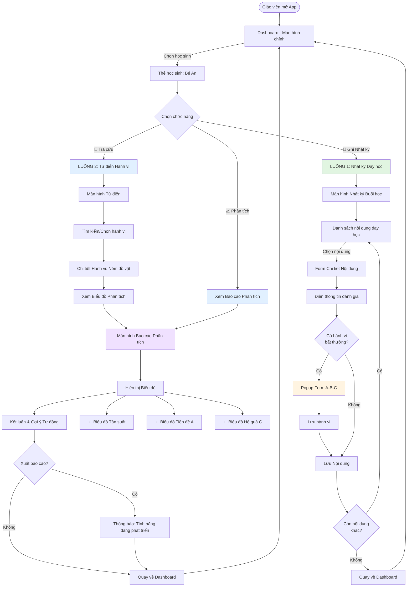
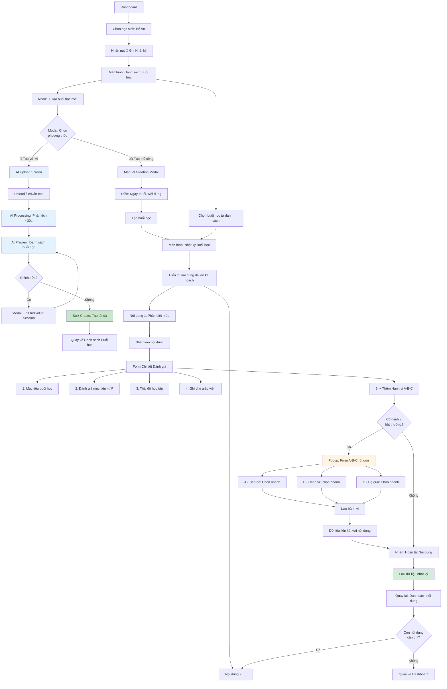
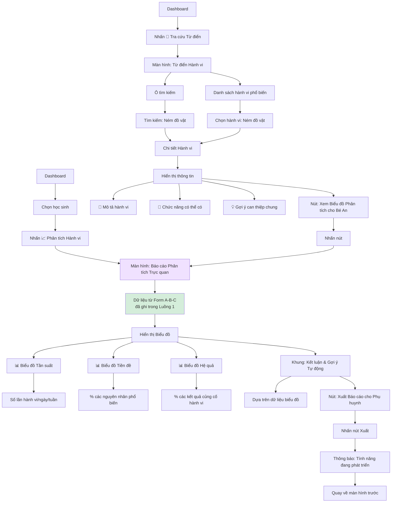
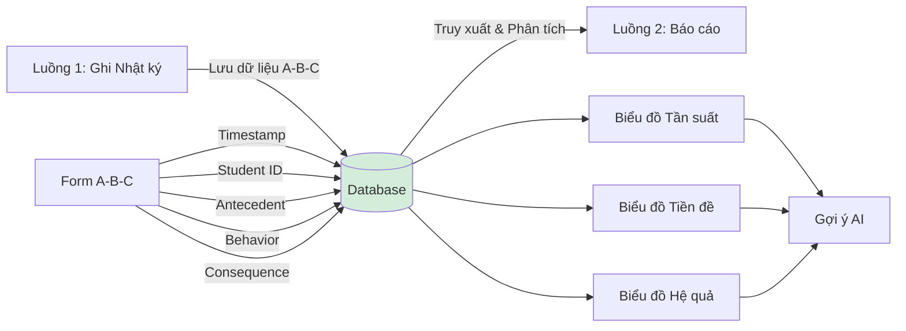

# Sơ đồ Luồng Người dùng (User Flow) - Educare Connect

## Mục tiêu

Trực quan hóa hành trình của giáo viên khi sử dụng 2 module chính:

1. **Nhật ký Dạy học & Can thiệp**
2. **Từ điển Giải mã Hành vi**

---

## Flowchart Tổng quan



---

## Luồng 1: Ghi nhận Nhật ký Dạy học & Can thiệp

### Sơ đồ Chi tiết Luồng 1



### Chi tiết Các Bước

#### Bước 1: Chọn Học sinh

- **Màn hình**: Dashboard
- **Hành động**: Giáo viên chọn thẻ học sinh (ví dụ: "Bé An")
- **Nút**: Nhấn "📝 Ghi Nhật ký"
- **Kết quả**: Chuyển đến màn hình "Danh sách Buổi học"

#### Bước 2: Xem Danh sách Buổi học (MỚI)

- **Màn hình**: Danh sách Buổi học
- **Hiển thị**:
  - Mini Calendar: Chọn ngày (mặc định: hôm nay)
  - Danh sách buổi học theo ngày đã chọn
  - Trạng thái mỗi buổi:
    - ✅ **Đã hoàn thành**: Đã ghi đầy đủ nhật ký
    - 📝 **Đang ghi**: Đang trong quá trình ghi nhật ký
    - ⏰ **Đã lên lịch**: Chưa bắt đầu ghi
    - ⚠️ **Quá hạn**: Đã qua ngày nhưng chưa ghi
  - Nút: "➕ Tạo buổi học mới" (cho ngày đã chọn)

**Các hành động**:

- Tap vào Mini Calendar → Chọn ngày → Hiển thị buổi học của ngày đó
- Tap vào buổi học **đã hoàn thành** → Xem chi tiết (read-only) hoặc chỉnh sửa
- Tap vào buổi học **chưa ghi/đang ghi** → Tiếp tục ghi nhật ký
- Tap "➕ Tạo buổi học mới" → **Modal chọn phương thức**:
  - **Tùy chọn 1: ✍️ Tạo thủ công** → Manual Creation Modal:
    - Ngày: [Ngày đã chọn từ calendar]
    - Buổi: Sáng/Chiều
    - Thời gian: 8:00-11:00 (có thể điều chỉnh)
    - Nội dung dạy học: [+ Thêm nội dung]
  - **Tùy chọn 2: 🤖 Tạo với AI** → Chuyển sang **AI Creation Flow** (xem chi tiết ở **Bước 2b**)
    - Upload file bài giảng hoặc dán text
    - AI phân tích và trích xuất nội dung
    - Preview danh sách buổi học
    - Chỉnh sửa và tạo hàng loạt

#### Bước 2b: AI Creation Flow (Tạo buổi học với AI) - MỚI 🤖

**Điều kiện**: Giáo viên chọn "🤖 Tạo với AI" từ Modal chọn phương thức

**Sub-step 1: Upload File/Dán Text**

- **Màn hình**: AI Upload Screen
- **Hiển thị**:
  - Drag & Drop zone với icon file lớn
  - Button "📂 Chọn file" (hỗ trợ PDF, DOCX, TXT, JPG/PNG)
  - Hoặc: Text area để dán nội dung bài giảng
  - Example hint: "Ví dụ: Thứ 2: Hoạt động 1..."
  - Preview file đã chọn (tên, kích thước, loại)

**Các hành động**:

- Drag file vào zone hoặc Tap "Chọn file" → Chọn file từ thiết bị
- Paste text vào text area
- Tap "📤 Upload và Phân tích" → Chuyển sang Sub-step 2

**Sub-step 2: AI Processing (Đang phân tích)**

- **Màn hình**: AI Processing Screen
- **Hiển thị**:
  - Loading spinner hoặc progress bar
  - Animation "🤖 AI đang phân tích..."
  - Step-by-step status:
    - ✅ Đọc file thành công
    - 🔄 Trích xuất cấu trúc bài học
    - ⏳ Phân tích nội dung và mục tiêu
    - ⏳ Tạo danh sách buổi học
  - Thời gian ước tính: ~30 giây

**Sub-step 3: Preview & Edit (Xem trước kết quả)**

- **Màn hình**: AI Preview Screen
- **Hiển thị**:
  - Header: "✨ AI đã tạo **12 buổi học** cho bạn"
  - **Danh sách buổi học** (expandable cards):
    - **Thứ 2, 22/10** • Buổi sáng • 8:00-11:00
      - Nội dung 1: Ai đây? (Nhận biết bản thân)
      - Nội dung 2: Hoạt động vận động (Phát triển vận động thô)
      - [Expand để xem chi tiết]
    - **Thứ 3, 23/10** • Buổi sáng • 8:00-11:00
      - ...
  - Mỗi card có button: "✏️ Sửa" và "🗑️ Xóa"
  - Bottom bar:
    - "✏️ Chỉnh sửa tất cả" (batch edit mode)
    - "✅ Tạo tất cả (12 buổi)"

**Các hành động**:

- Tap "✏️" trên một buổi học → Modal Edit Individual Session:
  - Cho phép sửa: Ngày, Buổi, Thời gian, Nội dung
  - "💾 Lưu" hoặc "❌ Hủy"
- Tap "🗑️" → Xóa buổi học khỏi danh sách
- Tap "✅ Tạo tất cả" → Bulk create và chuyển về Session List (hiển thị các buổi học mới tạo)

**Sub-step 4: Hoàn tất (Bulk Creation Success)**

- **Kết quả**: Tất cả buổi học được tạo trong database
- **Màn hình**: Quay về Session List
- **Hiển thị**:
  - Toast notification: "✅ Đã tạo 12 buổi học thành công!"
  - Danh sách buổi học cập nhật với các buổi mới (trạng thái: "Chưa ghi")
  - Các buổi mới được highlight (border màu xanh) trong 3 giây

---

#### Bước 3: Mở Nhật ký Buổi học (với ngày đã xác định)

- **Màn hình**: Nhật ký Buổi học
- **Hiển thị rõ ràng**:
  - **Header**: 👦 Bé An • 📅 **Thứ Hai, 22/10/2025** • 🕐 Buổi sáng
  - Date Pill nổi bật (có màu nền): "Đang ghi cho: **22/10/2025**"
  - Nếu đang ghi retroactive (ngày quá khứ): Badge màu vàng "⏰ Ghi bổ sung"

#### Bước 4: Xem Danh sách Nội dung Dạy học

- **Màn hình**: Nhật ký Buổi học
- **Hiển thị**:
  - **Ngày buổi học được chọn rõ ràng** (từ Bước 2)
  - Danh sách các nội dung đã lên kế hoạch cho buổi học này
  - Ví dụ: "Nội dung 1: Phân biệt màu", "Nội dung 2: Kỹ năng vận động tinh"
- **Trạng thái**: Có thể có trạng thái "Đã hoàn thành" hoặc "Chưa ghi nhận"

#### Bước 5: Ghi nhận Chi tiết Nội dung

- **Hành động**: Nhấn vào một nội dung (ví dụ: "Phân biệt màu")
- **Hiển thị**: Form đánh giá chi tiết với 5 phần:

**3.1. Mục tiêu buổi học**

- Hiển thị các mục tiêu cụ thể đã đặt ra
- Ví dụ: "Gọi tên màu đỏ", "Nhận thức được màu đỏ"

**3.2. Đánh giá mục tiêu**

- Checkbox: Có ✓ / Không ✗
- Cho từng mục tiêu

**3.3. Đánh giá Thái độ học tập**

- Giao diện: Thanh trượt hoặc nút chọn
- Tùy chọn:
  - Hợp tác tích cực
  - Tập trung tốt
  - Chưa tập trung
  - Cần nhắc nhở thường xuyên
  - Chống đối

**3.4. Ghi chú của giáo viên**

- Ô văn bản tự do
- Ví dụ: "Con nhận thức được màu đỏ, tuy nhiên có lúc tự ý rời khỏi chỗ ngồi"

**3.5. Ghi nhận Hành vi Bất thường (Tích hợp A-B-C)**

- Nút nổi bật: "➕ Thêm ghi nhận hành vi (A-B-C)"
- Nếu nhấn → Mở Popup Form A-B-C

#### Bước 6: Form A-B-C (Nếu có hành vi)

**Popup/Modal hiển thị:**

```
┌─────────────────────────────────────┐
│  Ghi nhận Hành vi (A-B-C)          │
├─────────────────────────────────────┤
│  A - Tiền đề (Nguyên nhân)         │
│  [Dropdown: Chọn nhanh]            │
│  - Yêu cầu làm việc khó            │
│  - Môi trường quá kích thích       │
│  - Thiếu chú ý từ người lớn        │
│  - Khác...                         │
├─────────────────────────────────────┤
│  B - Hành vi (Mô tả)               │
│  [Dropdown: Chọn nhanh]            │
│  - Ném đồ vật                      │
│  - Tự ý rời khỏi chỗ               │
│  - La hét                          │
│  - Khác...                         │
├─────────────────────────────────────┤
│  C - Hệ quả (Kết quả)              │
│  [Dropdown: Chọn nhanh]            │
│  - Được chú ý                      │
│  - Tránh nhiệm vụ                  │
│  - Nhận kích thích cảm giác        │
│  - Khác...                         │
├─────────────────────────────────────┤
│       [Hủy]      [Lưu hành vi]     │
└─────────────────────────────────────┘
```

- **Xử lý**: Dữ liệu A-B-C được lưu và **liên kết** với nội dung dạy học này
- **Thời gian**: Tự động ghi nhận timestamp (theo ngày buổi học được chọn)

#### Bước 7: Hoàn tất Nội dung

- **Hành động**: Nhấn nút "Hoàn tất Nội dung này"
- **Xử lý**: Hệ thống lưu tất cả dữ liệu đánh giá vào database
- **Chuyển hướng**: Quay lại màn hình "Nhật ký Buổi học"

#### Bước 8: Tiếp tục hoặc Kết thúc

- Nếu còn nội dung khác → Lặp lại từ Bước 5
- Nếu đã hoàn thành tất cả → Nhấn "Hoàn tất Buổi học" → Quay về Danh sách Buổi học hoặc Dashboard

---

## Luồng 2: Tra cứu, Phân tích và Báo cáo

### Sơ đồ Chi tiết Luồng 2



### Chi tiết Các Bước

#### Cách 1: Từ Tra cứu Từ điển

**Bước 1: Mở Từ điển Hành vi**

- **Màn hình**: Dashboard
- **Hành động**: Nhấn nút "📖 Tra cứu Từ điển Hành vi" (ở thanh điều hướng)
- **Chuyển hướng**: Màn hình "Từ điển Hành vi"

**Bước 2: Tìm kiếm Hành vi**

- **Hiển thị**:
  - Ô tìm kiếm ở đầu màn hình
  - Danh sách hành vi phổ biến (dạng thẻ hoặc list)
- **Hành động**:
  - Gõ tìm kiếm: "Ném đồ vật"
  - Hoặc chọn từ danh sách có sẵn

**Bước 3: Xem Chi tiết Hành vi**

- **Màn hình**: Chi tiết Hành vi "Ném đồ vật"
- **Hiển thị**:

```
┌─────────────────────────────────────┐
│  🎯 Ném đồ vật                      │
├─────────────────────────────────────┤
│  📄 Mô tả:                          │
│  Hành vi ném các vật dụng, đồ chơi │
│  trong lớp học hoặc tại nhà...     │
│                                     │
│  🎯 Chức năng có thể có:            │
│  • Thu hút sự chú ý                │
│  • Tránh nhiệm vụ khó              │
│  • Kích thích cảm giác             │
│  • Thể hiện cảm xúc                │
│                                     │
│  💡 Gợi ý can thiệp chung:          │
│  • Dạy kỹ năng giao tiếp thay thế  │
│  • Cung cấp kích thích cảm giác    │
│  • Điều chỉnh môi trường...        │
├─────────────────────────────────────┤
│  [Xem Biểu đồ Phân tích cho Bé An] │
└─────────────────────────────────────┘
```

**Bước 4: Chuyển sang Phân tích**

- **Hành động**: Nhấn nút "Xem Biểu đồ Phân tích cho [Tên trẻ]"
- **Lưu ý**: Nút này có thể chọn học sinh (nếu chưa chọn)
- **Chuyển hướng**: Màn hình "Báo cáo Phân tích Trực quan"

#### Cách 2: Từ Nút Phân tích Trực tiếp

**Bước 1: Chọn Phân tích từ Dashboard**

- **Màn hình**: Dashboard
- **Hành động**: Chọn học sinh → Nhấn nút "📈 Phân tích Hành vi"
- **Chuyển hướng**: Trực tiếp đến "Báo cáo Phân tích Trực quan"

#### Bước 5: Màn hình Báo cáo Phân tích Trực quan

**Nguồn dữ liệu**:

- Tất cả các Form A-B-C đã được ghi nhận trong Luồng 1
- Lọc theo học sinh đã chọn (ví dụ: Bé An)

**Hiển thị 3 Biểu đồ chính**:

**5.1. Biểu đồ Tần suất Hành vi**

```
Loại: Line Chart / Bar Chart
Trục X: Ngày/Tuần (ví dụ: 01/10 - 07/10)
Trục Y: Số lần hành vi xảy ra
Ví dụ:
  01/10: 3 lần
  02/10: 5 lần
  03/10: 2 lần
  ...
```

**5.2. Biểu đồ Phân tích Tiền đề (A)**

```
Loại: Pie Chart / Horizontal Bar Chart
Hiển thị: % các nguyên nhân phổ biến nhất
Ví dụ:
  - Yêu cầu làm việc khó: 40%
  - Thiếu chú ý từ người lớn: 35%
  - Môi trường quá kích thích: 15%
  - Khác: 10%
```

**5.3. Biểu đồ Phân tích Hệ quả (C)**

```
Loại: Pie Chart / Horizontal Bar Chart
Hiển thị: % các kết quả củng cố hành vi
Ví dụ:
  - Được chú ý: 50%
  - Tránh nhiệm vụ: 30%
  - Nhận kích thích cảm giác: 15%
  - Khác: 5%
```

**5.4. Khung "Kết luận & Gợi ý Tự động"**

```
┌─────────────────────────────────────┐
│  💡 Kết luận & Gợi ý Can thiệp      │
├─────────────────────────────────────┤
│  Dựa trên dữ liệu 2 tuần gần đây:  │
│                                     │
│  ✓ Hành vi "Ném đồ vật" xảy ra     │
│    trung bình 3.2 lần/ngày         │
│                                     │
│  ✓ Nguyên nhân chính: Tránh nhiệm  │
│    vụ khó (40%)                    │
│                                     │
│  ✓ Hậu quả củng cố: Được chú ý (50%)│
│                                     │
│  📌 Gợi ý can thiệp:                │
│  • Giảm độ khó của nhiệm vụ        │
│  • Dạy kỹ năng xin nghỉ thay thế   │
│  • Tăng cường khen thưởng khi hoàn │
│    thành nhiệm vụ                  │
└─────────────────────────────────────┘
```

**5.5. Nút Xuất Báo cáo**

- **Hiển thị**: Nút "Xuất Báo cáo cho Phụ huynh" (PDF/Email)
- **Hành động**: Nhấn nút
- **Kết quả**: Hiển thị thông báo "Tính năng đang được phát triển" (placeholder cho demo)

#### Bước 6: Quay lại

- **Hành động**: Nhấn nút "Quay lại" hoặc nút Back
- **Chuyển hướng**: Về màn hình trước đó hoặc Dashboard

---

## Tích hợp giữa 2 Luồng

### Kết nối dữ liệu



### Điểm Kết nối Quan trọng

1. **Dữ liệu A-B-C** được ghi nhận trong Luồng 1 (Form A-B-C)
2. Dữ liệu này được **lưu trữ có cấu trúc** trong database
3. **Luồng 2** truy xuất dữ liệu để:

   - Tạo biểu đồ trực quan
   - Phân tích xu hướng
   - Đưa ra gợi ý can thiệp

4. **Liên kết 2 chiều**:
   - Từ "Tra cứu Từ điển" → "Xem Phân tích" (cho học sinh cụ thể)
   - Từ "Dashboard" → "Phân tích Hành vi" (trực tiếp)

---

## Tóm tắt User Journey

### Journey Map

```
1. Giáo viên mở App
   ↓
2. Chọn Học sinh (Bé An)
   ↓
3. [Luồng A] Ghi Nhật ký Buổi học
   - Chọn nội dung dạy học
   - Đánh giá mục tiêu
   - Ghi nhận hành vi A-B-C (nếu có)
   - Lưu dữ liệu
   ↓
4. [Luồng B] Tra cứu & Phân tích
   - Tra cứu Từ điển Hành vi
   - Xem chi tiết hành vi
   - Xem Biểu đồ Phân tích (dữ liệu từ Luồng A)
   - Đọc Kết luận & Gợi ý
   ↓
5. Xuất Báo cáo (Tính năng tương lai)
   ↓
6. Quay về Dashboard
```

### Tần suất sử dụng

| Chức năng       | Tần suất                     | Thời gian trung bình |
| --------------- | ---------------------------- | -------------------- |
| Ghi Nhật ký     | Hàng ngày (sau mỗi buổi học) | 3-5 phút/nội dung    |
| Ghi Form A-B-C  | Khi có hành vi xảy ra        | 1-2 phút/lần         |
| Tra cứu Từ điển | Khi cần tìm hiểu hành vi     | 2-3 phút             |
| Xem Phân tích   | Hàng tuần hoặc theo yêu cầu  | 5-7 phút             |
| Xuất Báo cáo    | Hàng tháng                   | 2-3 phút             |

---

## Các Trường hợp Đặc biệt

### Trường hợp 1: Không có hành vi bất thường

- Luồng 1 vẫn hoàn tất bình thường
- Bỏ qua bước "Thêm ghi nhận hành vi A-B-C"
- Chỉ điền đánh giá mục tiêu và thái độ học tập

### Trường hợp 2: Nhiều hành vi trong 1 buổi học

- Có thể nhấn "➕ Thêm ghi nhận hành vi" **nhiều lần**
- Mỗi lần tạo 1 bản ghi A-B-C riêng biệt
- Tất cả đều liên kết với nội dung dạy học đó

### Trường hợp 3: Chưa có dữ liệu A-B-C

- Khi vào "Báo cáo Phân tích" lần đầu
- Hiển thị: "Chưa có dữ liệu. Hãy bắt đầu ghi nhận hành vi trong Nhật ký Buổi học"
- Nút hành động: "Đến Ghi Nhật ký"

### Trường hợp 4: Tra cứu hành vi chưa có trong danh sách

- Hiển thị: "Hành vi này chưa có trong từ điển"
- Nút: "Gợi ý thêm hành vi mới" (feedback cho nhà phát triển)

---

## Kết luận

Hai luồng chính được thiết kế để:

1. **Luồng 1** - Ghi nhận dữ liệu một cách tự nhiên trong quy trình dạy học hàng ngày
2. **Luồng 2** - Biến dữ liệu thành insight có giá trị cho quyết định can thiệp

Sự tích hợp liền mạch giúp giáo viên:

- Không phải nhập dữ liệu nhiều lần
- Có cái nhìn trực quan về tiến trình
- Đưa ra can thiệp dựa trên bằng chứng khoa học

---

**Tài liệu tiếp theo**: Xem [SCREEN_DESIGN.md](./SCREEN_DESIGN.md) để biết chi tiết thiết kế từng màn hình.
