# Sơ đồ ERD - Educare Connect (Mermaid Format)

Sơ đồ quan hệ cơ sở dữ liệu sử dụng Mermaid để có thể render trực tiếp trên GitHub, VSCode, hoặc các công cụ hỗ trợ Mermaid.

---

## 📊 SƠ ĐỒ ERD HOÀN CHỈNH

```mermaid
erDiagram
    %% ========================================
    %% CORE USER & STUDENT MANAGEMENT
    %% ========================================

    TEACHERS ||--o{ STUDENTS : "quản lý"
    TEACHERS ||--o{ TEACHER_FAVORITES : "yêu thích"
    TEACHERS ||--o{ CONTENT_LIBRARY : "tạo template"
    TEACHERS ||--o{ USER_SETTINGS : "cài đặt"
    TEACHERS ||--o{ BACKUP_HISTORY : "sao lưu"
    TEACHERS ||--o{ AI_PROCESSING : "xử lý AI"

    TEACHERS {
        uuid id PK
        varchar email UK "unique"
        varchar first_name
        varchar last_name
        varchar phone
        varchar school
        text avatar_url
        varchar password_hash "bcrypt"
        boolean is_verified "default false"
        boolean is_active "default true"
        boolean two_fa_enabled
        varchar timezone "Asia/Ho_Chi_Minh"
        varchar language "vi"
        timestamp last_login_at
        timestamp created_at
        timestamp updated_at
    }

    STUDENTS ||--o{ SESSIONS : "có buổi học"

    STUDENTS {
        uuid id PK
        uuid teacher_id FK
        varchar first_name
        varchar last_name
        varchar nickname "tên gọi tắt"
        date date_of_birth
        varchar gender "male,female,other"
        text avatar_url
        varchar status "active,paused,archived"
        text diagnosis
        text notes
        varchar parent_name
        varchar parent_phone
        timestamp created_at
        timestamp updated_at
        timestamp deleted_at "soft delete"
    }

    %% ========================================
    %% SESSION MANAGEMENT
    %% ========================================

    SESSIONS ||--o{ SESSION_CONTENTS : "chứa nội dung"
    SESSIONS ||--o| SESSION_LOGS : "có đánh giá"

    SESSIONS {
        uuid id PK
        uuid student_id FK
        date session_date
        varchar time_slot "morning,afternoon,evening"
        time start_time
        time end_time
        int duration_minutes "computed"
        varchar location
        text notes
        varchar creation_method "manual,ai"
        varchar status "pending,completed,cancelled"
        boolean has_evaluation
        text cancelled_reason
        timestamp cancelled_at
        uuid created_by FK
        timestamp created_at
        timestamp updated_at
        timestamp deleted_at "soft delete"
    }

    SESSION_CONTENTS ||--o{ CONTENT_GOALS : "có mục tiêu"
    CONTENT_LIBRARY ||--o{ SESSION_CONTENTS : "template cho"

    SESSION_CONTENTS {
        uuid id PK
        uuid session_id FK
        uuid content_library_id FK "nullable"
        varchar title
        varchar domain "cognitive,motor,language,social,self_care"
        text description
        text materials_needed
        int order_index
        int estimated_duration "phút"
        text notes
        timestamp created_at
        timestamp updated_at
    }

    CONTENT_GOALS {
        uuid id PK
        uuid session_content_id FK
        text description
        varchar goal_type "knowledge,skill,behavior"
        boolean is_primary
        int order_index
        timestamp created_at
        timestamp updated_at
    }

    %% ========================================
    %% SESSION LOGGING
    %% ========================================

    SESSION_LOGS ||--o{ LOG_MEDIA_ATTACHMENTS : "đính kèm media"
    SESSION_LOGS ||--o{ GOAL_EVALUATIONS : "đánh giá mục tiêu"
    SESSION_LOGS ||--o{ BEHAVIOR_INCIDENTS : "ghi hành vi"

    SESSION_LOGS {
        uuid id PK
        uuid session_id FK "unique,1-1"
        timestamp logged_at
        timestamp completed_at
        time actual_start_time
        time actual_end_time
        varchar mood "very_difficult,difficult,normal,good,very_good"
        int energy_level "1-5"
        int cooperation_level "1-5"
        int focus_level "1-5"
        int independence_level "1-5"
        text attitude_summary
        text progress_notes
        text challenges_faced
        text recommendations
        text teacher_notes_text
        int overall_rating "1-5"
        uuid created_by FK
        timestamp created_at
        timestamp updated_at
    }

    LOG_MEDIA_ATTACHMENTS {
        uuid id PK
        uuid session_log_id FK
        varchar media_type "image,video,audio"
        text url "cloud storage"
        text thumbnail_url
        varchar filename
        bigint file_size "bytes"
        varchar mime_type
        int duration "giây, cho audio/video"
        int width "px"
        int height "px"
        text caption
        uuid uploaded_by FK
        timestamp created_at
    }

    CONTENT_GOALS ||--o{ GOAL_EVALUATIONS : "được đánh giá"

    GOAL_EVALUATIONS {
        uuid id PK
        uuid session_log_id FK
        uuid content_goal_id FK
        varchar status "achieved,partially_achieved,not_achieved,not_applicable"
        int achievement_level "0-100%"
        varchar support_level "independent,minimal_prompt,moderate_prompt,full_prompt,hand_over_hand"
        text notes
        text next_steps
        timestamp created_at
        timestamp updated_at
    }

    %% ========================================
    %% BEHAVIOR SYSTEM (Enhanced)
    %% ========================================

    BEHAVIOR_GROUPS ||--o{ BEHAVIOR_LIBRARY : "chứa hành vi"

    BEHAVIOR_GROUPS {
        uuid id PK
        varchar code UK "GROUP_01,GROUP_02..."
        varchar name_vn "CHỐNG ĐỐI & BƯỚNG BỈNH"
        varchar name_en "Opposition & Defiance"
        text description_vn
        text description_en
        varchar icon "😤,👊,👂"
        varchar color_code "#FF5733"
        json common_tips "array of tips"
        int order_index
        boolean is_active
        timestamp created_at
        timestamp updated_at
    }

    BEHAVIOR_LIBRARY ||--o{ BEHAVIOR_INCIDENTS : "sử dụng trong"
    BEHAVIOR_LIBRARY ||--o{ TEACHER_FAVORITES : "được yêu thích"

    BEHAVIOR_LIBRARY {
        uuid id PK
        uuid behavior_group_id FK
        varchar behavior_code UK "BH_01_01,BH_01_02..."
        varchar name_vn "Ăn vạ"
        varchar name_en "Tantrums"
        json keywords_vn "10-15 keywords - backend search only"
        json keywords_en
        text manifestation_vn "clinical description"
        text manifestation_en
        int age_range_min
        int age_range_max
        json severity_indicators
        json explanation "array of frameworks - 2-4 items"
        json solutions "array of interventions - 4-5 items"
        json prevention_strategies
        json sources "academic citations - 2+ items"
        json related_behaviors "array of behavior IDs"
        varchar icon "emoji"
        boolean is_active
        int usage_count "auto-increment"
        timestamp last_used_at
        timestamp created_at
        timestamp updated_at
    }

    BEHAVIOR_INCIDENTS {
        uuid id PK
        uuid session_log_id FK
        uuid behavior_library_id FK
        int incident_number "thứ tự trong buổi"
        text antecedent "A - tình huống"
        text behavior_description "B - hành vi"
        text consequence "C - kết quả"
        int duration_minutes
        int intensity_level "1-5"
        int frequency_count
        text intervention_used
        boolean intervention_effective
        text environmental_factors
        timestamp occurred_at
        text notes
        boolean requires_followup
        text followup_notes
        uuid recorded_by FK
        timestamp created_at
        timestamp updated_at
    }

    TEACHER_FAVORITES {
        uuid id PK
        uuid teacher_id FK
        uuid behavior_library_id FK
        timestamp created_at
    }

    %% ========================================
    %% CONTENT LIBRARY & TEMPLATES
    %% ========================================

    CONTENT_LIBRARY {
        uuid id PK
        uuid teacher_id FK "null = system template"
        varchar code
        varchar title
        varchar domain "cognitive,motor,language,social,self_care"
        text description
        int target_age_min
        int target_age_max
        varchar difficulty_level "beginner,intermediate,advanced"
        json default_goals "array of default goals"
        text materials_needed
        int estimated_duration "phút"
        text instructions
        text tips
        boolean is_template
        boolean is_public
        int usage_count
        decimal rating_avg "0-5.00"
        int rating_count
        json tags
        timestamp created_at
        timestamp updated_at
        timestamp deleted_at "soft delete"
    }

    CONTENT_LIBRARY ||--o{ CONTENT_LIBRARY_RATINGS : "được đánh giá"

    CONTENT_LIBRARY_RATINGS {
        uuid id PK
        uuid content_library_id FK
        uuid teacher_id FK
        int rating "1-5"
        text review
        timestamp created_at
        timestamp updated_at
    }

    %% ========================================
    %% SUPPORTING TABLES
    %% ========================================

    USER_SETTINGS {
        uuid id PK
        uuid teacher_id FK
        varchar key "unique with teacher_id"
        json value
        timestamp created_at
        timestamp updated_at
    }

    BACKUP_HISTORY {
        uuid id PK
        uuid teacher_id FK
        varchar backup_type "manual,auto"
        text file_url
        bigint file_size
        varchar status "pending,completed,failed"
        timestamp created_at
    }

    AI_PROCESSING {
        uuid id PK
        uuid teacher_id FK
        uuid student_id FK "nullable"
        text file_url
        varchar file_type "pdf,docx,txt,jpg..."
        text text_content
        varchar processing_status "pending,processing,completed,failed"
        int progress "0-100%"
        json result_sessions "array of created sessions"
        text error_message
        timestamp created_at
        timestamp completed_at
    }
```



---

## 📋 CHÚ THÍCH KÝ HIỆU

### Relationship Symbols (Mermaid)

```
||--o{ : One-to-Many (1:N)
||--|| : One-to-One (1:1)
||--o| : One-to-Zero-or-One (1:0..1)
}o--o{ : Many-to-Many (N:M)
```

### Field Annotations

```
PK  = Primary Key
FK  = Foreign Key
UK  = Unique Key
```

---

## 🔗 MỐI QUAN HỆ CHI TIẾT

### 1. Luồng Dữ liệu Chính

```
TEACHER (Giáo viên)
  ↓ manages (1:N)
STUDENT (Học sinh)
  ↓ has (1:N)
SESSION (Buổi học)
  ├─→ contains (1:N) → SESSION_CONTENT → has (1:N) → CONTENT_GOAL
  └─→ has evaluation (1:0..1) → SESSION_LOG
                                  ├─→ attachments (1:N) → LOG_MEDIA_ATTACHMENT
                                  ├─→ evaluates (1:N) → GOAL_EVALUATION
                                  └─→ records (1:N) → BEHAVIOR_INCIDENT
```

### 2. Hệ thống Hành vi

```
BEHAVIOR_GROUP (3 nhóm)
  ↓ contains (1:N)
BEHAVIOR_LIBRARY (127+ hành vi)
  ├─→ used in (1:N) → BEHAVIOR_INCIDENT
  └─→ favorited by (N:M via TEACHER_FAVORITES) → TEACHER
```

### 3. Template & AI

```
TEACHER
  ├─→ creates (1:N) → CONTENT_LIBRARY (templates)
  │                     ├─→ rated by (1:N) → CONTENT_LIBRARY_RATING
  │                     └─→ used in (1:N) → SESSION_CONTENT
  │
  └─→ processes (1:N) → AI_PROCESSING → creates → SESSION
```

---

## 📊 THỐNG KÊ DATABASE

### Tổng quan

- **Tổng số bảng:** 16
- **Bảng chính (Core):** 8
  - TEACHERS, STUDENTS, SESSIONS, SESSION_CONTENTS, CONTENT_GOALS, SESSION_LOGS, GOAL_EVALUATIONS, LOG_MEDIA_ATTACHMENTS
- **Bảng hành vi (Behavior):** 3
  - BEHAVIOR_GROUPS, BEHAVIOR_LIBRARY, BEHAVIOR_INCIDENTS
- **Bảng hỗ trợ (Supporting):** 5
  - TEACHER_FAVORITES, CONTENT_LIBRARY, CONTENT_LIBRARY_RATINGS, USER_SETTINGS, BACKUP_HISTORY, AI_PROCESSING

### Đặc điểm kỹ thuật

#### Primary Keys

- Tất cả bảng sử dụng UUID làm PK
- Lợi ích: distributed system friendly, không lộ số lượng records

#### Foreign Keys với CASCADE

```sql
-- Xóa teacher → xóa students, sessions, favorites
STUDENTS.teacher_id ON DELETE CASCADE
SESSIONS.student_id ON DELETE CASCADE
SESSION_CONTENTS.session_id ON DELETE CASCADE
CONTENT_GOALS.session_content_id ON DELETE CASCADE
SESSION_LOGS.session_id ON DELETE CASCADE
LOG_MEDIA_ATTACHMENTS.session_log_id ON DELETE CASCADE
GOAL_EVALUATIONS.session_log_id ON DELETE CASCADE
BEHAVIOR_INCIDENTS.session_log_id ON DELETE CASCADE
```

#### JSONB Fields (PostgreSQL/Supabase)

```
BEHAVIOR_GROUPS.common_tips          → Array of strings
BEHAVIOR_LIBRARY.keywords_vn         → Array of 10-15 keywords
BEHAVIOR_LIBRARY.explanation         → Array of {title, description} objects
BEHAVIOR_LIBRARY.solutions           → Array of {title, description} objects
BEHAVIOR_LIBRARY.sources             → Array of citation strings
CONTENT_LIBRARY.default_goals        → Array of goal objects
CONTENT_LIBRARY.tags                 → Array of tag strings
AI_PROCESSING.result_sessions        → Array of session objects
USER_SETTINGS.value                  → Flexible JSON config
```

**Lợi ích JSONB:**

- Schema flexibility
- Atomic updates
- GIN indexing cho search
- Native JSON operators trong PostgreSQL

#### Computed Fields

```sql
-- TEACHERS
full_name = CONCAT(first_name, ' ', last_name)

-- STUDENTS
full_name = CONCAT(first_name, ' ', last_name)
age = EXTRACT(YEAR FROM AGE(CURRENT_DATE, date_of_birth))

-- SESSIONS
duration_minutes = EXTRACT(EPOCH FROM (end_time - start_time)) / 60
```

#### Soft Delete

```sql
-- Các bảng hỗ trợ soft delete
STUDENTS.deleted_at
SESSIONS.deleted_at
CONTENT_LIBRARY.deleted_at
```

**Query với soft delete:**

```sql
-- Chỉ lấy records chưa xóa
SELECT * FROM students WHERE deleted_at IS NULL;

-- Lấy cả đã xóa
SELECT * FROM students;

-- Khôi phục
UPDATE students SET deleted_at = NULL WHERE id = '...';
```

---

## 🎯 INDEXES QUAN TRỌNG

### Primary & Foreign Key Indexes

```sql
-- Tự động tạo khi định nghĩa PK/FK
idx_students_teacher_id
idx_sessions_student_id
idx_session_contents_session_id
idx_content_goals_session_content_id
idx_session_logs_session_id
idx_behavior_library_group_id
idx_behavior_incidents_behavior_id
...
```

### Composite Indexes

```sql
-- Tối ưu cho query phức tạp
CREATE INDEX idx_sessions_student_date ON sessions(student_id, session_date);
CREATE INDEX idx_students_teacher_active ON students(teacher_id, status) WHERE deleted_at IS NULL;
CREATE INDEX idx_behavior_search ON behavior_library(behavior_group_id, is_active);
```

### Full-Text Search (GIN)

```sql
-- PostgreSQL GIN index cho JSONB
CREATE INDEX idx_behavior_keywords_gin ON behavior_library USING GIN (keywords_vn);
CREATE INDEX idx_content_tags_gin ON content_library USING GIN (tags);

-- Query example
SELECT * FROM behavior_library
WHERE keywords_vn @> '["ăn vạ"]'::jsonb;
```

### Performance Indexes

```sql
-- Sorting & Filtering
CREATE INDEX idx_sessions_date_desc ON sessions(session_date DESC);
CREATE INDEX idx_behavior_usage_desc ON behavior_library(usage_count DESC);
CREATE INDEX idx_behavior_last_used ON behavior_library(last_used_at DESC NULLS LAST);
```

---

## 🔐 CONSTRAINTS & VALIDATIONS

### Unique Constraints

```sql
UNIQUE (email)                                    -- TEACHERS
UNIQUE (behavior_code)                            -- BEHAVIOR_LIBRARY
UNIQUE (session_log_id, content_goal_id)          -- GOAL_EVALUATIONS
UNIQUE (teacher_id, behavior_library_id)          -- TEACHER_FAVORITES
UNIQUE (teacher_id, key)                          -- USER_SETTINGS
UNIQUE (content_library_id, teacher_id)           -- CONTENT_LIBRARY_RATINGS
```

### Check Constraints

```sql
-- ENUM-like constraints
CHECK (gender IN ('male', 'female', 'other'))
CHECK (status IN ('active', 'paused', 'archived'))
CHECK (time_slot IN ('morning', 'afternoon', 'evening'))
CHECK (creation_method IN ('manual', 'ai'))
CHECK (domain IN ('cognitive', 'motor', 'language', 'social', 'self_care'))

-- Range constraints
CHECK (cooperation_level BETWEEN 1 AND 5)
CHECK (focus_level BETWEEN 1 AND 5)
CHECK (independence_level BETWEEN 1 AND 5)
CHECK (intensity_level BETWEEN 1 AND 5)
CHECK (achievement_level BETWEEN 0 AND 100)
CHECK (progress BETWEEN 0 AND 100)
CHECK (rating BETWEEN 1 AND 5)
CHECK (rating_avg BETWEEN 0 AND 5)

-- Logic constraints
CHECK (end_time > start_time)
CHECK (target_age_max >= target_age_min)
CHECK (age_range_max >= age_range_min)
```

### Business Rules (Triggers)

```sql
-- Auto-increment usage_count
CREATE TRIGGER update_behavior_usage_count
  AFTER INSERT ON behavior_incidents
  FOR EACH ROW EXECUTE FUNCTION increment_usage_count();

-- Auto-update session status
CREATE TRIGGER update_session_status
  AFTER INSERT ON session_logs
  FOR EACH ROW EXECUTE FUNCTION mark_session_completed();

-- Auto-calculate ratings
CREATE TRIGGER recalculate_content_rating
  AFTER INSERT OR UPDATE OR DELETE ON content_library_ratings
  FOR EACH ROW EXECUTE FUNCTION update_avg_rating();
```

---

## 📐 NORMALIZATION ANALYSIS

### Current Level: **3NF (Third Normal Form)**

#### 1NF - First Normal Form ✅

- Mọi cột đều atomic (không có repeating groups)
- JSONB fields là intentional denormalization cho flexibility

#### 2NF - Second Normal Form ✅

- Tất cả non-key attributes phụ thuộc hoàn toàn vào PK
- Không có partial dependency

#### 3NF - Third Normal Form ✅

- Không có transitive dependency
- Non-key attributes không phụ thuộc vào non-key attributes khác

### Intentional Denormalization

**JSONB Fields** được giữ lại vì:

1. **Performance:** Tránh multiple joins cho nested data
2. **Flexibility:** Schema evolution dễ dàng
3. **Atomicity:** Update entire JSON object một lúc
4. **Query capability:** PostgreSQL có native JSON operators

**Examples:**

```json
// BEHAVIOR_LIBRARY.explanation
[
  {"title": "Nhu cầu Giao tiếp", "description": "..."},
  {"title": "Giới hạn Sinh lý", "description": "..."}
]

// BEHAVIOR_LIBRARY.solutions
[
  {"title": "Giữ bình tĩnh", "description": "..."},
  {"title": "Phớt lờ có kế hoạch", "description": "..."}
]

// CONTENT_LIBRARY.default_goals
[
  {"description": "Goal 1", "order": 1},
  {"description": "Goal 2", "order": 2}
]
```

**Alternative (Normalized):**

```sql
-- Nếu normalize hoàn toàn sẽ cần thêm 4+ bảng:
BEHAVIOR_EXPLANATIONS (behavior_id, title, description, order_index)
BEHAVIOR_SOLUTIONS (behavior_id, title, description, order_index)
BEHAVIOR_SOURCES (behavior_id, citation, order_index)
CONTENT_DEFAULT_GOALS (content_id, description, order_index)
...
```

**Trade-off:** Flexibility + Performance vs. Strict Normalization

---

## 🚀 MIGRATION STRATEGY

### Phase 1: Core Tables

```sql
-- Order matters due to FK dependencies
CREATE TABLE teachers;
CREATE TABLE students;
CREATE TABLE sessions;
CREATE TABLE session_contents;
CREATE TABLE content_goals;
CREATE TABLE session_logs;
CREATE TABLE log_media_attachments;
CREATE TABLE goal_evaluations;
```

### Phase 2: Behavior System

```sql
CREATE TABLE behavior_groups;
CREATE TABLE behavior_library;
CREATE TABLE behavior_incidents;
CREATE TABLE teacher_favorites;
```

### Phase 3: Supporting Tables

```sql
CREATE TABLE content_library;
CREATE TABLE content_library_ratings;
CREATE TABLE user_settings;
CREATE TABLE backup_history;
CREATE TABLE ai_processing;
```

### Phase 4: Indexes & Constraints

```sql
-- Foreign key indexes
CREATE INDEX idx_students_teacher_id ON students(teacher_id);
CREATE INDEX idx_sessions_student_id ON sessions(student_id);
...

-- Search indexes
CREATE INDEX idx_behavior_keywords_gin ON behavior_library USING GIN (keywords_vn);
...

-- Check constraints
ALTER TABLE sessions ADD CONSTRAINT chk_time CHECK (end_time > start_time);
...
```

### Phase 5: Triggers & Functions

```sql
CREATE FUNCTION increment_usage_count() ...;
CREATE TRIGGER update_behavior_usage_count ...;
...
```

---

## 📝 SAMPLE DATA SEED

### Behavior Groups (3 groups)

```sql
INSERT INTO behavior_groups (id, code, name_vn, name_en, icon, order_index) VALUES
('uuid-1', 'GROUP_01', 'CHỐNG ĐỐI & BƯỚNG BỈNH', 'Opposition & Defiance', '😤', 1),
('uuid-2', 'GROUP_02', 'HÀNH VI GÂY HẤN', 'Aggression', '👊', 2),
('uuid-3', 'GROUP_03', 'VẤN ĐỀ VỀ GIÁC QUAN', 'Sensory Issues', '👂', 3);
```

### Behavior Library (sample)

```sql
INSERT INTO behavior_library (
  behavior_group_id, behavior_code, name_vn, name_en,
  keywords_vn, manifestation_vn, explanation, solutions, sources
) VALUES (
  'uuid-1',
  'BH_01_01',
  'Ăn vạ',
  'Tantrums',
  '["ăn vạ","la hét","nằm lăn ra đất","gào khóc","tức giận dữ dội","khóc dai","mè nheo","hờn dỗi","nổi cáu","cơn giận"]'::jsonb,
  'Trẻ bộc phát cảm xúc một cách dữ dội, có thể la hét, khóc, nằm lăn ra đất...',
  '[
    {"title":"Nhu cầu Giao tiếp","description":"Với trẻ nhỏ..."},
    {"title":"Giới hạn Sinh lý","description":"Khi trẻ mệt..."}
  ]'::jsonb,
  '[
    {"title":"Giữ bình tĩnh","description":"Phản ứng của người lớn..."},
    {"title":"Phớt lờ có kế hoạch","description":"Nếu ăn vạ để đòi..."}
  ]'::jsonb,
  '["Potegal, M., & Davidson, R. J. (2003)...","Sroufe, L. A. (2000)..."]'::jsonb
);
```

---

_Sơ đồ ERD chi tiết cho Educare Connect với hệ thống hành vi evidence-based cải tiến._
