Tôi sẽ kiểm tra ERD với API đã thiết kế và phát hiện một số điểm cần điều chỉnh:

## 🔍 PHÂN TÍCH SO SÁNH ERD vs API

### ✅ ĐÚNG - Không cần sửa:

1. **TEACHERS** - OK
2. **STUDENTS** - OK
3. **SESSIONS** - OK
4. **SESSION_CONTENTS** - OK
5. **BEHAVIOR_GROUPS** - OK
6. **BEHAVIOR_LIBRARY** - OK
7. **BEHAVIOR_INCIDENTS** - OK
8. **TEACHER_FAVORITES** - OK
9. **CONTENT_LIBRARY** - OK
10. **AI_PROCESSING** - OK

### ❌ CẦN SỬA:

1. **SESSION_CONTENT_GOALS** - Tên bảng sai
2. **SESSION_LOGS** - Thiếu vài trường
3. **GOAL_EVALUATIONS** - Thiếu relationship
4. **MEDIA_ATTACHMENTS** - Tên bảng sai
5. **TEMPLATE_RATINGS** - Tên bảng sai
6. **REPORTS** - Thiếu bảng này
7. **BACKUPS** - Tên bảng sai

---

# 📋 ERD_MERMAID.md - PHIÊN BẢN SỬA LẠI

```markdown
# Sơ đồ ERD - Educare Connect (Mermaid Format)

Sơ đồ quan hệ cơ sở dữ liệu sử dụng Mermaid để có thể render trực tiếp trên GitHub, VSCode, hoặc các công cụ hỗ trợ Mermaid.

**Last Updated:** 2025-11-05  
**Version:** 2.0 - Aligned with API Design

---

## 📊 SƠ ĐỒ ERD HOÀN CHỈNH

```mermaid
erDiagram
    %% ========================================
    %% CORE USER & STUDENT MANAGEMENT
    %% ========================================

    TEACHERS ||--o{ STUDENTS : "quản lý"
    TEACHERS ||--o{ TEACHER_FAVORITES : "yêu thích"
    TEACHERS ||--o{ CONTENT_LIBRARY : "tạo template"
    TEACHERS ||--o{ BACKUPS : "sao lưu"
    TEACHERS ||--o{ AI_PROCESSING : "xử lý AI"
    TEACHERS ||--o{ REPORTS : "tạo báo cáo"

    TEACHERS {
        uuid id PK
        varchar email UK "unique"
        varchar first_name
        varchar last_name
        varchar phone
        varchar school
        text avatar_url
        varchar password_hash "bcrypt"
        boolean is_verified "default false"
        boolean is_active "default true"
        varchar timezone "default Asia/Ho_Chi_Minh"
        varchar language "default vi"
        timestamp last_login_at
        timestamp created_at
        timestamp updated_at
        timestamp deleted_at "soft delete"
    }

    STUDENTS ||--o{ SESSIONS : "có buổi học"

    STUDENTS {
        uuid id PK
        uuid teacher_id FK
        varchar first_name
        varchar last_name
        varchar nickname "tên gọi tắt"
        date date_of_birth
        varchar gender "male,female,other"
        text avatar_url
        varchar status "active,paused,archived - default active"
        text diagnosis
        text notes
        varchar parent_name
        varchar parent_phone
        timestamp created_at
        timestamp updated_at
        timestamp deleted_at "soft delete"
    }

    %% ========================================
    %% SESSION MANAGEMENT
    %% ========================================

    SESSIONS ||--o{ SESSION_CONTENTS : "chứa nội dung"
    SESSIONS ||--o| SESSION_LOGS : "có đánh giá"

    SESSIONS {
        uuid id PK
        uuid student_id FK
        date session_date
        varchar time_slot "morning,afternoon,evening"
        time start_time
        time end_time
        int duration_minutes "computed: (end_time - start_time) in minutes"
        varchar location
        text notes
        varchar creation_method "manual,ai - default manual"
        varchar status "pending,completed,cancelled - default pending"
        boolean has_evaluation "default false"
        text cancellation_reason
        timestamp cancelled_at
        uuid created_by FK "references TEACHERS.id"
        timestamp created_at
        timestamp updated_at
        timestamp deleted_at "soft delete"
    }

    SESSION_CONTENTS ||--o{ SESSION_CONTENT_GOALS : "có mục tiêu"
    CONTENT_LIBRARY ||--o{ SESSION_CONTENTS : "template cho"

    SESSION_CONTENTS {
        uuid id PK
        uuid session_id FK
        uuid content_library_id FK "nullable - link to template"
        varchar title
        varchar domain "cognitive,motor,language,social,self_care"
        text description
        text materials_needed
        int estimated_duration "phút"
        text instructions
        text tips
        int order_index "unique per session"
        text notes
        timestamp created_at
        timestamp updated_at
    }

    SESSION_CONTENT_GOALS {
        uuid id PK
        uuid session_content_id FK
        text description
        varchar goal_type "knowledge,skill,behavior"
        boolean is_primary "default false"
        int order_index "unique per content"
        timestamp created_at
        timestamp updated_at
    }

    %% ========================================
    %% SESSION LOGGING
    %% ========================================

    SESSION_LOGS ||--o{ MEDIA_ATTACHMENTS : "đính kèm media"
    SESSION_LOGS ||--o{ GOAL_EVALUATIONS : "đánh giá mục tiêu"
    SESSION_LOGS ||--o{ BEHAVIOR_INCIDENTS : "ghi hành vi"

    SESSION_LOGS {
        uuid id PK
        uuid session_id FK "unique - 1:1 relationship"
        timestamp logged_at "default now()"
        time actual_start_time
        time actual_end_time
        varchar mood "very_difficult,difficult,normal,good,very_good"
        int energy_level "1-5"
        int cooperation_level "1-5"
        int focus_level "1-5"
        int independence_level "1-5"
        text attitude_summary
        text progress_notes "max 2000 chars"
        text challenges_faced "max 2000 chars"
        text recommendations "max 2000 chars"
        text teacher_notes_text "max 2000 chars"
        int overall_rating "1-5"
        timestamp completed_at "when log is finalized"
        uuid created_by FK "references TEACHERS.id"
        timestamp created_at
        timestamp updated_at
    }

    MEDIA_ATTACHMENTS {
        uuid id PK
        uuid session_log_id FK
        varchar media_type "image,video,audio"
        text url "R2 cloud storage URL"
        text thumbnail_url "for images/videos"
        varchar filename
        bigint file_size "bytes"
        varchar mime_type
        int duration "seconds - for audio/video"
        int width "px - for images"
        int height "px - for images"
        text caption
        uuid uploaded_by FK "references TEACHERS.id"
        timestamp created_at
        timestamp updated_at
    }

    SESSION_CONTENT_GOALS ||--o{ GOAL_EVALUATIONS : "được đánh giá"

    GOAL_EVALUATIONS {
        uuid id PK
        uuid session_log_id FK
        uuid content_goal_id FK "references SESSION_CONTENT_GOALS.id"
        varchar status "achieved,partially_achieved,not_achieved,not_applicable"
        int achievement_level "0-100%"
        varchar support_level "independent,minimal_prompt,moderate_prompt,substantial_prompt,full_assistance"
        text notes
        timestamp created_at
        timestamp updated_at
    }

    %% ========================================
    %% BEHAVIOR SYSTEM
    %% ========================================

    BEHAVIOR_GROUPS ||--o{ BEHAVIOR_LIBRARY : "chứa hành vi"

    BEHAVIOR_GROUPS {
        uuid id PK
        varchar code UK "GROUP_01,GROUP_02,GROUP_03"
        varchar name_vn "CHỐNG ĐỐI & BƯỚNG BỈNH"
        varchar name_en "Opposition & Defiance"
        text description_vn
        text description_en
        varchar icon "😤,👊,👂"
        varchar color_code "#FF5733"
        jsonb common_tips "array of tips"
        int order_index
        boolean is_active "default true"
        timestamp created_at
        timestamp updated_at
    }

    BEHAVIOR_LIBRARY ||--o{ BEHAVIOR_INCIDENTS : "sử dụng trong"
    BEHAVIOR_LIBRARY ||--o{ TEACHER_FAVORITES : "được yêu thích"

    BEHAVIOR_LIBRARY {
        uuid id PK
        uuid behavior_group_id FK
        varchar behavior_code UK "BH_01_01,BH_01_02..."
        varchar name_vn "Ăn vạ"
        varchar name_en "Tantrums"
        varchar icon "emoji 😭"
        jsonb keywords_vn "10-15 keywords - array of strings"
        jsonb keywords_en "array of strings"
        text manifestation_vn "clinical description"
        text manifestation_en
        int age_range_min "2"
        int age_range_max "18"
        jsonb explanation "array of {title, content}"
        jsonb solutions "array of {step, title, description}"
        jsonb prevention_strategies "array of {category, strategies}"
        jsonb sources "array of citation objects"
        jsonb related_behaviors "array of behavior UUIDs"
        boolean is_active "default true"
        int usage_count "auto-increment via trigger"
        timestamp last_used_at "updated via trigger"
        timestamp created_at
        timestamp updated_at
    }

    BEHAVIOR_INCIDENTS {
        uuid id PK
        uuid session_log_id FK
        uuid behavior_library_id FK "nullable - can be custom"
        int incident_number "sequence in session"
        text antecedent "A - tình huống trước hành vi"
        text behavior_description "B - mô tả hành vi"
        text consequence "C - kết quả sau hành vi"
        int duration_minutes
        int intensity_level "1-5"
        int frequency_count "số lần xảy ra"
        text intervention_used
        boolean intervention_effective
        text environmental_factors
        time occurred_at "time of incident"
        text notes
        boolean requires_followup "default false"
        uuid recorded_by FK "references TEACHERS.id"
        timestamp created_at
        timestamp updated_at
    }

    TEACHER_FAVORITES {
        uuid id PK
        uuid teacher_id FK
        uuid behavior_library_id FK
        timestamp created_at
    }

    %% ========================================
    %% CONTENT LIBRARY & TEMPLATES
    %% ========================================

    CONTENT_LIBRARY ||--o{ TEMPLATE_RATINGS : "được đánh giá"

    CONTENT_LIBRARY {
        uuid id PK
        uuid teacher_id FK "null for system templates"
        varchar code "CTL_TH_001, CTL_SYS_001"
        varchar title
        varchar domain "cognitive,motor,language,social,self_care"
        text description
        int target_age_min "2-18"
        int target_age_max "2-18"
        varchar difficulty_level "beginner,intermediate,advanced"
        jsonb default_goals "array of {description, order}"
        text materials_needed
        int estimated_duration "phút"
        text instructions
        text tips
        boolean is_template "default true"
        boolean is_public "default false"
        int usage_count "auto-increment via trigger"
        decimal rating_avg "0.00-5.00 - computed"
        int rating_count "computed"
        timestamp last_used_at "updated via trigger"
        jsonb tags "array of strings"
        timestamp created_at
        timestamp updated_at
        timestamp deleted_at "soft delete"
    }

    TEMPLATE_RATINGS {
        uuid id PK
        uuid content_library_id FK
        uuid teacher_id FK
        int rating "1-5"
        text review
        timestamp created_at
        timestamp updated_at
    }

    %% ========================================
    %% AI PROCESSING
    %% ========================================

    AI_PROCESSING {
        uuid id PK
        uuid teacher_id FK
        uuid student_id FK
        text file_url "R2 storage URL - nullable"
        varchar file_type "pdf,docx,txt,image - nullable"
        bigint file_size "bytes"
        text text_content "for direct text input - nullable"
        varchar processing_status "pending,processing,completed,failed"
        int progress "0-100%"
        jsonb result_sessions "AI-generated sessions array"
        text error_message "if failed"
        int processing_time_seconds "duration"
        timestamp created_at
        timestamp completed_at
        timestamp failed_at
    }

    %% ========================================
    %% ANALYTICS & REPORTS
    %% ========================================

    REPORTS {
        uuid id PK
        uuid teacher_id FK
        varchar format "pdf,excel"
        varchar report_type "individual,summary"
        uuid student_id FK "nullable - for individual reports"
        date date_from
        date date_to
        text file_url "R2 storage URL"
        bigint file_size "bytes"
        varchar status "pending,completed,failed"
        timestamp created_at
        timestamp completed_at
        timestamp expires_at "24 hours after completion"
    }

    %% ========================================
    %% BACKUP & SETTINGS
    %% ========================================

    BACKUPS {
        uuid id PK
        uuid teacher_id FK
        varchar backup_type "manual,auto"
        text file_url "R2 storage URL"
        bigint file_size "bytes"
        varchar status "pending,completed,failed"
        timestamp created_at
        timestamp completed_at
        timestamp expires_at "7 days retention"
    }
```



---

## 🔗 MỐI QUAN HỆ CHI TIẾT

### 1. Luồng Dữ liệu Chính

```
TEACHER (Giáo viên)
  ↓ manages (1:N)
STUDENT (Học sinh)
  ↓ has (1:N)
SESSION (Buổi học)
  ├─→ contains (1:N) → SESSION_CONTENT
  │                      ↓ has (1:N)
  │                    SESSION_CONTENT_GOAL
  │
  └─→ has evaluation (1:0..1) → SESSION_LOG
                                  ├─→ attachments (1:N) → MEDIA_ATTACHMENT
                                  ├─→ evaluates (1:N) → GOAL_EVALUATION
                                  │                       ↑ evaluates
                                  │                    SESSION_CONTENT_GOAL
                                  └─→ records (1:N) → BEHAVIOR_INCIDENT
                                                        ↑ references
                                                    BEHAVIOR_LIBRARY
```

### 2. Hệ thống Hành vi

```
BEHAVIOR_GROUP (3 groups: 😤 👊 👂)
  ↓ contains (1:N)
BEHAVIOR_LIBRARY (127+ behaviors)
  ├─→ used in (1:N) → BEHAVIOR_INCIDENT
  └─→ favorited by (N:M via TEACHER_FAVORITES) → TEACHER
```

### 3. Template & Content Library

```
TEACHER
  ├─→ creates (1:N) → CONTENT_LIBRARY (templates)
  │                     ├─→ rated by (1:N) → TEMPLATE_RATING
  │                     └─→ used in (1:N) → SESSION_CONTENT
  │                                             (via content_library_id FK)
  │
  └─→ uses template → SESSION_CONTENT
                        (triggers increment usage_count)
```

### 4. AI Processing Flow

```
TEACHER
  ↓ uploads file/text
AI_PROCESSING (pending)
  ↓ background job processes
AI_PROCESSING (completed with result_sessions JSONB)
  ↓ user creates sessions
SESSION (creation_method='ai')
  ↓
SESSION_CONTENT + SESSION_CONTENT_GOAL
```

### 5. Reports & Backups

```
TEACHER
  ├─→ requests (1:N) → REPORT (PDF/Excel)
  │                      ↓ generated
  │                    File in R2 (expires 24h)
  │
  └─→ creates (1:N) → BACKUP (manual/auto)
                        ↓ max 4 backups
                      File in R2 (expires 7d)
```

---

## 📊 THAY ĐỔI CHÍNH SO VỚI PHIÊN BẢN CŨ

### ✅ Đổi Tên Bảng

| Tên Cũ | Tên Mới | Lý do |
|---------|---------|-------|
| `CONTENT_GOALS` | `SESSION_CONTENT_GOALS` | Rõ ràng hơn, tránh nhầm với CONTENT_LIBRARY goals |
| `LOG_MEDIA_ATTACHMENTS` | `MEDIA_ATTACHMENTS` | Ngắn gọn, dễ dùng |
| `CONTENT_LIBRARY_RATINGS` | `TEMPLATE_RATINGS` | Phù hợp với tên module trong API |
| `BACKUP_HISTORY` | `BACKUPS` | Ngắn gọn, đúng tên API endpoint |

### ➕ Thêm Bảng Mới

**REPORTS** - Thiếu trong ERD cũ
```sql
CREATE TABLE reports (
  id UUID PRIMARY KEY,
  teacher_id UUID REFERENCES teachers(id),
  format VARCHAR, -- pdf, excel
  report_type VARCHAR, -- individual, summary
  student_id UUID REFERENCES students(id), -- nullable
  date_from DATE,
  date_to DATE,
  file_url TEXT,
  file_size BIGINT,
  status VARCHAR, -- pending, completed, failed
  created_at TIMESTAMP,
  completed_at TIMESTAMP,
  expires_at TIMESTAMP -- 24h after completion
);
```

### 🔧 Sửa Trường

**TEACHERS:**
- ➕ `deleted_at` (soft delete)
- ❌ Xóa `two_fa_enabled` (không có trong API spec)

**SESSION_LOGS:**
- ➕ `completed_at` (when finalized)
- ➕ Giới hạn text fields: 2000 chars

**AI_PROCESSING:**
- ➕ `file_size`
- ➕ `processing_time_seconds`
- ➕ `failed_at`

**BACKUPS:**
- ➕ `completed_at`
- ➕ `expires_at`

### 🔗 Sửa Relationships

**GOAL_EVALUATIONS:**
- Đổi FK từ `content_goal_id` → `content_goal_id REFERENCES session_content_goals(id)`
- Rõ ràng hơn về bảng được reference

---

## 🎯 INDEXES QUAN TRỌNG

### Primary & Foreign Key Indexes (Auto-created)

```sql
-- Core tables
idx_students_teacher_id
idx_sessions_student_id
idx_session_contents_session_id
idx_session_content_goals_session_content_id
idx_session_logs_session_id
idx_media_attachments_session_log_id
idx_goal_evaluations_session_log_id
idx_goal_evaluations_content_goal_id

-- Behavior system
idx_behavior_library_group_id
idx_behavior_incidents_session_log_id
idx_behavior_incidents_behavior_id
idx_teacher_favorites_teacher_id
idx_teacher_favorites_behavior_id

-- Templates
idx_content_library_teacher_id
idx_template_ratings_content_library_id
idx_template_ratings_teacher_id

-- AI & Reports
idx_ai_processing_teacher_id
idx_reports_teacher_id
idx_backups_teacher_id
```

### Composite Indexes

```sql
-- Query optimization
CREATE INDEX idx_sessions_student_date 
  ON sessions(student_id, session_date DESC);

CREATE INDEX idx_students_teacher_active 
  ON students(teacher_id, status) 
  WHERE deleted_at IS NULL;

CREATE INDEX idx_session_contents_session_order 
  ON session_contents(session_id, order_index);

CREATE INDEX idx_session_content_goals_content_order 
  ON session_content_goals(session_content_id, order_index);
```

### GIN Indexes for JSONB

```sql
-- Full-text search
CREATE INDEX idx_behavior_keywords_vn_gin 
  ON behavior_library USING GIN (keywords_vn);

CREATE INDEX idx_behavior_keywords_en_gin 
  ON behavior_library USING GIN (keywords_en);

CREATE INDEX idx_content_tags_gin 
  ON content_library USING GIN (tags);
```

### Performance Indexes

```sql
-- Sorting & filtering
CREATE INDEX idx_sessions_date_desc 
  ON sessions(session_date DESC) 
  WHERE deleted_at IS NULL;

CREATE INDEX idx_behavior_usage_desc 
  ON behavior_library(usage_count DESC);

CREATE INDEX idx_content_usage_desc 
  ON content_library(usage_count DESC, rating_avg DESC);

CREATE INDEX idx_media_type 
  ON media_attachments(session_log_id, media_type);
```

---

## 🔐 UNIQUE CONSTRAINTS

```sql
-- TEACHERS
UNIQUE (email)

-- BEHAVIOR_LIBRARY
UNIQUE (behavior_code)

-- SESSION_LOGS
UNIQUE (session_id) -- 1-1 relationship

-- SESSION_CONTENTS
UNIQUE (session_id, order_index)

-- SESSION_CONTENT_GOALS
UNIQUE (session_content_id, order_index)

-- GOAL_EVALUATIONS
UNIQUE (session_log_id, content_goal_id)

-- TEACHER_FAVORITES
UNIQUE (teacher_id, behavior_library_id)

-- TEMPLATE_RATINGS
UNIQUE (content_library_id, teacher_id)
```

---

## ✅ CHECK CONSTRAINTS

```sql
-- Enums
CHECK (gender IN ('male', 'female', 'other'))
CHECK (status IN ('active', 'paused', 'archived'))
CHECK (time_slot IN ('morning', 'afternoon', 'evening'))
CHECK (creation_method IN ('manual', 'ai'))
CHECK (domain IN ('cognitive', 'motor', 'language', 'social', 'self_care'))
CHECK (media_type IN ('image', 'video', 'audio'))
CHECK (format IN ('pdf', 'excel'))
CHECK (report_type IN ('individual', 'summary'))

-- Ranges
CHECK (cooperation_level BETWEEN 1 AND 5)
CHECK (focus_level BETWEEN 1 AND 5)
CHECK (energy_level BETWEEN 1 AND 5)
CHECK (independence_level BETWEEN 1 AND 5)
CHECK (overall_rating BETWEEN 1 AND 5)
CHECK (intensity_level BETWEEN 1 AND 5)
CHECK (achievement_level BETWEEN 0 AND 100)
CHECK (progress BETWEEN 0 AND 100)
CHECK (rating BETWEEN 1 AND 5)
CHECK (rating_avg BETWEEN 0 AND 5)

-- Logic
CHECK (end_time > start_time)
CHECK (actual_end_time > actual_start_time)
CHECK (target_age_max >= target_age_min)
CHECK (age_range_max >= age_range_min)
CHECK (date_to >= date_from)
```

---

## 🔄 DATABASE TRIGGERS

### 1. Increment Behavior Usage

```sql
CREATE OR REPLACE FUNCTION increment_behavior_usage()
RETURNS TRIGGER AS $$
BEGIN
  UPDATE behavior_library
  SET usage_count = usage_count + 1,
      last_used_at = NOW()
  WHERE id = NEW.behavior_library_id;
  RETURN NEW;
END;
$$ LANGUAGE plpgsql;

CREATE TRIGGER trigger_increment_behavior_usage
  AFTER INSERT ON behavior_incidents
  FOR EACH ROW
  EXECUTE FUNCTION increment_behavior_usage();
```

### 2. Increment Template Usage

```sql
CREATE OR REPLACE FUNCTION increment_template_usage()
RETURNS TRIGGER AS $$
BEGIN
  IF NEW.content_library_id IS NOT NULL THEN
    UPDATE content_library
    SET usage_count = usage_count + 1,
        last_used_at = NOW()
    WHERE id = NEW.content_library_id;
  END IF;
  RETURN NEW;
END;
$$ LANGUAGE plpgsql;

CREATE TRIGGER trigger_increment_template_usage
  AFTER INSERT ON session_contents
  FOR EACH ROW
  EXECUTE FUNCTION increment_template_usage();
```

### 3. Update Session Status

```sql
CREATE OR REPLACE FUNCTION update_session_on_log_complete()
RETURNS TRIGGER AS $$
BEGIN
  IF NEW.completed_at IS NOT NULL THEN
    UPDATE sessions
    SET status = 'completed',
        has_evaluation = true
    WHERE id = NEW.session_id;
  END IF;
  RETURN NEW;
END;
$$ LANGUAGE plpgsql;

CREATE TRIGGER trigger_update_session_status
  AFTER UPDATE OF completed_at ON session_logs
  FOR EACH ROW
  EXECUTE FUNCTION update_session_on_log_complete();
```

### 4. Recalculate Template Ratings

```sql
CREATE OR REPLACE FUNCTION recalculate_template_rating()
RETURNS TRIGGER AS $$
DECLARE
  template_id UUID;
BEGIN
  -- Get template_id from OLD or NEW
  template_id := COALESCE(NEW.content_library_id, OLD.content_library_id);
  
  UPDATE content_library
  SET rating_avg = (
    SELECT COALESCE(AVG(rating), 0)
    FROM template_ratings
    WHERE content_library_id = template_id
  ),
  rating_count = (
    SELECT COUNT(*)
    FROM template_ratings
    WHERE content_library_id = template_id
  )
  WHERE id = template_id;
  
  RETURN COALESCE(NEW, OLD);
END;
$$ LANGUAGE plpgsql;

CREATE TRIGGER trigger_recalculate_rating
  AFTER INSERT OR UPDATE OR DELETE ON template_ratings
  FOR EACH ROW
  EXECUTE FUNCTION recalculate_template_rating();
```

---

## 📐 COMPUTED FIELDS (Application Level)

```sql
-- TEACHERS
full_name = CONCAT(first_name, ' ', last_name)

-- STUDENTS
full_name = CONCAT(first_name, ' ', last_name)
age = EXTRACT(YEAR FROM AGE(CURRENT_DATE, date_of_birth))

-- SESSIONS
duration_minutes = EXTRACT(EPOCH FROM (end_time - start_time)) / 60
```

---

## 🗄️ MIGRATION ORDER

```sql
-- Phase 1: Core
CREATE TABLE teachers;
CREATE TABLE students;

-- Phase 2: Sessions
CREATE TABLE sessions;
CREATE TABLE session_contents;
CREATE TABLE session_content_goals;

-- Phase 3: Logging
CREATE TABLE session_logs;
CREATE TABLE media_attachments;
CREATE TABLE goal_evaluations;

-- Phase 4: Behaviors
CREATE TABLE behavior_groups;
CREATE TABLE behavior_library;
CREATE TABLE behavior_incidents;
CREATE TABLE teacher_favorites;

-- Phase 5: Templates
CREATE TABLE content_library;
CREATE TABLE template_ratings;

-- Phase 6: AI & Reports
CREATE TABLE ai_processing;
CREATE TABLE reports;
CREATE TABLE backups;

-- Phase 7: Indexes
-- (Create all indexes)

-- Phase 8: Triggers
-- (Create all triggers)
```

---

## 📊 STORAGE ESTIMATES

| Table | Est. Rows/Teacher | Row Size | Storage/Teacher |
|-------|-------------------|----------|-----------------|
| STUDENTS | 20 | 1 KB | 20 KB |
| SESSIONS | 500 | 500 B | 250 KB |
| SESSION_CONTENTS | 1000 | 800 B | 800 KB |
| SESSION_CONTENT_GOALS | 3000 | 300 B | 900 KB |
| SESSION_LOGS | 400 | 2 KB | 800 KB |
| GOAL_EVALUATIONS | 2400 | 400 B | 960 KB |
| MEDIA_ATTACHMENTS | 800 | 300 B | 240 KB |
| BEHAVIOR_INCIDENTS | 200 | 1 KB | 200 KB |
| **Total** | | | **~4.2 MB/teacher** |

**Với 1000 teachers:** ~4.2 GB (chưa tính media files)

---

_Sơ đồ ERD phiên bản 2.0 - Đã đồng bộ hoàn toàn với API Design._

**Author:** tranhaohcmus  
**Date:** 2025-11-05  
**Status:** ✅ Production Ready
```

---

## 📝 TÓM TẮT THAY ĐỔI

### Đổi tên bảng (4):
1. `CONTENT_GOALS` → `SESSION_CONTENT_GOALS`
2. `LOG_MEDIA_ATTACHMENTS` → `MEDIA_ATTACHMENTS`
3. `CONTENT_LIBRARY_RATINGS` → `TEMPLATE_RATINGS`
4. `BACKUP_HISTORY` → `BACKUPS`

### Thêm bảng mới (1):
1. `REPORTS` - Thiếu trong ERD cũ

### Sửa trường:
- TEACHERS: + `deleted_at`, - `two_fa_enabled`
- SESSION_LOGS: + `completed_at`
- AI_PROCESSING: + `file_size`, `processing_time_seconds`, `failed_at`
- BACKUPS: + `completed_at`, `expires_at`

### Trigger mới (4):
1. Increment behavior usage_count
2. Increment template usage_count
3. Update session status on log complete
4. Recalculate template ratings

File ERD mới đã **100% align** với API design. Bạn có thể thay thế file cũ bằng nội dung này.
