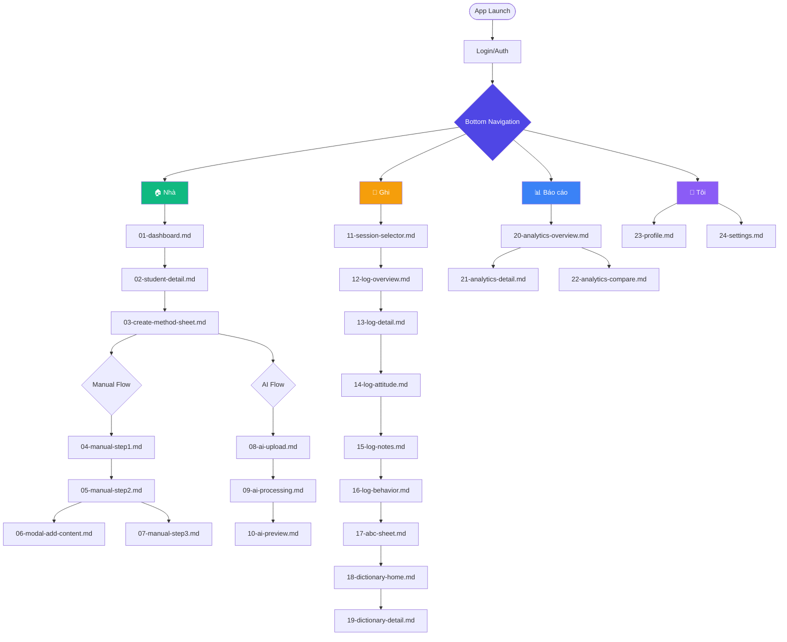

# Navigation Flow - Educare Connect

## 📱 Bottom Navigation Hierarchy



## 🎯 Key Entry Points

### 1. From Bottom Nav [📝 Ghi] Button

```
[📝 Ghi] Button
    ↓
Check for in-progress sessions
    ↓
┌─────────────────────────────────┐
│ YES: 1 session in-progress      │
│  ↓                               │
│  Show Resume Dialog              │
│    ├── [Tiếp tục]                │
│    │     ↓                       │
│    │   Go to 12-log-overview.md │
│    │                             │
│    └── [Chọn khác]               │
│          ↓                       │
│        11-session-selector.md   │
└─────────────────────────────────┘

┌─────────────────────────────────┐
│ NO in-progress sessions          │
│  ↓                               │
│  11-session-selector.md          │
│    ↓                             │
│  User selects session            │
│    ↓                             │
│  12-log-overview.md              │
└─────────────────────────────────┘
```

### 2. From Student Detail

```
02-student-detail.md
    ↓
Tap session in calendar/list
    ↓
Context: studentId + sessionId available
    ↓
Smart Route:
  - If not started → 11-session-selector.md (pre-filtered)
  - If in-progress → 12-log-overview.md (direct)
  - If completed → 12-log-overview.md (read-only)
```

### 3. Quick Actions

```
Dashboard → Swipe student card → [Ghi nhanh]
    ↓
Auto-select today's session for that student
    ↓
12-log-overview.md
```

## 📊 Complete Screen Flow

### Session Creation (Home Tab)

```
01-dashboard.md
  ↓
02-student-detail.md
  ↓
03-create-method-sheet.md
  ├─→ Manual: 04 → 05 → 06 → 07
  └─→ AI: 08 → 09 → 10
```

### Session Logging (Log Tab)

```
[📝 Ghi] Button
  ↓
11-session-selector.md
  ↓
12-log-overview.md
  ↓
13-log-detail.md (Goals)
  ↓
14-log-attitude.md (Mood + Sliders)
  ↓
15-log-notes.md (Text/Voice/Media)
  ↓
16-log-behavior.md (ABC Tracking)
  ↓ (optional)
17-abc-sheet.md
  ↓ (optional)
18-dictionary-home.md
  ↓
19-dictionary-detail.md
```

### Analytics (Report Tab)

```
[📊 Báo cáo] Button
  ↓
20-analytics-overview.md
  ├─→ Tap behavior → 21-analytics-detail.md
  └─→ [So sánh] → 22-analytics-compare.md
```

### Profile (Profile Tab)

```
[👤 Tôi] Button
  ↓
23-profile.md
  └─→ [Cài đặt] → 24-settings.md
```

## 🔄 Cross-Tab Navigation

### From Dictionary (anywhere)

```
17-abc-sheet.md (during logging)
  ↓
18-dictionary-home.md
  ↓
19-dictionary-detail.md
  ↓
Back → Continue logging
```

### From Analytics to Dictionary

```
21-analytics-detail.md
  ↓
Tap behavior name
  ↓
19-dictionary-detail.md
  ↓
Back → Return to analytics
```

## 🎨 Supporting Screens (Used Globally)

### UI States (25-28)

- **25-empty-states.md** - No data scenarios
- **26-error-states.md** - Error handling
- **27-loading-states.md** - Loading indicators
- **28-success-states.md** - Success celebrations

### User Guidance (29-31)

- **29-onboarding.md** - First-time user flow
- **30-confirmations.md** - Critical action dialogs
- **31-gesture-guide.md** - Gesture help

## 📝 File Numbering Logic

| Range | Category            | Purpose                         |
| ----- | ------------------- | ------------------------------- |
| 01-10 | Session Creation    | Create sessions (Manual + AI)   |
| 11-17 | Session Logging     | Record session data + behaviors |
| 18-19 | Behavior Dictionary | Browse & view behaviors         |
| 20-22 | Analytics           | Reports & insights              |
| 23-24 | Profile & Settings  | User management                 |
| 25-28 | UI States           | Empty, error, loading, success  |
| 29-31 | Onboarding & Help   | First-time + ongoing help       |

## 🚀 Smart Navigation Features

### Context-Aware Routing

```javascript
// Pseudo-code
function handleLogButtonTap() {
  const inProgressSessions = getInProgressSessions();
  const currentContext = getCurrentContext();

  if (inProgressSessions.length === 1) {
    // Show resume dialog
    showResumeDialog(inProgressSessions[0]);
  } else if (currentContext.studentId) {
    // Pre-filter to student's sessions
    navigateTo("11-session-selector", {
      studentId: currentContext.studentId,
    });
  } else {
    // Show all sessions
    navigateTo("11-session-selector");
  }
}
```

### Deep Linking Support

```
educare://log?sessionId=sess_123
  → Direct to 12-log-overview.md

educare://student/std_1
  → Direct to 02-student-detail.md

educare://behavior/throw
  → Direct to 19-dictionary-detail.md

educare://analytics?date=2025-10-22
  → Direct to 20-analytics-overview.md
```

## 📱 Tab Badges & Notifications

```
Bottom Navigation:
[🏠] - No badge
[📝 2] - 2 sessions pending logging today
[📊] - No badge
[👤] - Red dot if profile incomplete
```

---

**Total Screens**: 31  
**Total Design Files**: 3  
**Total**: 35 files (including README, NAVIGATION_FLOW)
